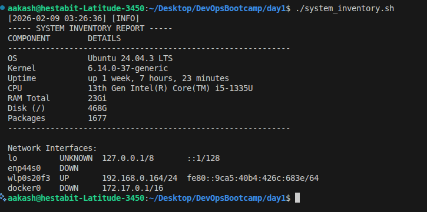
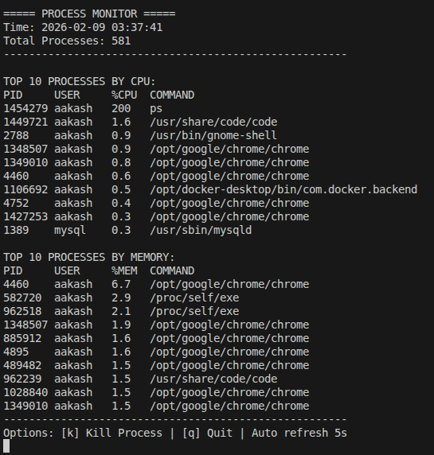

# DAY 1 - System Engineering & Linux Fundamentals

##### Script-  `script_inventory.sh`

How to run:

make the script executalbe `chmod +x ./script_inventory.sh`
then run - `./script_inventory.sh`

This script gathers the information like CPU, memory, disk, OS information, uptime and Network Interface.

Log File -`var/log/apps/system_inventory.log`

Below is the Output from the script :



##### Script- process_monitor.sh
How to run:

make the script executalbe `chmod +x ./process_monitor.sh`
then run - `./process_monitor.sh`

This script -
Shows top 10 processes by CPU usage
Shows top 10 processes by memory usage
Displays total process count
Updates every 5 seconds (like top)
Allows killing processes by PID

All the snapshots are saved to `var/log/apps/process_monitor.log`

Below is the Output from the script :


##### Script- health_check.sh

How to run:

make the script executalbe `chmod +x ./health_check.sh`
then run - `./health_check.sh`

Checks if critical services are running (ssh, cron)
Verifies disk space is below 90%
Confirms memory usage is below 85%
Tests network connectivity (ping 8.8.8.8)
Returns exit code 0 (healthy) or 1 (unhealthy)
Outputs: PASS/FAIL for each check

All the Health Checks are saved to `var/log/apps/health_check.log`


Below is the Output from the script :


- To check what individual script does you can :
```bash
./<script-name>.sh -h
```
OR 

```bash
./<script-name>.sh --help
```

##### Script - generate_baseline_report.sh

How to run:

make the script executalbe `chmod +x ./generate_baseline_report.sh`
then run - `./generate_baseline_report.sh`

Runs all the scripts one by one and captures the output 
writes the ouputs from each script into the txt file 
Generates detailed system report with all the required system information and generates the report with Date and TImestamp to `reports/` folder

