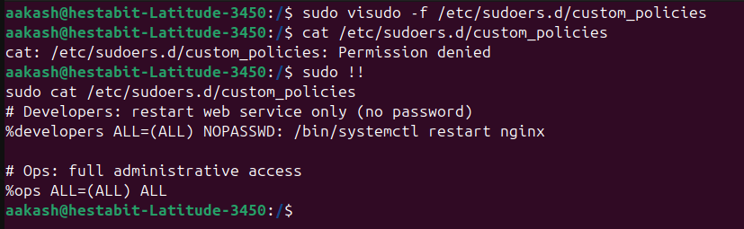

## user_provision.sh

```bash
Usage: sudo ./user_provision.sh users.txt
```

- Uses `set -euo pipefail` for strict error handling.
- Requires root privileges to execute.
- Accepts `users.txt` as positional argument.
- Supports `-h / --help` for usage instructions.
- Supports `-v / --verbose` for console logging.
- Logs all actions to `var/log/apps/user_provision.log`.
- Logs the usernames and generated password to `var/log/user_pass.log`
---

##### Input Handling

- Validates input file existence.
- Skips CSV header row.
- Parses CSV using `IFS=','`.
- Trims whitespace from fields.
- Validates mandatory fields (username, group).

---

##### Group Management

- Checks group existence using `getent group`.
- Creates group if it does not exist.
- Ensures compatibility with LDAP/NSS systems.

---

##### User Management

- Checks if user already exists using `id`.
- Creates user with:
  - Home directory (`-m`)
  - Primary group (`-g`)
  - Comment field (`-c` full name)
  - Default shell (`/bin/bash`)
- Generates secure random password using `openssl rand`.
- Sets password securely via `chpasswd`.
- Saves the password in a log file at `var/log/user_pass.log`
- Forces password change on first login (`chage -d 0`).

---

##### Home Directory 

- Retrieves actual home path via `getent passwd`.
- Sets home directory permissions to `750`.
- Ensures correct ownership (`user:group`).

---

##### SSH

- Creates `.ssh` directory inside home.
- Sets `.ssh` permission to `700`.
- Ensures correct ownership.

---

##### Role-Based Access Control

- Detects role from CSV.
- Grants sudo access to `sysadmin` or `admin`.
- Uses `usermod -aG sudo` for privilege assignment.

---

## permission_audit.sh

```bash
Usage: sudo ./permission_audit.sh
```

- Recursively scans `/home` and `/var/www` using `find` with depth-first traversal to inspect all files and subdirectories.
- Detects files with exact `0777` permissions using `-perm 0777`, identifying fully world-accessible security risks.
- Identifies world-writable directories without sticky bit using `-perm -0002 ! -perm -1000` to detect unsafe shared directories.
- Detects SUID and SGID binaries using `-perm -4000 -o -perm -2000` to highlight potential privilege escalation vectors.
- Lists files owned by deleted users using `-nouser`, validating UID entries against system account database.
- Lists files owned by deleted groups using `-nogroup`, validating GID entries against system group database.
- Uses structured logging via `log_info()` and `log_error()` functions to write timestamped logs into `var/log/apps/permission_audit.log`.
- Generates a structured audit report at `reports/permission_audit.txt` with categorized sections and suggested remediation commands.


## Configuring sudo policies

- Create /etc/sudoers.d/custom_policies
- Allow developers to restart web services only
- Allow ops team to run any command



- Secure the Policy File


- Disable Direct Root Login


- Enable Direct Root Login


- Set up sudo logging to /var/log/sudo.log


- Test each policy with sudo -l -U username


## backup_system.sh

note - Sir, i have backed up only the home folder for hestabit only as the home folder for my username was very large and was taking up a lot of time as it was very large 

```bash
Usage: sudo ./backup_system.sh
```

- Backs up critical system directories `/etc`, `/home/hestabit`, and `/var/log` as instructed
- Stores all backups centrally under the `/backup` directory
- Creates compressed `.tar.gz` backup archives with unique timestamps
- Secures backup archives with `600` permissions (owner access only)
- Automatically creates the backup directory with restricted access
- Retains only the last 7 days of backups by deleting older archives
- Verifies backup integrity using `tar -tzf` after archive creation
- Sends backup success and failure status messages to syslog
- Enforces root-only execution to ensure secure system-level backups

## user_activity_monitor.sh


```bash
Usage: sudo ./user_activity_monitor.sh
```

- Captures currently logged-in users using `who` and `w` as required
- Records recent system-wide login history using `last`
- Reports last login details for all human users (UID ≥ 1000)
- Audits recent user command activity from `.bash_history` files
- Identifies inactive user accounts with no login activity in the last 90 days
- Excludes never-logged-in and currently active users from inactivity checks
- Generates an audit report at `reports/user_activity_report.txt`
- Enforces root-only execution for accurate system-level auditing
- Uses strict error handling and logging for reliable audit execution
- Implemented global error handling if any unexpected error occures