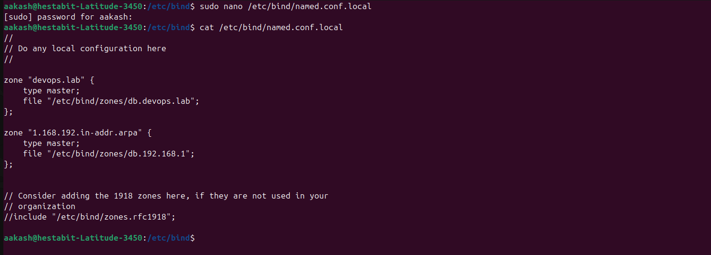
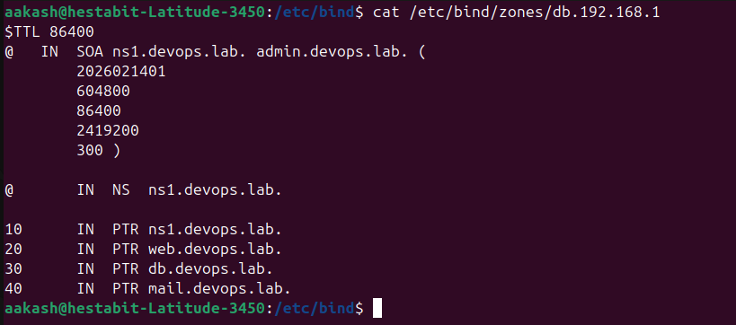
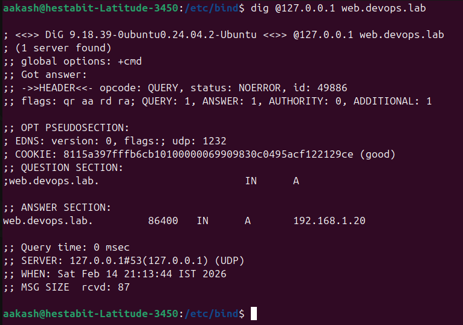
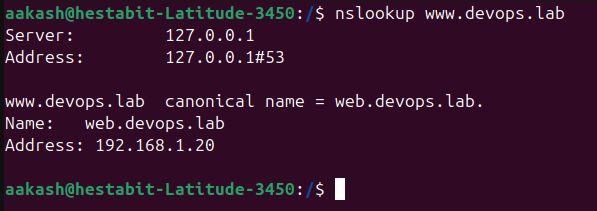

### network_diagnostics.sh

for Usage : 
```bash
 ./network_diagnostics.sh --help

```

- Tested internet connectivity using `ping` to `8.8.8.8` and `1.1.1.1` with clear `[PASS]/[FAIL]` status.
- Verified DNS resolution using `dig google.com` to confirm name lookup functionality.
- Displayed all network interfaces and assigned IP addresses using `ip addr`.
- Shown the system routing table using `ip route` for gateway and route validation.
- Listed listening TCP/UDP ports using `ss -tuln` to identify active services.
- Implemented targeted port connectivity testing using `nc -z` for `HOST:PORT`.
- Measured average network latency using `ping` and flagged high latency with `[WARN]`.
- Generated a timestamped diagnostic report at `logs/network_diag_YYYYMMDD.log`.
- Used structured logging with severity levels: `INFO`, `PASS`, `WARN`, `FAIL`.

### Setup BIND DNS Server

- BIND is active and running properly 


- Configure named.conf.local



- Created Forward Zone


- Created Reverse Zone



- Validated the changes


- Checking foreward zone


- Checking backward zone


- Chcecking after changing nameserver
  - Foreward 

  - Backward
  
  - nslookup for the domain 
  


I have also 
- copied the  `/etc/bind/named.conf.local` configuration file to the present directory as `named.conf.local`
- copied the  `/etc/bind/zones/db.devops.lab` configuration file to the present directory as `db.devops.lab`
- copied the  `/etc/bind/zones/db.192.168.1` configuration file to the present directory as `db.192.168.1`

### zone_generator.sh 

for usage - 
```bash
    sudo ./zone_generator.sh  --help
```
- log file - `logs/zone_generator.log`

- Automated generation of forward and reverse DNS zones from a single CSV source of truth
- Supports A and CNAME records with automatic alias handling
- Enforces DNS best practices by requiring authoritative name servers to have address records
- Automatically increments SOA serial numbers using date-based versioning
- Generates zone files in temporary locations to avoid partial writes
- Validates zones using named-checkzone before deployment
- Deploys zones using atomic file replacement (mv) to ensure consistency
- Creates timestamped backups of existing zone files before any change
- Supports dry-run mode for safe previews without deployment
- Provides structured logging with optional verbose/debug output
- Existing zone files are fully backed up before deployment, enabling manual restoration at any time
- Validation failures prevent deployment, ensuring previous zones remain active and untouched
- Atomic updates guarantee that BIND never reads a partially written or corrupted zone file

### dns_monitor.sh

for usage - 
```bash
    sudo ./dns_monitor.sh  --help
```
Log file - `logs/dns_monitor.log`

- Queries all DNS records in zone file - Automatically parses the forward zone file to enumerate all defined A records

- Verifies each record resolves correctly - Compares live DNS query results against expected IP addresses from the zone file

- Tests forward and reverse lookups - Performs both A (forward) and PTR (reverse) DNS resolution checks per host

- Checks DNS server responsiveness - Confirms DNS server availability by executing queries against a configurable DNS endpoint

- Measures query response times - Measures per-record DNS query latency in milliseconds

- Alerts on failures or high latency - Flags resolution failures and issues warnings when latency exceeds the 100 ms threshold

- Supports scheduled execution - Designed for non-interactive execution and safe automation via cron, with persistent logging


### dns_backup.sh
```bash
sudo ./dns_backup.sh --help
```
Log file - `logs/dns_backup.log`

- Backs up complete BIND configuration - Creates a compressed archive of the entire `/etc/bind` directory, ensuring all DNS configuration files are captured

- Exports all DNS zone files - Includes all forward and reverse zone files located under `/etc/bind/zones`

- Includes named.conf configurations - Preserves `named.conf`, `named.conf.local`, `named.conf.options`, and related BIND configuration files required for full restoration

- Creates timestamped backup archives - Generates uniquely named archives in the format `dns_backup_YYYYMMDD_HHMMSS.tar.gz` to support historical recovery

- Stores backups in a dedicated location - Saves all DNS backups under `/backup/dns` for centralized and predictable storage

- Implements retention policy - Automatically deletes backup archives older than 30 days to prevent uncontrolled disk usage

- Tests restore procedure - Verifies archive integrity after creation by validating that the backup can be successfully read and extracted

**ALL THE LOG FILES ARE ALSO PUSHED TO GITHUB IN `/logs` FOLDER**