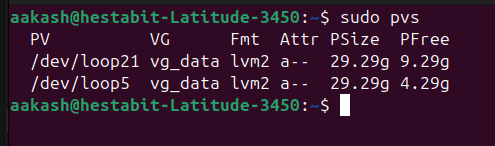

# LVM Setup Guide

- Implement Logical Volume Management for logs, backups, and monitoring data

## Disk Preparation
- Used loopback devices to simulate additional disks
```bash
losetup -fP /var/lvm-disks/disk1.img # Became /dev/loop5
losetup -fP /var/lvm-disks/disk2.img # Became /dev/loop21
```
## Physical Volumes
```bash
pvcreate /dev/loop5 /dev/loop21
```
### Volume Group
```bash
vgcreate vg_data /dev/loop5 /dev/loop21
```
## Logical Volumes
```bash
lvcreate -L 10G -n lv_logs vg_data
lvcreate -L 20G -n lv_backups vg_data
lvcreate -L 15G -n lv_monitoring vg_data
```
## Filesystem Creation
```bash
mkfs.ext4 /dev/vg_data/lv_logs
mkfs.ext4 /dev/vg_data/lv_backups
mkfs.xfs  /dev/vg_data/lv_monitoring
```
## Mounting
```bash
mount /dev/vg_data/lv_logs /var/log/apps
mount /dev/vg_data/lv_backups /backup
mount /dev/vg_data/lv_monitoring /monitoring
```
## Persistence
```bash
/dev/vg_data/lv_logs       /var/log/apps  ext4 defaults 0 2
/dev/vg_data/lv_backups    /backup        ext4 defaults 0 2
/dev/vg_data/lv_monitoring /monitoring    xfs  defaults 0 2
```
## Verification

- pvs


- vgs


- lvs


- df -h
