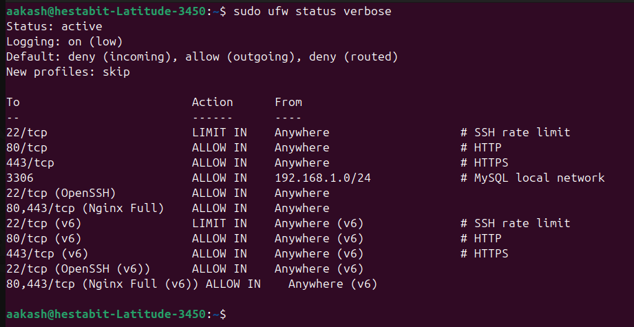
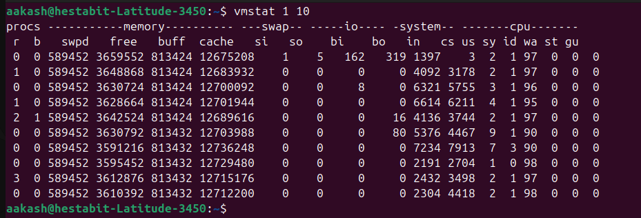

### Configure UFW Firewall
- configured ufw firewall and saved the updated rules to `firewall_rules.txt`

--- 

### firewall_audit.sh

Usage :
```bash
    sudo ./firewall_audit.sh
```

Log File `var/log/apps/firewall_audit.log`

Implemented an automated UFW firewall audit script that enumerates all active firewall rules and records them in a dated audit report for traceability.

Verified firewall operational status, detecting and flagging disabled UFW configurations as a critical security risk with score impact.

Audited SSH (port `22`) configuration, validating the presence of rate-limiting rules and identifying missing protection against brute-force attacks.

Scanned for insecure legacy services (FTP on port `21`, Telnet on port `23`) and reported any exposed ports as critical misconfigurations.

Detected database exposure risks by identifying MySQL (`port 3306`) rules open to Anywhere (`0.0.0.0/0`) instead of restricted subnets.

Evaluated overly permissive firewall rules, flagging excessive services allowed from unrestricted sources.

Generated a quantitative security score (0–100) based on detected misconfigurations, providing an objective security posture assessment.

Produced a timestamped audit report (`reports/firewall_audit_YYYYMMDD.txt`) containing rules, findings, recommendations, and final score.

Logged all audit activity to a dedicated log file for operational auditing and troubleshooting.

Included actionable remediation suggestions aligned with each identified issue to support immediate hardening.

---

### performance_baseline.sh

Usage :
```bash
    sudo ./performance_baseline.sh
```

Log File `var/log/apps/performance_baseline.log`

- Captures a 60-second system performance baseline with metrics sampled every 5 seconds for consistency.
- Measures CPU utilization (average and peak) and reports per-core CPU statistics for detailed analysis.
- Collects memory usage statistics including used, free, cached memory, and swap consumption with peak values.
- Monitors disk I/O activity using extended statistics to observe read/write behavior.
- Records load averages (1, 5, and 15 minutes) to assess system load trends.
- Tracks network throughput by calculating total received and transmitted bytes.
- Logs process count and identifies top CPU and memory consuming processes, saving results to `reports/performance_baseline.txt` for post-tuning comparison.

---

### Kernel Tuning Guide

configured `/etc/sysctl.d/99-custom-performance.conf` file


copied the file as `99-custom-performance.conf` in the urrent directory 

Changes are persistent across reboots and can be reverted safely.

#### Network Performance Tuning

##### net.core.somaxconn = 65535
- Increases maximum pending TCP connection queue.
- Prevents dropped connections under high traffic.
- Useful for web servers, APIs, and load balancers.

##### net.core.netdev_max_backlog = 5000
- Improves packet handling when the kernel receives packets faster than it can process them.
- Reduces packet loss during traffic bursts.

##### net.ipv4.tcp_max_syn_backlog = 8192
- Increases backlog for half-open TCP connections.
- Protects against SYN floods and high connection churn.

##### net.ipv4.tcp_fin_timeout = 15
- Reduces time sockets remain in FIN-WAIT state.
- Frees system resources faster.

##### net.ipv4.tcp_keepalive_time = 300
- Detects dead TCP connections sooner.
- Improves cleanup of stale connections.


#### Memory Management Tuning

##### vm.swappiness = 10
- Minimizes swap usage.
- Keeps active workloads in RAM.
- Ideal for performance-sensitive systems.

##### vm.dirty_ratio = 15
- Limits maximum percentage of dirty memory.
- Prevents long I/O blocking during writeback.

##### vm.dirty_background_ratio = 5
- Starts background flushing earlier.
- Provides smoother disk I/O behavior.

#### File System Scaling

##### fs.file-max = 2097152
- Increases system-wide open file limit.
- Required for high-concurrency workloads (web servers, databases).

#### Security Hardening

##### kernel.dmesg_restrict = 1
- Restricts access to kernel logs.
- Prevents information leakage to unprivileged users.

##### kernel.kptr_restrict = 2
- Hides kernel memory addresses.
- Reduces attack surface for kernel exploits.

#### Applying Configuration

```bash
sudo sysctl -p /etc/sysctl.d/99-custom-performance.conf
```
##### Verification
```bash
sysctl net.core.somaxconn
sysctl vm.swappiness
sysctl fs.file-max
```

##### Rollback Procedure

To revert changes:

```bash
sudo rm /etc/sysctl.d/99-custom-performance.conf
sudo sysctl --system
```

The performance report generated after tuning is placed as `reports/performance_baseline.txt`

---

### security_hardening.sh

Usage :
```bash
    sudo ./security_hardening.sh
```

Log File `var/log/apps/security_hardening.log`

Report file - `reports/security_hardening_report_YYYYMMDD.txt`

- Automates SSH hardening by disabling root login, enforcing key-based authentication, and changing the default SSH port to 2222.
- Installs and configures Fail2Ban with an active SSH jail to protect against brute-force attacks.
- Removes unnecessary and insecure legacy packages such as telnet, ftp, and rsh-server.
- Disables unused services to reduce the system attack surface.
- Enforces system-wide password aging policies using `/etc/login.defs`.
- Enables automatic security updates to ensure timely patching of vulnerabilities.
- Activates audit logging using `auditd` and generates a detailed security hardening report in `reports/`.

---

### Screenshots

- ufw status verbose



- vmstat 1 10 output



- fail2ban-client status sshd

