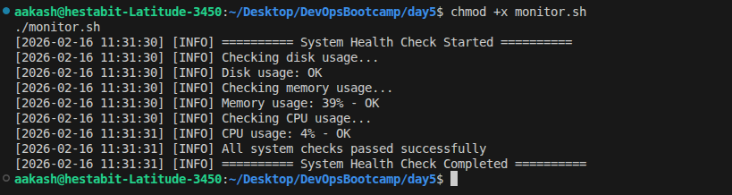
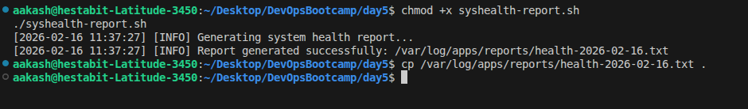
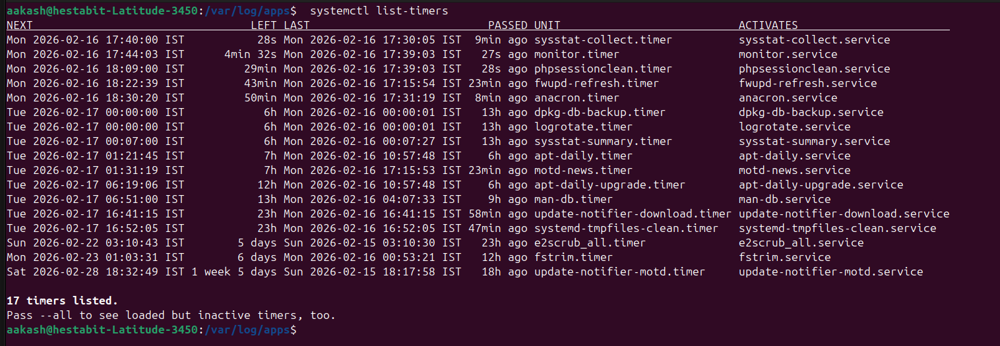

### Configure LVM Setup
Configured and generated `lvm_guide.md` markdown file.

### Implement Centralized Logging

Configured `/etc/rsyslog.d/10-custom.conf` to 

```
# Application logs
local0.*    /var/log/apps/application.log
local1.*    /var/log/apps/security.log
local2.*    /var/log/apps/monitoring.log

# Separate auth logs
auth,authpriv.*    /var/log/apps/auth.log

# Error logs to separate file
*.err    /var/log/apps/errors.log

# Forward critical logs to monitoring server (optional)
*.crit    @192.168.1.100:514

```

I have also copied the `/etc/rsyslog.d/10-custom.conf` file as `10-custom.conf`

tested the logging using `./test_log.sh`

- logs generated


### Configure Logrotate

Created: `/etc/logrotate.d/custom-apps` with the following configuration 

```
/var/log/apps/*.log {
    daily
    rotate 30
    compress
    delaycompress
    missingok
    notifempty
    create 0640 root adm
    sharedscripts
    postrotate
        systemctl reload rsyslog > /dev/null 2>&1 || true
    endscript
}

/var/log/apps/errors.log {
    daily
    rotate 60
    compress
    size 100M
    missingok
    notifempty
    create 0640 root adm
}
```
I have also copied the `/etc/logrotate.d/custom-apps` file as `custom-apps`

- Output for `sudo logrotate -d /etc/logrotate.d/custom-apps`


- checking if the logs were rotated


### monitor.sh

Usage :
```bash
chmod +x monitor.sh
./monitor.sh

```

Implemented disk, memory, and CPU usage monitoring with configurable threshold limits.

Added structured logging with timestamps, severity levels, and separate alert logs.

Ensured fail-fast safety using set -euo pipefail for reliable production execution.

Standardized the script to a reusable enterprise template (headers, exit codes, usage).

Implemented non-interactive health checks suitable for cron and automation.

Automatically creates log directories to prevent runtime failures.

Designed clear alerting behavior when system thresholds are exceeded.

Returned meaningful exit codes for CI/CD and monitoring system integration.

`monitor.sh` output- 



monitor logs generated can be found as `monitor.log`

### syshealth-report.sh


Usage :
```bash
chmod +x syshealth-report.sh
./syshealth-report.sh

```


Generated a daily system health report with timestamped filenames for auditing.

Collected core system information including OS, kernel, hostname, and uptime.

Reported disk, memory, and CPU load statistics for capacity monitoring.

Identified top CPU and memory consuming processes for performance analysis.

Captured network interface status and active connection counts.

Included recent application error logs for troubleshooting visibility.

Verified critical service availability (SSH and Cron).

Structured the script using a standardized production template with help, exit codes, and safe execution flags.

Output - 


health report generated can be found as `health-2026-02-16.txt`.


### Setup Cron Jobs

Verifying cron setup:


cron is running and active


cron jobs are running (system log)


The cronab file is copied to `crontab`.

###  Create systemd Timer

Created: /etc/systemd/system/monitor.service
```
[Unit]
Description=System Monitoring Service
After=network.target

[Service]
Type=oneshot
ExecStart=/home/aakash/Desktop/DevOpsBootcamp/day5/monitor.sh
User=root
```

Created: /etc/systemd/system/monitor.timer
```
Description=Run System Monitor every 5 minutes
Requires=monitor.service

[Timer]
OnBootSec=5min
OnUnitActiveSec=5min
Unit=monitor.service

[Install]
WantedBy=timers.target
```

i have copied - 
- `/etc/systemd/system/monitor.service` as `monitor.service`
- ` /etc/systemd/system/monitor.timer` as `monitor.timer`

```bash 
sudo systemctl daemon-reload
sudo systemctl enable monitor.timer
sudo systemctl start monitor.timer
sudo systemctl list-timers
```

sudo systemctl list-timers output 

