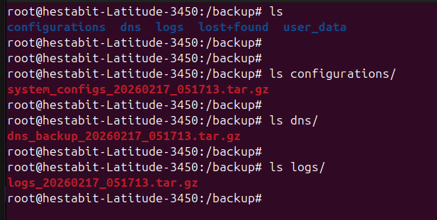

# Server Provisioning System

## What It Does
Runs system inventory  
Creates users with proper permissions  
Configures DNS client settings  
Sets up UFW firewall from rules file  
Applies security hardening from config files  
Deploys centralized logging and log rotation  

## Main Script
- **server-provision.sh** — Master orchestrator, runs all 6 steps in sequence

## Scripts in server-provision_scripts/

- **system_inventory.sh** — Collects OS, CPU, RAM, disk, network info into report
- **user_provision.sh** — Creates users from `users.txt`, sets SSH dirs, assigns sudo by role
- **ufw_setup.sh** — Reads `firewall_rules.csv`, applies UFW rules and defaults
- **security_hardening.sh** — Validates and deploys SSH, Fail2Ban, sysctl configs before going live
- **setup_logging.sh** — Validates and deploys rsyslog + logrotate configs before going live

## Config / Input Files (in server-provision_scripts/)

### Users
- **users.txt** — CSV: `username,fullname,group,role`

### Firewall
- **firewall_rules.csv** — Columns: `type,rule,from,comment`
  - `type`: `port` | `app` | `limit`
  - Example: `port,22/tcp,,SSH` / `limit,22/tcp,,SSH rate limit`

### Security Hardening (read and validated before deployment)
- **sshd_config.hardened** - deployed to `/etc/ssh/sshd_config`
- **jail.local** - deployed to `/etc/fail2ban/jail.local`
- **99-custom-performance.conf** - deployed to `/etc/sysctl.d/`

### Logging (read and validated before deployment)
- **10-custom.conf** - deployed to `/etc/rsyslog.d/10-custom.conf`
- **custom-apps** - deployed to `/etc/logrotate.d/custom-apps`

## What Gets Configured

### Logging (setup_logging.sh)
- `/var/log/apps/` created with correct permissions
- `application.log`, `security.log`, `monitoring.log`, `auth.log`, `errors.log` pre-created
- rsyslog routes: `local0` → application, `local1` → security, `local2` → monitoring
- logrotate: daily rotation, 30-day retention, errors.log 60-day / 100MB

### Firewall (ufw_setup.sh)
- Default: deny incoming, allow outgoing
- Ports: 22/tcp (SSH + rate-limit), 80/tcp, 443/tcp, 3306 (LAN only)
- Apps: OpenSSH, Nginx Full

### Security Hardening (security_hardening.sh)
- SSH: root login disabled, password auth off, port - 2222
- Fail2Ban: SSH jail, 3 retries, 1h ban
- Sysctl: network performance + security hardening
- Removes: telnet, ftp, rsh-server, xinetd
- Disables: avahi-daemon, cups
- Password policy: 90-day max, 7-day warning
- Enables: unattended-upgrades, auditd

## Script Call Chain
```
server-provision.sh
├── system_inventory.sh           (Step 1)
├── user_provision.sh users.txt   (Step 2)
├── (internal) configure_dns_client - /etc/resolv.conf  (Step 3)
├── ufw_setup.sh                  (Step 4) - reads firewall_rules.csv
├── security_hardening.sh         (Step 5) - reads sshd_config.hardened,
│                                             jail.local,
│                                             99-custom-performance.conf
└── setup_logging.sh              (Step 6) - reads 10-custom.conf,
                                              custom-apps
```


# infrastructure-monitor.sh

Combines all monitoring scripts  
Generates comprehensive dashboard  
Sends alerts for issues  
Creates daily reports  

## Main Script
- **infrastructure-monitor.sh** - Master orchestrator that runs all scripts and generates report

## Monitoring Scripts

### System Engineering
- **generate_baseline_report.sh** - Calls: system_inventory.sh, process_monitor.sh, health_check.sh
- **system_inventory.sh** - Gathers OS, CPU, RAM, disk, network info
- **process_monitor.sh** - Captures top CPU/memory processes
- **health_check.sh** - Validates services (ssh, cron), disk, memory, network

### Security & Permissions
- **permission_audit.sh** - Scans /home and /var/www for insecure permissions
- **user_activity_monitor.sh** - Tracks logins, command history, inactive users
- **firewall_audit.sh** - Audits UFW rules and security misconfigurations

### Network & DNS
- **network_diagnostics.sh** - Tests connectivity, DNS, latency, open ports
- **dns_monitor.sh** - Validates forward/reverse DNS resolution

### Performance
- **performance_baseline.sh** - 60-second CPU, memory, disk, network sampling
- **syshealth-report.sh** - Daily health snapshot (disk, memory, CPU, services)

## Quick Start
```bash
./infrastructure-monitor.sh
# Report saved to: infrastructure-reports/infrastructure-monitor-TIMESTAMP.txt
```

## Script Call Chain
```
infrastructure-monitor.sh
├── generate_baseline_report.sh
│   ├── system_inventory.sh
│   ├── process_monitor.sh
│   └── health_check.sh
├── permission_audit.sh
├── user_activity_monitor.sh
├── network_diagnostics.sh
├── dns_monitor.sh
├── firewall_audit.sh
├── performance_baseline.sh
└── syshealth-report.sh
```

# Auto-Backup System

Backs up all server configurations  
Includes DNS zones and BIND config  
Saves user data from /home  
Tests restore procedures  

## Main Script
- **auto-backup.sh** - Master backup orchestrator that coordinates all backup operations

## Backup Scripts (in backup_scripts/)
- **dns_backup.sh** - Backs up /etc/bind (DNS zones and configuration)

## Configuration Files Backed Up

### Core System Configuration
- `/etc/hostname` - Server hostname
- `/etc/hosts` - Host mappings
- `/etc/fstab` - Filesystem mount configuration
- `/etc/sysctl.conf` - Kernel parameters
- `/etc/sysctl.d/` - Custom kernel tuning
- `/etc/login.defs` - Login policies
- `/etc/security/limits.conf` - Resource limits

### User, Group and Privileges
- `/etc/passwd` - User accounts
- `/etc/shadow` - Encrypted passwords
- `/etc/group` - Group definitions
- `/etc/gshadow` - Encrypted group passwords
- `/etc/sudoers` - Sudo configuration
- `/etc/sudoers.d/` - Custom sudo policies

### SSH and Authentication Security
- `/etc/ssh/sshd_config` - SSH server config
- `/etc/ssh/ssh_config` - SSH client config
- `/etc/fail2ban/` - Intrusion prevention

### Firewall and Network
- `/etc/ufw/` - Firewall rules
- `/etc/netplan/` - Network configuration 

### DNS (BIND)
- `/etc/bind/` - All DNS zones and configuration

### Logging Configuration
- `/etc/rsyslog.conf` - System logging
- `/etc/rsyslog.d/` - Custom log rules
- `/etc/logrotate.conf` - Log rotation
- `/etc/logrotate.d/` - Custom log rotation

### Application Logs
- `/var/log/apps/` - All application logs

### User Data
- `/home/jdoe` - Currently a specific user to display implementation as it occupies less space

## Backup Locations
```
/backup/
├── configurations/          (System config files)
│   └── system_configs_YYYYMMDD_HHMMSS.tar.gz
├── dns/                     (DNS zones and BIND config)
│   └── dns_backup_YYYYMMDD_HHMMSS.tar.gz
├── user_data/              (User home directories)
│   └── user_data_YYYYMMDD_HHMMSS.tar.gz
└── logs/                   (Application logs)
    └── logs_YYYYMMDD_HHMMSS.tar.gz
```

## Retention Policy
- **System configs**: 7 days
- **DNS backups**: 30 days
- **User data**: 7 days
- **Logs**: 7 days

## Quick Start
```bash
# Run full backup
sudo ./auto-backup.sh

# Run with restore test
sudo ./auto-backup.sh --test

# Skip DNS backup
sudo ./auto-backup.sh --skip-dns
```

## Script Call Chain
```
auto-backup.sh
├── backup_scripts/dns_backup.sh        (DNS zones)
├── Internal function                   (System configs)
├── Internal function                   (User data)
├── Internal function                   (Logs)
└── test_restore()                      (Verify backups)
```

## Features
Secure permissions (600) on all backup archives  
Integrity verification for each backup  
Automatic retention policy enforcement  
Restore testing capability  
Syslog integration for monitoring  
Skips non-existent paths gracefully

Log File `var/log/apps/auto-backup.log`

The backups are generated as verifeid
