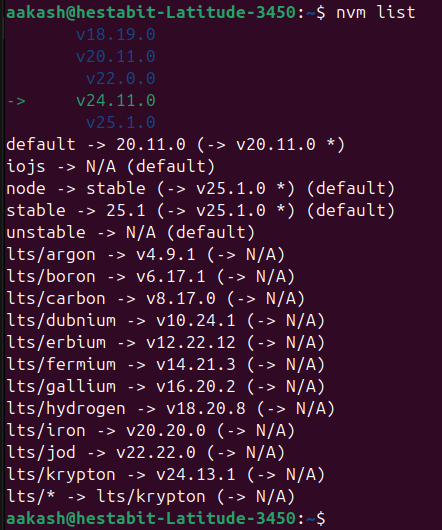
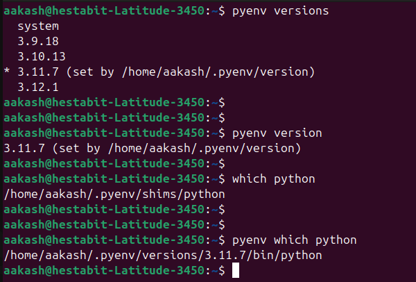
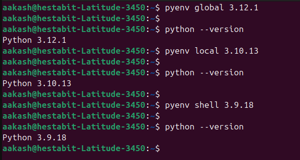
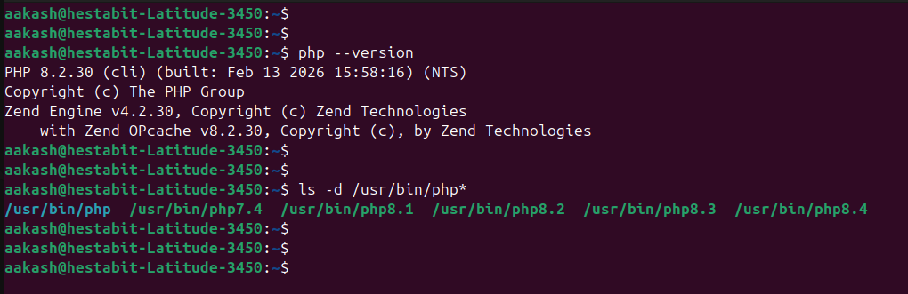
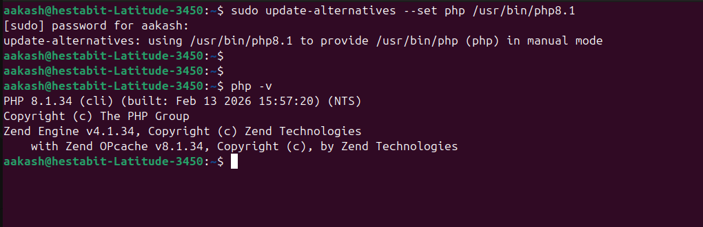
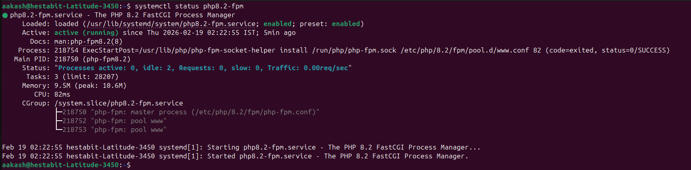
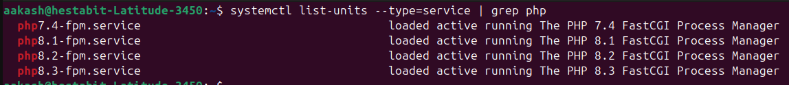
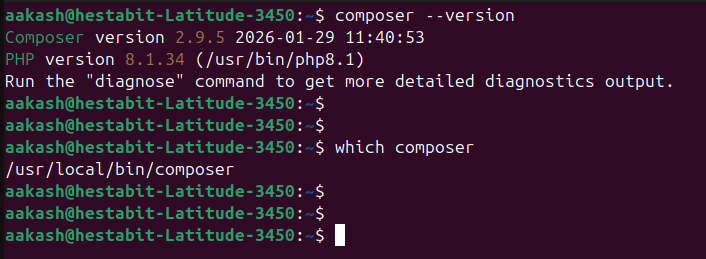
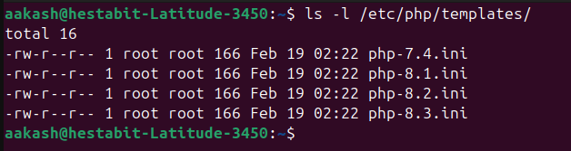

# node_installer.sh

Usage - 
```bash 
./node_installer.sh
```
Log file - `week2/day1/var/log/apps/node_installer.log`

* **Automated Environment Setup**: Implemented a zero-intervention installation of NVM ($v0.40.4$), ensuring the tool is available immediately for Node.js management.
* **Multi-Version Deployment**: Successfully automated the installation of three specific Node.js versions (**v18.19.0**, **v20.11.0**, and **v22.0.0**) to support diverse project requirements.
* **Persistent Default Configuration**: Programmatically assigned **v20.11.0** as the global default version using NVM aliases to ensure environment consistency across terminal sessions.
* **Project Standardization**: Integrated the creation of a `.nvmrc` file in the user's home directory to lock the environment to the preferred version.
* **Verification & Validation**: Built-in automated checks to verify successful installation by outputting active `node` and `npm` versions to the console and logs.
* **Logging & Traceability**: Developed a dual-output logging system that records script progress and errors to `var/log/apps/node_installer.log` for auditing.
* **User-Friendly Reporting**: Created a summary view using `nvm ls` to provide the user with a clear visual confirmation of the final system state.

* **Node versions available**- 



## python_installer.sh

Usage : 
```bash
./python_installer.sh && . ~/.bashrc # . ~/.bashrc to refresh the shell to apply the installations

```
Log file - `week2/day1/var/log/apps/node_installer.log`

- Installed pyenv using the official pyenv.run bootstrap script
- Configured pyenv in ~/.profile for login shells and automation safety
- Configured pyenv in ~/.bashrc with guards for interactive shells
- Installed required Linux build dependencies for CPython builds
- Installed Python versions 3.9.18, 3.10.13, 3.11.7, and 3.12.1
- Set Python 3.11.7 as the global default via pyenv
- Installed essential tooling: pip, virtualenv, pipenv
- Created a reusable virtual environment template and verified installation

verifying multiple versions installed 


verifying version changes 


## php_installer.sh

Usage :
```bash
sudo ./php_installer.sh
```

Log file - `var/log/apps/php_installer.log`

- Installed required system dependencies for PHP and PHP-FPM
- Added and validated the Ondřej Surý PHP PPA for multi-version support
- Installed PHP versions 7.4, 8.1, 8.2, and 8.3 with common production extensions
- Configured PHP 8.2 as the system-wide default using update-alternatives
- Enabled and started php8.2-fpm as the default PHP-FPM service
- Installed Composer globally and made it available system-wide
- Created reusable php.ini configuration templates for each PHP version
- Verified PHP and Composer installations with version checks

Verifying the installed versions- 


verifying version change 


verifying the PHP-FPM service status 


verifying all the php-fpm services 


verifying global composer 


the php templates generated 



## PLEASE FIND THE ATTACHED INSTALLATION_GUIDE.md FOR THE STEP BY STEP INSTALLATION AND version_compatibility_matrix.md FOR VERSIONS INFO.


## runtime_version_switcher.sh

Usage :
```bash
./runtime_version_switcher.sh
```

Log file - `var/log/apps/runtime_version_switcher.log`

- Provided an interactive menu to switch between Node.js, Python, and PHP runtimes
- Displayed currently active versions for each runtime before switching
- Switched Node.js versions using nvm without reinstalling binaries
- The version switched for node is done for default version `nvm alias default `
- Switched Python versions using pyenv and set the global interpreter
- Switched PHP versions using update-alternatives with sudo safety
- Verified each runtime switch by printing the active version immediately
- Added an option to list all installed Node.js, Python, and PHP versions
- Logged all version switch operations and exits for audit and troubleshooting

## runtime_audit.sh

Usage :
```bash
./runtime_audit.sh
```

Log file - `var/log/apps/runtime_audit.log`  
Report file - `reports/runtime_audit_report.txt`

- Scans the system for installed Node.js, Python, and PHP runtimes
- Detects all installed versions using nvm, pyenv, and system PHP binaries
- Captures the currently active (default) version for each runtime
- Compares active versions against defined LTS baselines
- Classifies runtime status as OK, OUTDATED, or NEWER based on LTS policy
- Records installation paths for each runtime manager
- Generates a timestamped, formatted audit report for review and screenshots
- Logs all audit operations for traceability and troubleshooting


## performance_tuning.sh

Usage :
```bash
sudo ./performance_tuning.sh
```

Log file - `var/log/apps/performance_tuning.log`  
Backup directory - `/var/backups/runtime-performance`

- Applies system-wide Node.js performance tuning by exporting NODE_OPTIONS
- Ensures Node.js settings are picked up by shells, PM2, and services
- Configures Python performance environment variables for the actual runtime user
- Safely updates the correct user’s ~/.bashrc even when executed with sudo
- Applies PHP performance tuning using version-aware conf.d drop-in files
- Enables and configures OPcache for both CLI and PHP-FPM
- Restarts PHP-FPM to activate changes without reboot
- Creates timestamped backups before modifying any configuration

## I HAVE LISTED THE PARAMETERS TUNED ALONG WITH THEIR SIGNIFICANCE IN PERFORMANCE_TUNING.md 