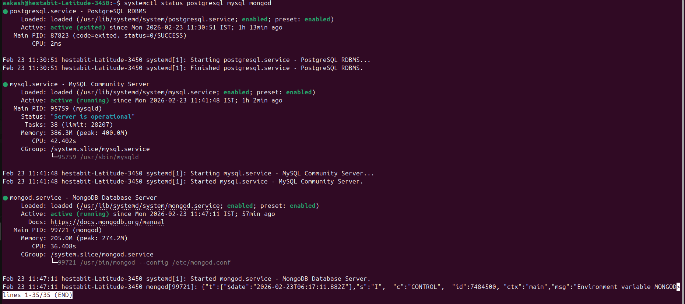
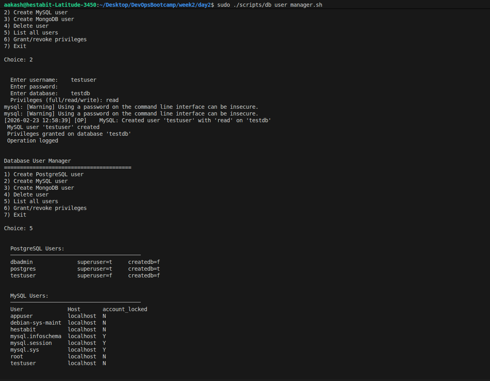
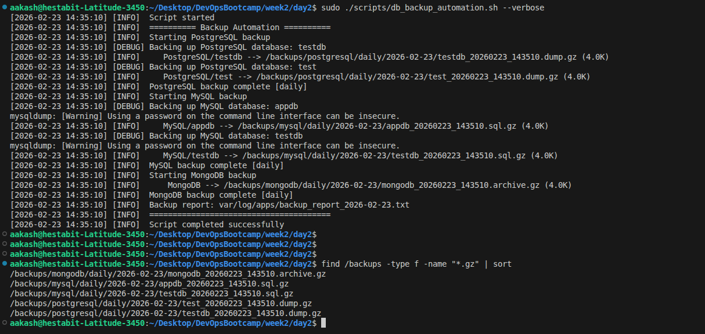
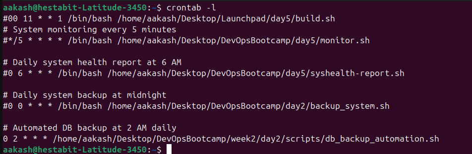
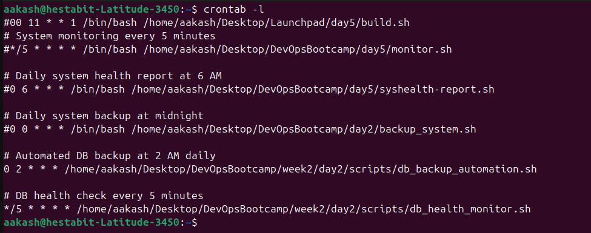

# Database Installation, Configuration & Management

Production-ready database setup, management, and monitoring for **PostgreSQL 15**, **MySQL 8.0**, and **MongoDB 7.0** on Ubuntu.

---

## Project Structure

```
db-project/
├── scripts/                        # All executable bash scripts
├── configs/                        # Production configuration files
└── docs/                           # Documentation
```

---

## Installation Scripts

---

### postgresql_setup.sh

- PostgreSQL 15 installation via official pgdg APT repository
- SCRAM-SHA-256 authentication (replaces default md5)
- Automated user `dbadmin` and database `testdb` creation
- Starts and enables PostgreSQL systemd service
- Verification and logging
- Full installation steps listed in `DATABASE_SETUP_GUIDE.md`

#### Config Files
- `99-custom-production.conf` — performance tuning (shared_buffers, work_mem, etc.), deployed to `/etc/postgresql/15/main/conf.d/`
- `pg_hba.conf` — authentication rules, modified directly at `/etc/postgresql/15/main/pg_hba.conf`
- Reference copies saved in `configs/` directory

#### Usage
```bash
chmod +x postgresql_setup.sh
sudo ./postgresql_setup.sh
sudo ./postgresql_setup.sh --help
```

Logs: `var/log/apps/postgresql_setup.log`

---

### mysql_setup.sh

- MySQL 8.0 installation via Ubuntu APT
- Automated secure installation: root password set, anonymous users removed, remote root disabled, test DB dropped
- Optimized `production.cnf` for 8GB RAM with InnoDB tuning and connection limits
- App user `appuser` created with least-privilege access on `appdb`
- Starts and enables MySQL systemd service
- Verification and logging
- Full installation steps listed in `DATABASE_SETUP_GUIDE.md`

#### Config Files
- `production.cnf` — production MySQL configuration, deployed to `/etc/mysql/conf.d/production.cnf`
- Reference copy saved in `configs/production.cnf`

#### Usage
```bash
chmod +x mysql_setup.sh
sudo ./mysql_setup.sh
sudo ./mysql_setup.sh --verbose
sudo ./mysql_setup.sh --help
```

Logs: `var/log/apps/mysql_setup.log`

---

### mongodb_setup.sh

- MongoDB 7.0 installation via official MongoDB APT repository with GPG key verification
- Two-phase setup: users created before auth enabled, then `authorization: enabled` activated
- Production `mongod.conf` with WiredTiger storage engine, localhost-only binding, slow op profiling
- Admin user `mongoadmin` and app user `appuser` created with scoped roles
- Test database `appdb` with `test_collection` created and verified
- Starts and enables `mongod` systemd service
- Verification and logging
- Full installation steps listed in `DATABASE_SETUP_GUIDE.md`

#### Config Files
- `mongod.conf` — production MongoDB configuration, deployed to `/etc/mongod.conf`
- Reference copy saved in `configs/mongod.conf`

#### Usage
```bash
chmod +x mongodb_setup.sh
sudo ./mongodb_setup.sh
sudo ./mongodb_setup.sh --verbose
sudo ./mongodb_setup.sh --help
```

Logs: `var/log/apps/mongodb_setup.log`

---



## Management Scripts

---

### db_user_manager.sh

- Interactive menu-driven user management across PostgreSQL, MySQL, and MongoDB
- Create users with `full`, `read`, or `write` privilege levels on any database
- Delete users from any of the three databases
- List all users across all databases in one view
- Grant or revoke specific privileges (PostgreSQL and MySQL)
- Input validation on all usernames and database names before any DB operation
- All operations logged with timestamp to a dedicated operations log

#### Usage
```bash
chmod +x db_user_manager.sh
sudo ./db_user_manager.sh
sudo ./db_user_manager.sh --verbose
sudo ./db_user_manager.sh --help
```

Logs: `var/log/apps/db_user_operations.log`, `var/log/apps/db_user_manager.log`

- Created and verified the creation of new user in MySQL

---

### db_backup_automation.sh

- Performs backups for all three databases in a single run
- PostgreSQL: `pg_dump -Fc` custom format (supports selective and parallel restore)
- MySQL: `mysqldump --single-transaction` (consistent snapshot, no table locks)
- MongoDB: `mongodump --gzip --archive` (single compressed archive file)
- Auto-detects backup category: daily / weekly / monthly based on current date
- Rotation: 7 daily, 4 weekly, 12 monthly backups retained
- All backups compressed with gzip
- Generates a backup report with file paths, sizes, and timestamps
- Supports `--type` flag to back up a single database only
- Designed to run unattended via cron

#### Cron Setup
```bash
0 2 * * * /path/to/db_backup_automation.sh
```

#### Usage
```bash
chmod +x db_backup_automation.sh
sudo ./db_backup_automation.sh
sudo ./db_backup_automation.sh --type postgresql
sudo ./db_backup_automation.sh --verbose
sudo ./db_backup_automation.sh --help
```

Logs: `var/log/apps/db_backup_automation.log`, `var/log/apps/backup_report_YYYY-MM-DD.txt`


- Verifying the script and backups generated


- Added it to cronjob

---

### db_restore.sh

- Interactive restore tool for PostgreSQL, MySQL, and MongoDB
- Lists available backup files with size and modification timestamp
- Validates backup file integrity with `gzip -t` before any restore attempt
- Creates a safety backup of the current database before overwriting
- Restores selected backup and verifies via table / collection count
- All restore operations logged with timestamp

#### Usage
```bash
chmod +x db_restore.sh
sudo ./db_restore.sh
sudo ./db_restore.sh --verbose
sudo ./db_restore.sh --help
```

Logs: `var/log/apps/db_restore.log`

---

### db_health_monitor.sh

- Checks service status, connection, and key metrics for all three databases
- PostgreSQL: active connections vs max, DB sizes, long-running queries (>30s), replication lag
- MySQL: thread connections vs max, InnoDB buffer pool usage, cumulative slow query count
- MongoDB: replica set status, database sizes, total index count
- Disk usage checked on all data directories
- Logs an `ALERT` line when any threshold is exceeded
- Saves a timestamped daily health report
- Designed to run every 5 minutes via cron

#### Alert Thresholds
- Connections > 80% of max
- Disk usage > 85%
- MySQL slow queries > 100
- PostgreSQL long-running queries > 30 seconds

#### Cron Setup
```bash
*/5 * * * * /path/to/db_health_monitor.sh
```

#### Usage
```bash
chmod +x db_health_monitor.sh
sudo ./db_health_monitor.sh
sudo ./db_health_monitor.sh --verbose
sudo ./db_health_monitor.sh --help
```

Logs: `var/log/apps/db_health_monitor.log`, `var/log/apps/db_health_YYYY-MM-DD.log`

- Added to cronjobs 


---

### db_performance_baseline.sh

- Runs INSERT, SELECT, and UPDATE benchmarks with 1000 iterations each (configurable via `--iterations`)
- Covers all three databases: PostgreSQL, MySQL, and MongoDB
- Measures total execution time, queries per second, and average latency per operation type
- All test data cleaned up after each run — safe on production
- Saves a formatted baseline report to `db_performance_baseline.txt`
- Re-run after tuning changes to measure improvement

#### Usage
```bash
chmod +x db_performance_baseline.sh
sudo ./db_performance_baseline.sh
sudo ./db_performance_baseline.sh --iterations 500
sudo ./db_performance_baseline.sh --verbose
sudo ./db_performance_baseline.sh --help
```

Logs: `var/log/apps/db_performance_baseline.log`  
Report: `var/log/apps/db_performance_baseline.txt`

---

## Configuration Files

| File | Applied To | Key Settings |
|------|-----------|-------------|
| `99-custom-production.conf` | PostgreSQL | shared_buffers=256MB, work_mem=16MB, WAL logging, autovacuum |
| `pg_hba.conf` | PostgreSQL | SCRAM-SHA-256 for local and loopback connections |
| `production.cnf` | MySQL 8.0 | innodb_buffer_pool=512MB, binary logging, slow query log |
| `mongod.conf` | MongoDB 7.0 | auth enabled, bindIp=127.0.0.1, WiredTiger, op profiling |

---

## Documentation

| File | Contents |
|------|----------|
| `DATABASE_SETUP_GUIDE.md` | Manual step-by-step install for all three databases |
| `BACKUP_RECOVERY_PROCEDURES.md` | Backup methods, rotation policy, and restore procedures |
| `PERFORMANCE_TUNING.md` | Parameter explanations and tuning recommendations |
| `MONITORING_GUIDE.md` | Health check setup, cron config, and alert thresholds |
| `db_security_audit.md` | Security configuration review for all three databases |

---

## Cron Jobs

```bash
# Backup all databases at 2:00 AM daily
0 2 * * * /opt/db-project/scripts/db_backup_automation.sh

# Health check every 5 minutes
*/5 * * * * /opt/db-project/scripts/db_health_monitor.sh
```

---