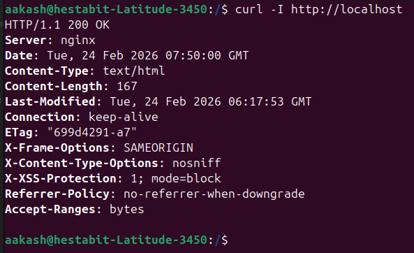
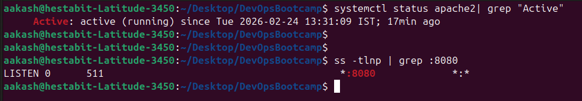
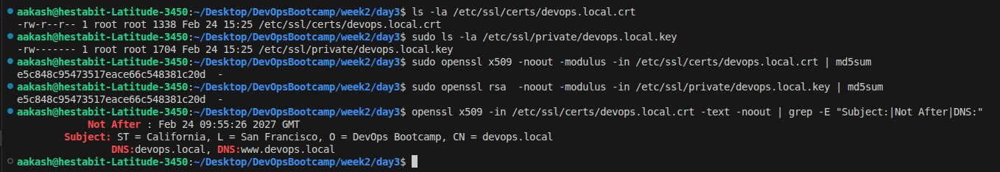
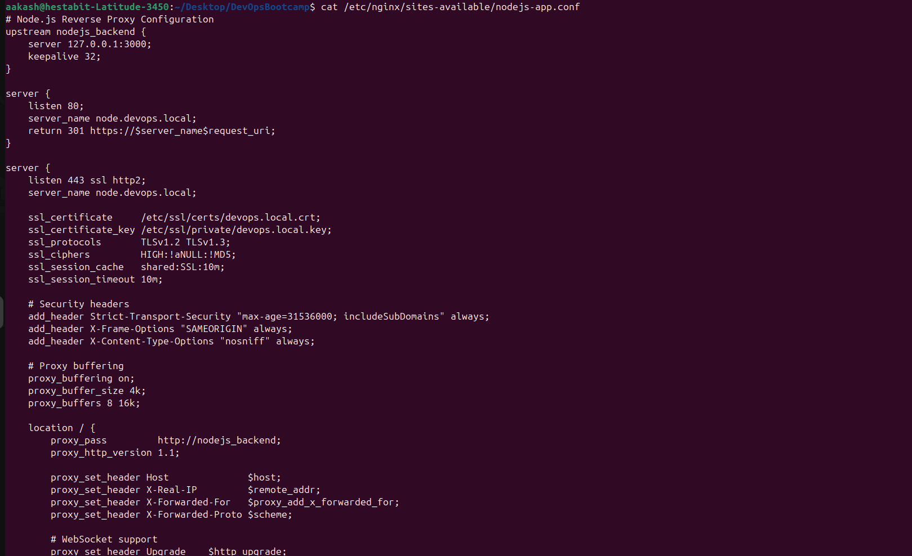
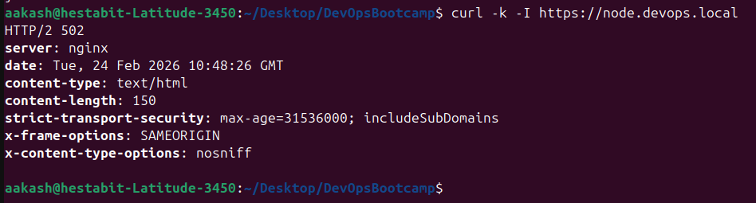
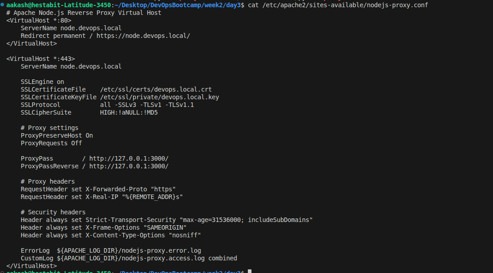
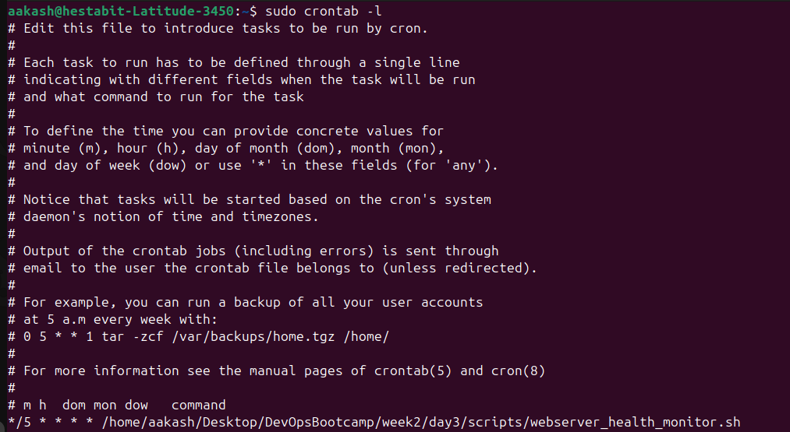
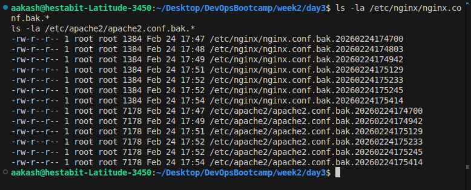
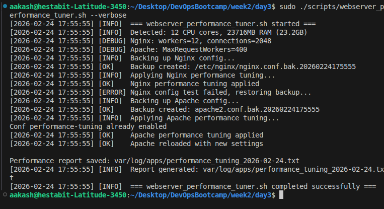
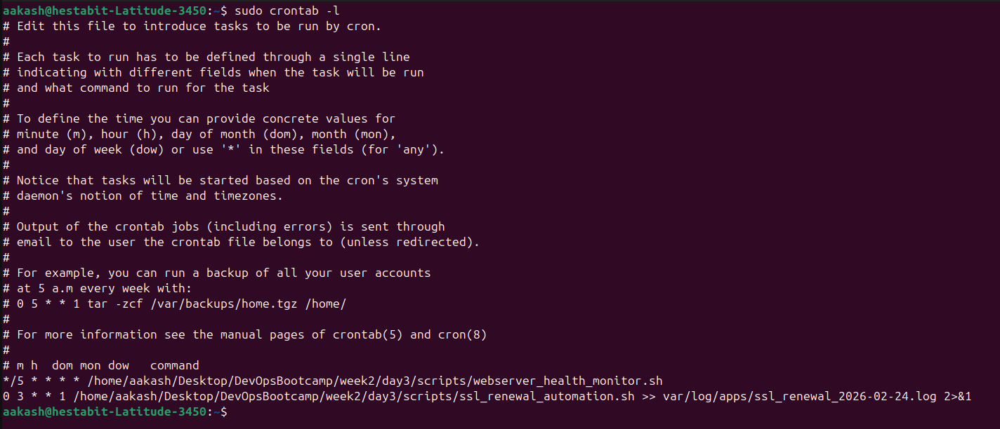

## Project Structure

```
day3/
├── scripts/
├── configs/
├── docs/
├── screenshots/
└── var/log/apps/
```

---

## Scripts

### nginx_setup.sh

- Installs Nginx latest stable version via the system package manager and captures the installed version string to display in the summary and log
- Writes a fully optimized `/etc/nginx/nginx.conf` with `worker_processes auto`, `multi_accept on`, `use epoll` event model, `sendfile on`, `tcp_nopush on`, and `server_tokens off` for both performance and security
- Enables gzip compression at level 6 with a comprehensive `gzip_types` list covering HTML, CSS, JS, JSON, XML, and SVG, with a `gzip_min_length 256` threshold to avoid compressing tiny responses
- Sets production-safe buffer values: `client_body_buffer_size`, `client_max_body_size 16m`, `client_header_buffer_size`, and `large_client_header_buffers` to handle real application traffic without hitting defaults
- Creates the full required directory structure: `/etc/nginx/sites-available/`, `/etc/nginx/sites-enabled/`, and `/var/www/html/`, matching the Debian/Ubuntu Nginx convention
- Generates a default server block on port 80 with a `try_files` directive, security headers (`X-Frame-Options`, `X-Content-Type-Options`, `X-XSS-Protection`), and a location block that denies access to hidden files
- Drops an HTML test page at `/var/www/html/index.html` so the default site returns a visible 200 response immediately after installation without any manual steps
- Configures log rotation at `/etc/logrotate.d/nginx` with daily rotation, 14-day retention, `compress`, `delaycompress`, and a `postrotate` hook that sends `USR1` to the Nginx master process for zero-downtime log file reopening
- Enables and starts the Nginx systemd service, then verifies a live HTTP 200 response using `curl -s` against `http://localhost` before printing the final summary
- Prints a structured summary block with version, status of each setup step, and overall readiness; writes all timestamped actions to `var/log/apps/nginx_setup.log`

```bash
sudo ./scripts/nginx_setup.sh
sudo ./scripts/nginx_setup.sh --verbose
```

Logs: `var/log/apps/nginx_setup.log`
Docs: [WEBSERVER_SETUP_GUIDE.md](docs/WEBSERVER_SETUP_GUIDE.md)

- Nginx is running fine


---

### apache_setup.sh

Automated Apache2 installation and module configuration script, set up on port 8080 to coexist with Nginx without port conflicts.

- Installs `apache2` and `curl` via apt and captures the installed version for logging and the summary output block
- Enables five required modules in a single pass: `mod_proxy`, `mod_proxy_http`, `mod_ssl`, `mod_rewrite`, and `mod_headers` — these are prerequisites for reverse proxying, HTTPS, URL rewriting, and header injection
- Disables `mpm_prefork` if loaded and enables `mpm_event`, the correct MPM for reverse proxy and high-concurrency scenarios — `mpm_event` handles connections with threads rather than processes, reducing memory overhead
- Writes a performance-tuned MPM event configuration drop-in with `StartServers`, `MinSpareThreads 25`, `MaxSpareThreads 75`, `ThreadsPerChild 25`, `MaxRequestWorkers 150`, and `MaxConnectionsPerChild 1000` for controlled resource use
- Sets `ServerTokens Prod` and `ServerSignature Off` globally to prevent Apache from advertising its exact version and OS in response headers and HTML error pages, reducing information leakage
- Adds `Listen 8080` to `/etc/apache2/ports.conf` conditionally (only if not already present) so Apache binds to port 8080 without interfering with Nginx on port 80
- Creates the virtual host directory structure at `/etc/apache2/sites-available/` and `/etc/apache2/sites-enabled/` in line with the Debian Apache convention
- Generates a default virtual host for port 8080 with `Options -Indexes +FollowSymLinks`, `AllowOverride All`, `Require all granted`, and security response headers via `mod_headers`
- Enables and starts the Apache2 systemd service, runs `apachectl configtest` before starting to catch configuration errors, then verifies a live response at `http://localhost:8080`
- Prints a structured summary block and writes all timestamped actions to `var/log/apps/apache_setup.log`

```bash
sudo ./scripts/apache_setup.sh
sudo ./scripts/apache_setup.sh --verbose
```

Logs: `var/log/apps/apache_setup.log`
Docs: [WEBSERVER_SETUP_GUIDE.md](docs/WEBSERVER_SETUP_GUIDE.md)

- Verifying apache status 

---

### ssl_certificate_generator.sh

Interactive SSL certificate management tool supporting self-signed generation, Let's Encrypt issuance, renewal, and certificate inventory listing.

- Presents a numbered interactive menu with five options: generate self-signed, generate Let's Encrypt, renew existing, list all certificates, and exit — with validation that rejects any input outside 1–5 and loops back to the menu
- For self-signed generation: prompts for domain, organization, country code, state, and city, then generates a 2048-bit RSA private key using `openssl genrsa` saved to `/etc/ssl/private/<domain>.key` with `600` permissions
- Creates the self-signed X.509 certificate valid for 365 days with a single `openssl req -new -x509` call, embedding both the provided subject fields and a `subjectAltName` extension covering `DNS:<domain>` and `DNS:www.<domain>`
- For Let's Encrypt: automatically installs `certbot` and `python3-certbot-nginx` if not present on the system, then runs `certbot --nginx` in fully non-interactive mode with `--agree-tos` and the provided email address
- Configures an auto-renewal cron job (`0 3 * * 1 certbot renew --quiet --post-hook 'systemctl reload nginx'`) only if one does not already exist in the root crontab, preventing duplicate entries on repeated runs
- The renewal option runs `certbot renew --quiet` with a Nginx reload post-hook, so successful renewals are applied without any manual service management
- The list option inspects every `.crt` file in `/etc/ssl/certs/` using `openssl x509 -enddate` and also calls `certbot certificates` to display Let's Encrypt managed certificates with their expiry dates
- Prints the exact file paths of generated key and certificate files immediately after creation so they can be referenced in Nginx or Apache configs without searching
- All generated key and certificate file paths, expiry dates, and operation results are written to `var/log/apps/ssl_certificate_generator.log` with timestamps

```bash
sudo ./scripts/ssl_certificate_generator.sh
sudo ./scripts/ssl_certificate_generator.sh --verbose
```

Logs: `var/log/apps/ssl_certificate_generator.log`
Docs: [SSL_CERTIFICATE_GUIDE.md](docs/SSL_CERTIFICATE_GUIDE.md)

- Verifying ssl certificate generated 

---

### nginx_reverse_proxy.sh

Generates three complete, production-ready Nginx reverse proxy configuration files for Node.js, Python, and PHP application backends, with SSL termination and HTTP-to-HTTPS enforcement.

- Accepts a `--domain` flag to set the base domain at runtime (default: `devops.local`), making the same script reusable across dev, staging, and production environments without file edits
- Checks for an existing SSL certificate at `/etc/ssl/certs/<domain>.crt` and automatically generates a 2048-bit self-signed certificate if none is found, so HTTPS configuration works immediately on first run
- Generates `nodejs-app.conf` with a named `upstream nodejs_backend` block pointing to `127.0.0.1:3000`, `keepalive 32` for connection pooling, and WebSocket upgrade headers (`Upgrade`, `Connection: upgrade`) required for Socket.IO and real-time apps
- Generates `python-app.conf` targeting `127.0.0.1:8000` (Gunicorn/uWSGI standard port) with `keepalive 16`, proxy buffering enabled, and the standard proxy header set
- Generates `php-app.conf` using `fastcgi_pass` to `127.0.0.1:9000` (PHP-FPM), including `fastcgi_param SCRIPT_FILENAME`, `HTTPS on`, and a `try_files` location block for correct PHP application routing
- Every config includes a dedicated port 80 server block that issues a `301` permanent redirect to HTTPS, ensuring all traffic is encrypted and search engines index the HTTPS version
- Every HTTPS server block configures `ssl_protocols TLSv1.2 TLSv1.3`, `ssl_ciphers HIGH:!aNULL:!MD5`, a shared `ssl_session_cache shared:SSL:10m`, and 10-minute `ssl_session_timeout` to reduce repeated handshake overhead
- Forwards `X-Real-IP`, `X-Forwarded-For`, `X-Forwarded-Proto $scheme`, and `Host $host` headers on every config so backend applications can correctly identify client IPs and know the original request was HTTPS
- Creates symlinks in `/etc/nginx/sites-enabled/` for each of the three configs, copies all files to the `configs/` folder, then runs `nginx -t` and reloads Nginx — failing loudly if the config test does not pass
- Logs all steps with timestamps to `var/log/apps/nginx_reverse_proxy.log`

```bash
sudo ./scripts/nginx_reverse_proxy.sh
sudo ./scripts/nginx_reverse_proxy.sh --domain myapp.local
sudo ./scripts/nginx_reverse_proxy.sh --verbose
```

Logs: `var/log/apps/nginx_reverse_proxy.log`
Docs: [REVERSE_PROXY_GUIDE.md](docs/REVERSE_PROXY_GUIDE.md)

- Nginx config file for NodeJS


- Response from Nginx

---

### apache_reverse_proxy.sh

Generates Apache2 reverse proxy virtual host configuration files for Node.js and Python application backends, with SSL, correct header forwarding, and security headers.

- Accepts a `--domain` flag to set the base domain at runtime (default: `devops.local`), consistent with the Nginx reverse proxy script for a matching dual-server setup
- Verifies that `proxy`, `proxy_http`, `ssl`, `rewrite`, and `headers` modules are all enabled before generating any configuration files, enabling missing ones automatically via `a2enmod`
- Checks for an existing SSL certificate and generates a 2048-bit self-signed certificate for the domain if none exists, so HTTPS virtual hosts can be activated without a separate certificate step
- Generates `nodejs-proxy.conf` with a port 80 virtual host that issues a `Redirect permanent` to HTTPS, and a port 443 virtual host with `ProxyPass /` and `ProxyPassReverse /` pointing to `http://127.0.0.1:3000/`
- Generates `python-proxy.conf` following the same dual-virtual-host structure targeting `http://127.0.0.1:8000/`, suitable for any WSGI-compatible Python application server
- Sets `ProxyPreserveHost On` in every virtual host so the backend application receives the original client-facing `Host` header rather than the proxy's own loopback address, which is critical for applications that generate absolute URLs
- Injects `RequestHeader set X-Forwarded-Proto "https"` and `RequestHeader set X-Real-IP "%{REMOTE_ADDR}s"` so backend applications can correctly detect HTTPS and identify the real client IP behind the proxy
- Applies `Strict-Transport-Security`, `X-Frame-Options "SAMEORIGIN"`, and `X-Content-Type-Options "nosniff"` response headers via `Header always set` directives on every HTTPS virtual host
- Enables both virtual host configs with `a2ensite`, runs `apachectl configtest` before reloading, copies generated configs to the `configs/` folder, and reloads Apache only if the config test passes
- Logs all steps with timestamps to `var/log/apps/apache_reverse_proxy.log`

```bash
sudo ./scripts/apache_reverse_proxy.sh
sudo ./scripts/apache_reverse_proxy.sh --domain myapp.local
sudo ./scripts/apache_reverse_proxy.sh --verbose
```

Logs: `var/log/apps/apache_reverse_proxy.log`
Docs: [REVERSE_PROXY_GUIDE.md](docs/REVERSE_PROXY_GUIDE.md)

- Apache works fine
- 
---

### nginx_load_balancer.sh

Interactive Nginx load balancer configuration generator supporting three balancing algorithms, passive health checks, a dedicated backup server, and optional sticky sessions.

- Accepts `--algorithm` (round_robin, least_conn, ip_hash), `--domain`, and `--sticky` flags so the entire configuration can be driven from CLI flags in automated pipelines without interactive prompts
- Interactively collects between 2 and 5 primary upstream server `IP:PORT` entries, validates the count is within the 2–5 range, and then collects one dedicated backup server entry
- Supports round-robin (default, no directive emitted), `least_conn` for workloads with variable request durations such as API servers and file uploads, and `ip_hash` for simple client-affinity routing without shared session storage
- Applies `max_fails=3` and `fail_timeout=30s` to every primary server entry for passive health checking: after 3 failed connection attempts within a 30-second window, the server is removed from rotation for the next 30 seconds
- Marks the collected backup server with the `backup` parameter, so it only receives traffic when every primary server is simultaneously in the failed state — ideal for a maintenance or last-resort instance
- Configures `proxy_next_upstream error timeout http_500 http_502 http_503 http_504` so Nginx transparently retries a failed request on the next available upstream before the client receives any error
- Includes a `/lb-status` location block returning `200 load-balancer-ok` that external monitoring tools, uptime checkers, or cloud load balancer health probes can use to verify the proxy layer is running
- The `--sticky` flag overrides any `--algorithm` value and forces `ip_hash`, with a clear comment written into the generated config noting that sticky sessions are active
- Writes the complete configuration to `/etc/nginx/sites-available/load-balancer.conf`, creates the `sites-enabled` symlink, copies to `configs/`, runs `nginx -t`, and reloads Nginx — stopping on any config test failure
- Logs all steps with timestamps to `var/log/apps/nginx_load_balancer.log`

```bash
sudo ./scripts/nginx_load_balancer.sh
sudo ./scripts/nginx_load_balancer.sh --algorithm least_conn
sudo ./scripts/nginx_load_balancer.sh --domain lb.myapp.local --algorithm ip_hash
sudo ./scripts/nginx_load_balancer.sh --sticky
```

Logs: `var/log/apps/nginx_load_balancer.log`
Docs: [LOAD_BALANCING_GUIDE.md](docs/LOAD_BALANCING_GUIDE.md)

- The config file is copied as `configs/load-balancer.conf`
---

### webserver_health_monitor.sh

Comprehensive health monitoring script for Nginx, Apache2, and upstream backend servers — designed to run every 5 minutes via cron and produce daily timestamped report files.

- Checks `systemctl is-active` for both `nginx` and `apache2`, logging an `[ALERT]` entry and incrementing the issue counter if either service is not active
- Verifies that ports 80 and 443 are bound for Nginx and port 8080 for Apache using `ss -tlnp`, distinguishing between a service that is started but not listening versus one that is fully down
- Measures live HTTP response time for `http://localhost` (Nginx) and `http://localhost:8080` (Apache) using `curl` with a 5-second max timeout, reporting elapsed milliseconds and the HTTP status code received
- Scans the last 100 lines of each web server's error log for `[crit]`, `[emerg]`, and `[alert]` severity entries using `grep -c`, reporting the count and logging an alert if any critical errors are found
- Reports active Nginx connection count via `ss -tnp | grep nginx | wc -l` and active Apache worker count via `ps aux | grep apache2 | wc -l`, giving a live utilisation picture relative to configured limits
- Tests every backend in the `BACKENDS` array using `nc -z` with a 3-second timeout, prints the result as UP with measured response time or DOWN with timeout, and counts each DOWN backend separately
- Accepts a `--backends` flag to override the default `BACKENDS` array at runtime without editing the script, and an `--email` flag to send an alert email via `mail` when any issue is detected during the run
- Maintains two separate counters (`ISSUES` and `BACKEND_DOWN`) and prints a context-aware status line that distinguishes between "all healthy", "only backends down", and "server-level issues detected"
- Writes every check result to both `var/log/apps/webserver_health_monitor.log` (persistent cumulative log) and a per-day `var/log/apps/webserver_health_YYYY-MM-DD.log` for isolated daily review
- Designed for fully unattended cron execution — no interactive prompts, exit code 0 on healthy and on backend-only failures, email alerts sent only when both issues exist and an address is configured

```bash
sudo ./scripts/webserver_health_monitor.sh
sudo ./scripts/webserver_health_monitor.sh --backends 10.0.0.1:3000,10.0.0.2:3000
sudo ./scripts/webserver_health_monitor.sh --email admin@example.com
sudo ./scripts/webserver_health_monitor.sh --verbose
```

Cron (every 5 minutes):
```
*/5 * * * * /path/to/webserver_health_monitor.sh
```

Logs: `var/log/apps/webserver_health_monitor.log`, `var/log/apps/webserver_health_YYYY-MM-DD.log`

- Added to cronjob

---

### webserver_performance_tuner.sh

System-aware performance optimization script that reads CPU core count and total RAM at runtime and applies correctly proportioned tuning values to both Nginx and Apache2 configurations.

- Reads `nproc` for CPU core count and `/proc/meminfo` for total RAM in MB, using real system values as the basis for all calculations rather than relying on static defaults that may not fit the target host
- Sets Nginx `worker_processes` to the exact CPU core count (equivalent to `auto` but explicit and auditable in the log) and sets `worker_connections` to 1024 for systems under 4GB RAM or 2048 for systems with 4GB or more
- Writes a `/etc/nginx/conf.d/performance.conf` drop-in with `keepalive_timeout 65`, `keepalive_requests 1000`, client body buffer size scaled to available RAM, proxy buffer sizes (`proxy_buffer_size 4k`, `proxy_buffers 8 16k`), and an `open_file_cache` configuration to reduce `stat()` syscalls on static files
- Calculates Apache `MaxRequestWorkers` using the formula `(RAM_MB × 0.8) / 25`, reserving 20% of RAM for the OS and estimating 25MB per Apache worker process, then clamping the result between 50 and 400 to avoid extremes on very small or very large hosts
- Writes an Apache `/etc/apache2/conf-available/performance-tuning.conf` drop-in with `StartServers` set to CPU core count, `MinSpareThreads`, `MaxSpareThreads`, `ThreadsPerChild`, and `MaxConnectionsPerChild` for the `mpm_event` module
- Supports `--dry-run` mode which prints all proposed Nginx and Apache changes to the terminal without writing or modifying any file, enabling review and approval before commitment
- Creates a timestamped backup copy of `/etc/nginx/nginx.conf` and `/etc/apache2/apache2.conf` before applying any changes, so rollback is a single `cp` command
- Runs `nginx -t` before reloading Nginx and `apachectl configtest` before reloading Apache — exits without applying any changes and logs the failure clearly if either test fails
- Generates a human-readable performance report at `var/log/apps/performance_tuning_YYYY-MM-DD.txt` summarising the detected system specs, all applied values with their rationale, and the timestamp
- Logs all steps with timestamps to `var/log/apps/webserver_performance_tuner.log`

```bash
sudo ./scripts/webserver_performance_tuner.sh
sudo ./scripts/webserver_performance_tuner.sh --dry-run
sudo ./scripts/webserver_performance_tuner.sh --verbose
```

Logs: `var/log/apps/webserver_performance_tuner.log`
Report: `var/log/apps/performance_tuning_YYYY-MM-DD.txt`
Docs: [PERFORMANCE_TUNING.md](docs/PERFORMANCE_TUNING.md)

- Script is running fine 
- Backups are generated for nginx and apache


- Output of the script 

---

### ssl_renewal_automation.sh

Fully automated Let's Encrypt certificate renewal script designed for weekly unattended cron execution, with expiry checking, post-renewal Nginx validation, and optional email notifications.

- Validates that `certbot` is installed before doing anything else and exits immediately with a descriptive error message if not, preventing silent failures in cron that would go unnoticed
- Calls `certbot certificates` at the start of every run to log the full inventory of managed certificates and their current status, creating a complete audit record in each run's log file
- Iterates over every domain directory under `/etc/letsencrypt/live/` and uses `openssl x509 -enddate` to extract the exact expiry date, then calculates remaining days using a Unix timestamp difference
- Triggers renewal only for certificates with fewer than `EXPIRY_THRESHOLD_DAYS` remaining (default 30), skipping valid certificates entirely to avoid unnecessary certbot API calls and rate-limit consumption
- Accepts a `--threshold` flag to change the renewal trigger window: stricter environments might use `--threshold 14`, while more conservative setups might renew at `--threshold 60`
- Runs `certbot renew --quiet --no-random-sleep-on-renew`, captures the complete output to the daily log file for audit purposes, and treats a non-zero exit code as a renewal failure
- After any successful renewal, runs `nginx -t` to verify that the updated certificate paths and configuration are valid before touching the running service, preventing a broken reload from causing downtime
- Sends email notifications via `mail` (when installed and an address is configured) for three distinct outcomes: SUCCESS with Nginx reload, WARNING if Nginx test failed post-renewal and manual review is needed, and INFO if no renewal was required
- Checks the root crontab for an existing renewal entry and adds `0 3 * * 1` only if absent, making the script idempotent and safe to run manually without creating duplicate cron jobs
- Writes all operations with timestamps to both `var/log/apps/ssl_renewal_automation.log` (persistent cumulative) and a per-run `var/log/apps/ssl_renewal_YYYY-MM-DD.log` for isolated daily auditing

```bash
sudo ./scripts/ssl_renewal_automation.sh
sudo ./scripts/ssl_renewal_automation.sh --threshold 14
sudo ./scripts/ssl_renewal_automation.sh --email admin@example.com
sudo ./scripts/ssl_renewal_automation.sh --verbose
```

Cron (weekly, Monday 3 AM):
```
0 3 * * 1 /path/to/ssl_renewal_automation.sh
```

Logs: `var/log/apps/ssl_renewal_automation.log`, `var/log/apps/ssl_renewal_YYYY-MM-DD.log`
Docs: [SSL_CERTIFICATE_GUIDE.md](docs/SSL_CERTIFICATE_GUIDE.md)

- Added to cronjobs 

---

## Configuration Files

| File | Purpose |
|------|---------|
| `configs/security_headers.conf` | HTTP security headers (HSTS, CSP, X-Frame-Options, X-Content-Type-Options, Permissions-Policy) — include inside Nginx `server {}` blocks |
| `configs/ssl_params.conf` | Mozilla Modern SSL profile: TLSv1.2/1.3 only, strong ECDHE ciphers, session cache, session tickets off, OCSP stapling |
| `configs/rate_limit.conf` | Three `limit_req_zone` definitions (api: 10r/s, login: 5r/m, web: 30r/s) and a `limit_conn_zone` — include inside the Nginx `http {}` block |
| `configs/nodejs-app.conf` | Generated Node.js Nginx reverse proxy with upstream block, WebSocket headers, SSL termination, and HTTP redirect |
| `configs/python-app.conf` | Generated Python Nginx reverse proxy with upstream block, proxy buffering, SSL termination, and HTTP redirect |
| `configs/php-app.conf` | Generated PHP FastCGI Nginx config with `fastcgi_pass`, `try_files` routing, and SSL termination |
| `configs/load-balancer.conf` | Generated Nginx upstream load balancer with configured algorithm, health check parameters, and backup server |
| `configs/nodejs-proxy.conf` | Generated Node.js Apache2 virtual host with `ProxyPass`, `ProxyPassReverse`, SSL, and security headers |
| `configs/python-proxy.conf` | Generated Python Apache2 virtual host with `ProxyPass`, `ProxyPassReverse`, SSL, and security headers |

---

## Documentation

| File | Contents |
|------|---------|
| [WEBSERVER_SETUP_GUIDE.md](docs/WEBSERVER_SETUP_GUIDE.md) | Manual step-by-step Nginx and Apache installation, module enabling, virtual host setup, and service management reference |
| [REVERSE_PROXY_GUIDE.md](docs/REVERSE_PROXY_GUIDE.md) | How reverse proxies work, key Nginx and Apache directives explained, WebSocket support, header forwarding, and how to test proxy configurations |
| [SSL_CERTIFICATE_GUIDE.md](docs/SSL_CERTIFICATE_GUIDE.md) | Self-signed certificate generation, Let's Encrypt issuance, automated renewal setup, and SSL best practices reference |
| [LOAD_BALANCING_GUIDE.md](docs/LOAD_BALANCING_GUIDE.md) | Algorithm selection guide with use cases, health check parameter explanation, backup server behaviour, and how to test and verify load distribution |
| [PERFORMANCE_TUNING.md](docs/PERFORMANCE_TUNING.md) | Explanation of every tuning parameter, the reasoning behind calculated values, and what metrics to monitor after applying changes |
| [TROUBLESHOOTING.md](docs/TROUBLESHOOTING.md) | Common Nginx, Apache, SSL, load balancer, and health monitor issues with exact diagnostic commands and step-by-step fixes |

---

## Cron Jobs

```bash
# Health monitoring every 5 minutes
*/5 * * * * /path/to/webserver_health_monitor.sh

# SSL certificate renewal every Monday at 3:00 AM
0 3 * * 1 /path/to/ssl_renewal_automation.sh
```

---

