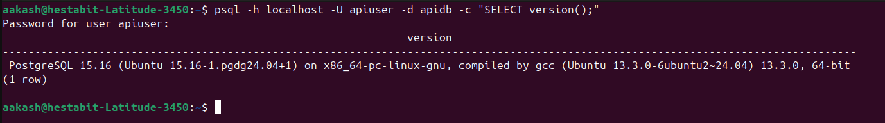
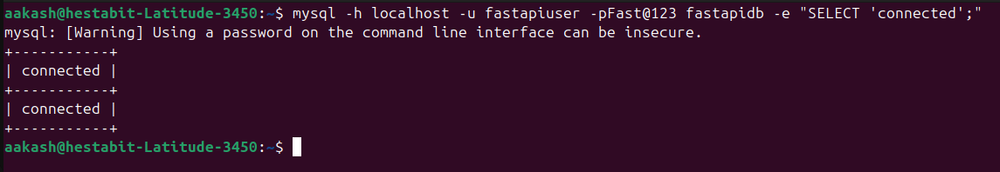
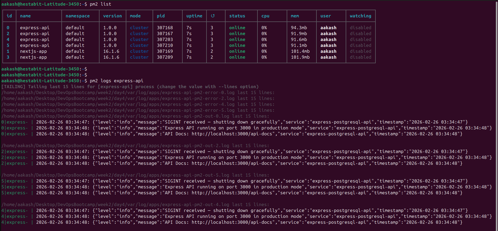
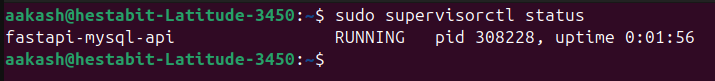
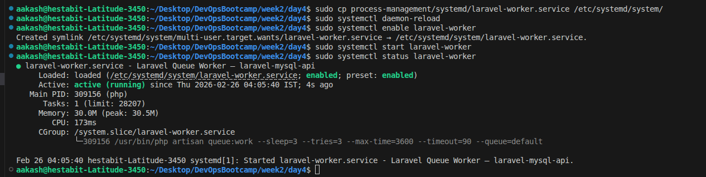
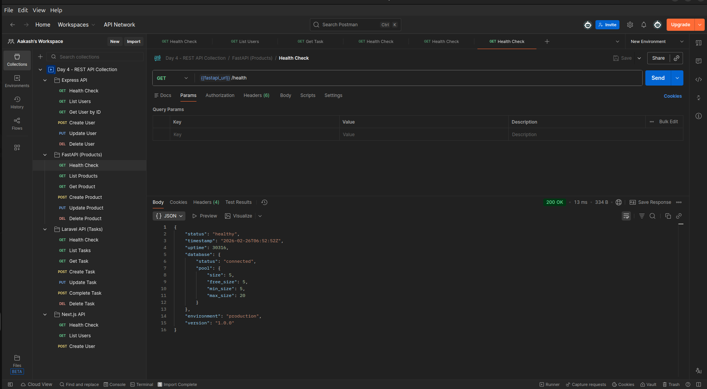

# Day 4 — Application Development, Process Management & Integration

## Project Overview

```
day4/
├── express-postgresql-api/     Node.js REST API --> PostgreSQL (PM2, cluster mode)
├── fastapi-mysql-api/          Python REST API  --> MySQL (Supervisor, 4 workers)
├── laravel-mysql-api/          PHP REST API     --> MySQL (systemd queue worker)
├── nextjs-fullstack-app/       Full-stack SSR   --> PostgreSQL (PM2, cluster mode)
├── process-management/         PM2 ecosystem, systemd services, supervisor configs
├── database-configs/           Connection pool reference configs
├── migrations/                 SQL migration files + rollback scripts
├── scripts/                    Monitoring, migration runner, log analyzer
├── docs/                       API docs, Postman collection, health check reference
├── var/log/apps/               All application log files (relative path)
└── var/reports/                Monitoring and performance reports
```

---

## Application Stack

| Project | Framework | Database | Process Manager | Port |
|---------|-----------|----------|-----------------|------|
| express-postgresql-api | Express.js | PostgreSQL | PM2 (4 instances) | 3000 |
| fastapi-mysql-api  | FastAPI | MySQL | Supervisor (4 workers) | 8000 |
| laravel-mysql-api  | Laravel  | MySQL | systemd (queue worker) | 8880 |
| nextjs-fullstack-app  | Next.js  | PostgreSQL | PM2 (2 instances) | 3001 |

---

## Quick Start


## PLEASE SETUP THE PROJECT BY RUNNING THE COMMANDS IN [ DEPLOYMENT_GUIDE](docs/DEPLOYMENT_GUIDE.md)

- **this guide has steps to setup the database users, moving the config files to correct places and steps to restart the services.**

---

- Postgresql set up 


- Set MySQL 


---


```bash

# 1. Set up each project (please see individual READMEs in specific project folders)

# 2. Run all migrations
bash scripts/run_migrations.sh

# 3. Start Node.js apps with PM2
pm2 start process-management/ecosystem.config.js --env production

# 4. Start FastAPI with Supervisor
sudo supervisorctl start fastapi-mysql-api

# 5. Start Laravel queue worker
sudo systemctl start laravel-worker

# 6. Monitor all apps
bash scripts/app_monitor.sh --verbose
```

---

## Monitoring the applications 

- pm2 is used to create multiple instances of express api and nextjs app 

- pm2 list and logging 



- using supervisor to create multiple workers of fast api



- using systemd services for laravel Queue Worker



- you can test all the apis in postman as i have attached the collection json in docs/postman_collection.json



## Key Deliverables

### API Documentation
- **Express API Swagger UI**: http://localhost:3000/api-docs
- **FastAPI Swagger UI**: http://localhost:8000/docs
- **Laravel API Swagger UI**: http://localhost:8880/api/documentation

### Health Checks
```bash
curl http://localhost:3000/api/health   # Express
curl http://localhost:8000/health       # FastAPI
curl http://localhost:8880/api/health   # Laravel
curl http://localhost:3001/api/health   # Next.js
```

### Monitoring (every 5 min via cron)
```bash
*/5 * * * * /path/to/day4/scripts/app_monitor.sh --email admin@example.com
```


---

## Documentation

| File | Purpose |
|------|---------|
| `IMPLEMENTATION_GUIDE.md` | Step-by-step setup, verification, and troubleshooting |
| `docs/API_DOCUMENTATION.md` | All endpoints with request/response examples |
| `docs/health_check_endpoints.md` | Health check reference for all apps |
| `docs/ENVIRONMENT_VARIABLES.md` | Complete env var reference for all projects |
| `docs/DEPLOYMENT_GUIDE.md` | Production deployment instructions |
| `docs/postman_collection.json` | Importable Postman collection |
| `process-management/pm2_commands.md` | PM2 command reference |

---


## Scripts 

### app_monitor.sh

- Monitors health of Express API, Next.js, FastAPI, and Laravel applications.
- Checks PM2/systemd status, ports, HTTP health endpoints, memory usage, and errors.

Generated files / paths:
- Logs: `var/log/apps/app_monitor.log`
- Reports: `var/reports/monitor_YYYY-MM-DD.log`


### log_analyzer.sh

- Analyzes recent application logs and summarizes error and warning counts.
- Generates a daily consolidated log analysis report.

Generated files / paths:
- Logs: `var/log/apps/log_analyzer.log`
- Reports: `var/reports/log_analysis_YYYY-MM-DD.txt`


### performance_check.sh

- Tests response times and throughput for application health endpoints.
- Reports average, minimum, and maximum latency.

Generated files / paths:
- Logs: `var/log/apps/performance_check.log`
- Reports: `var/reports/performance_YYYY-MM-DD_HH-MM.txt`


### run_migrations.sh

- Runs database migrations for Express (PostgreSQL), FastAPI (MySQL), and Laravel.
- Supports running all migrations or targeting a specific application.

Generated files / paths:
- Logs: `var/log/apps/run_migrations.log`
- Migrations:
  - Express: `migrations/express/`
  - FastAPI: `migrations/fastapi/`
  - Laravel: `laravel-mysql-api/database/migrations/`


### rollback_migrations.sh

- Rolls back database migrations and drops tables created by migration scripts.
- Supports rollback for all or specific applications.

Generated files / paths:
- Logs: `var/log/apps/rollback_migrations.log`
- Rollback sources:
  - Express: `migrations/express/*rollback*.sql`
  - FastAPI: `migrations/fastapi/*rollback*.sql`
  - Laravel: via `php artisan migrate:rollback`

---

## Log Locations

All logs write to `var/log/apps/` :

| App | Log Files |
|-----|-----------|
| Express API | `express-api-combined-DATE.log`, `express-api-error-DATE.log` |
| FastAPI | `fastapi-access.log`, `fastapi-supervisor-*.log` |
| Laravel | `storage/logs/laravel-DATE.log`, `storage/logs/worker.log` |
| Next.js | `nextjs-pm2-out.log`, `nextjs-pm2-error.log` |
| Monitoring | `app_monitor.log`, `monitor_DATE.log` |
