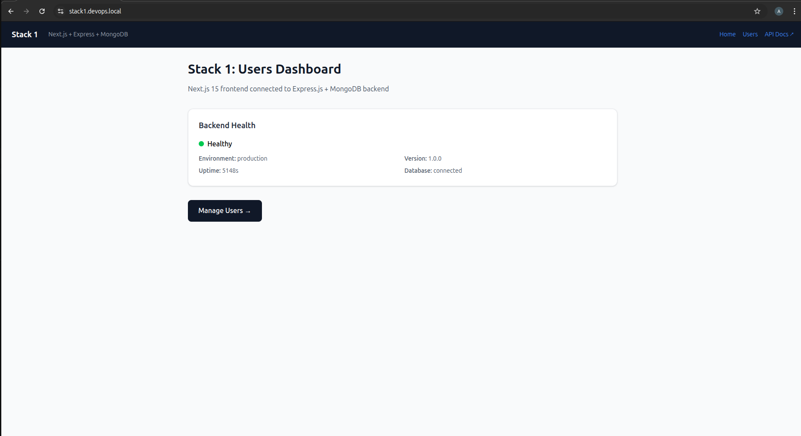
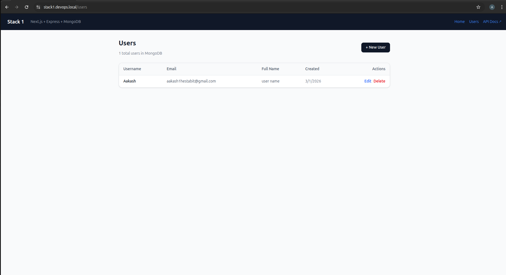
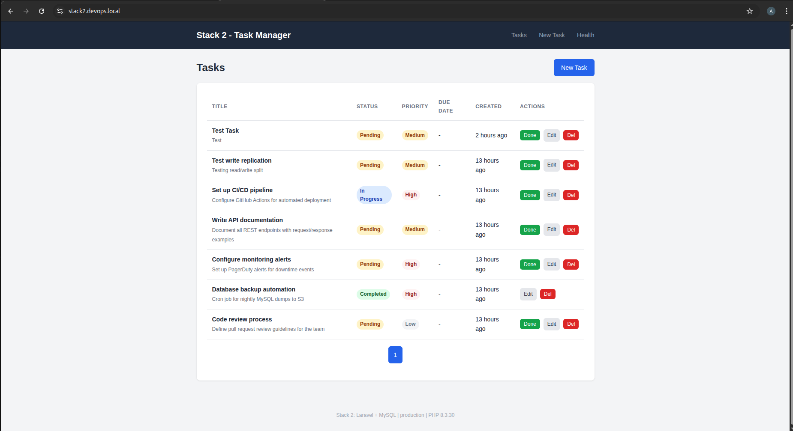
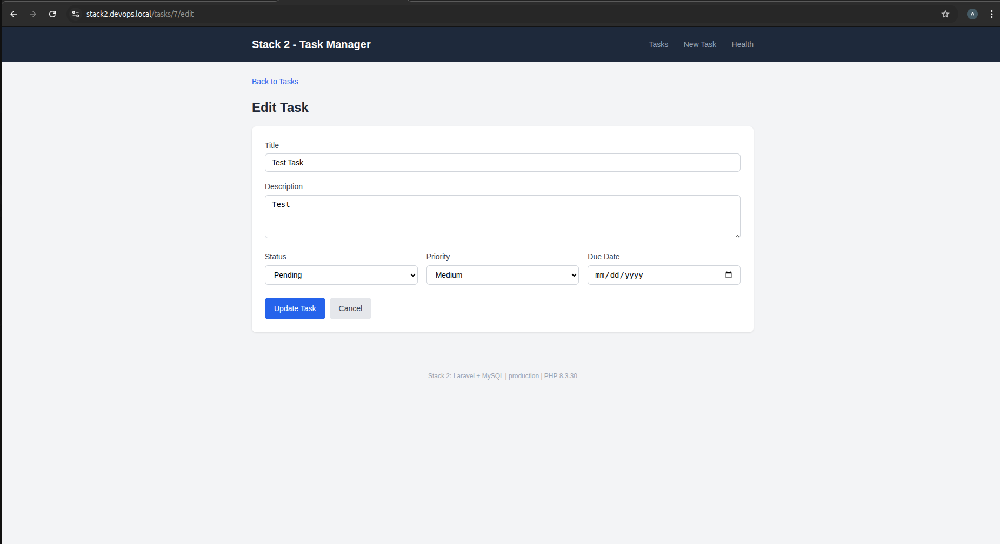
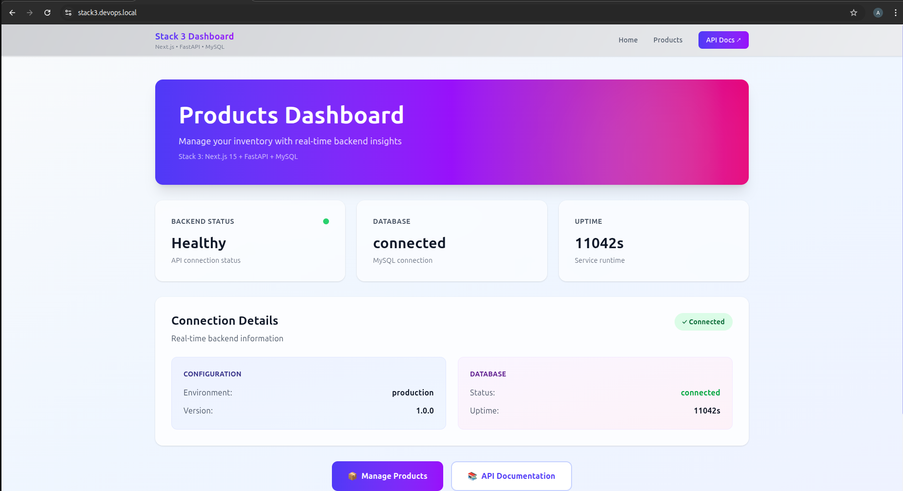
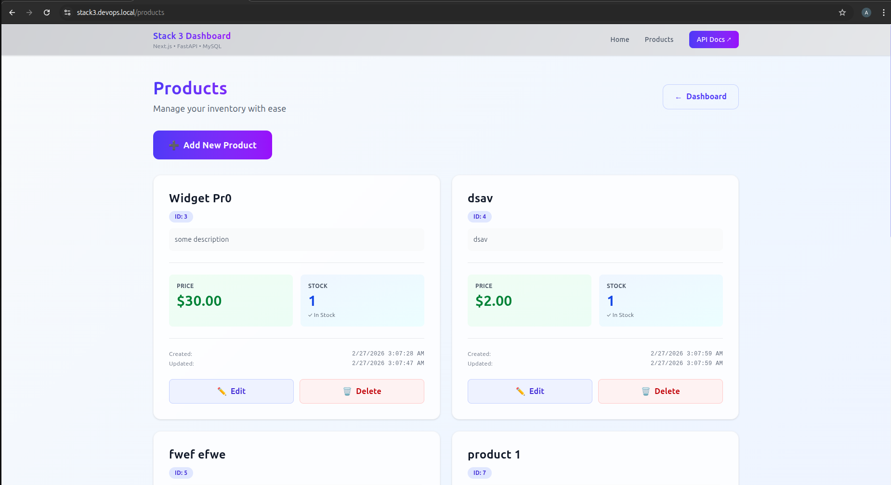
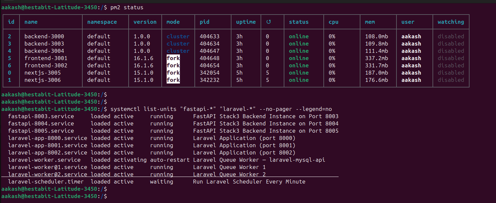
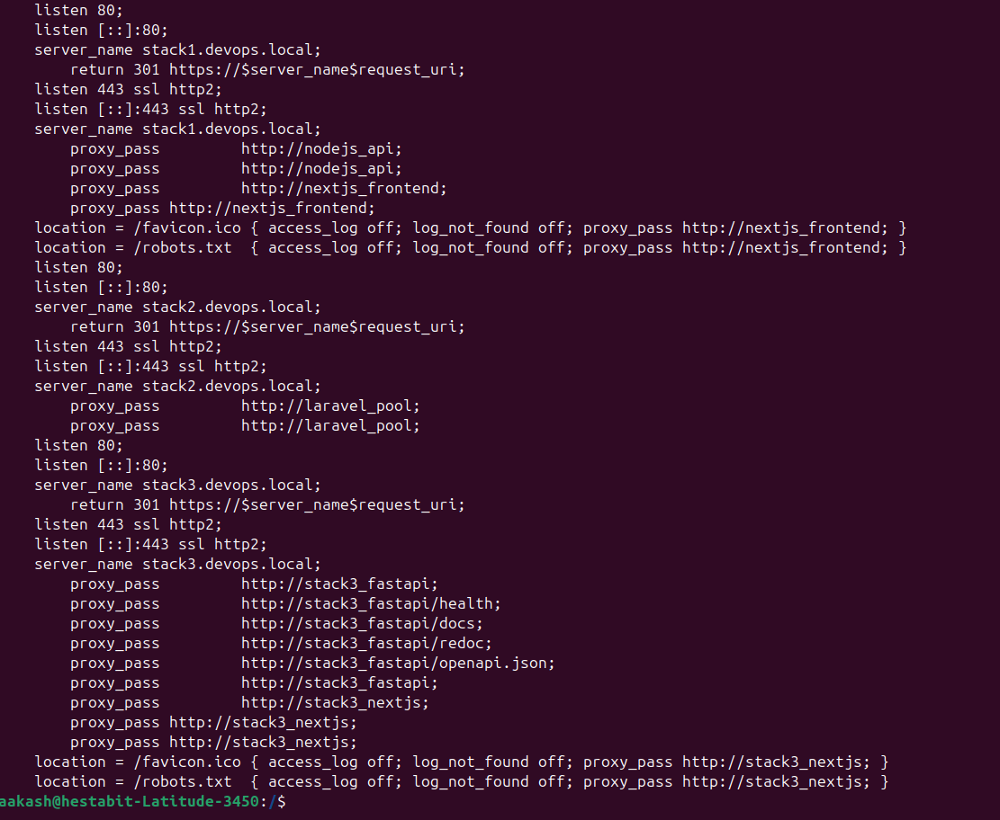

# Week 2 Day 5 — Full-Stack Multi-Application Deployment

Production deployment of **3 full-stack applications** on a single Ubuntu Linux host, each with its own reverse proxy, SSL, load balancer pool, database layer, and process manager. All stacks run simultaneously without port conflicts.

**Author:** Aakash  
**Date:** 2026-03-02

---

## Quick Start

```bash
# Deploy all stacks
cd stack1_next_node_mongodb && sudo bash deploy_stack1.sh --full && cd ..
cd stack2_laravel_mysql_api && sudo bash deploy_stack2.sh --full && cd ..
cd stack3_next_fastapi_mysql && sudo bash deploy_stack3.sh --full && cd ..

# Verify everything is healthy
./health_check_all_stacks.sh --level all

# Open real-time monitoring dashboard
./monitoring_dashboard.sh

# Run load tests (quick, ~3 min total)
./load_test_runner.sh --quick
```

---

## Architecture Overview

All three stacks share the same physical host. Nginx acts as the entry point for every stack — terminating SSL, routing by domain name, and load-balancing across backend pools. Each stack is completely isolated at the application and database level.

```
Browser / curl
      │
      ▼
┌─────────────────────────────────────────────────────────────────┐
│                         Nginx (host)                            │
│  :80  → 301 HTTPS redirect (all domains)                        │
│  :443 → SSL termination + reverse proxy + load balancing        │
│                                                                 │
│  stack1.devops.local ──────────────► Stack 1 pool               │
│  stack2.devops.local ──────────────► Stack 2 pool               │
│  stack3.devops.local ──────────────► Stack 3 pool               │
└─────────────────────────────────────────────────────────────────┘
      │                   │                   │
      ▼                   ▼                   ▼
  [Stack 1]           [Stack 2]           [Stack 3]
  Next.js +           Laravel +           Next.js +
  Express.js +        MySQL               FastAPI +
  MongoDB RS          Master/Slave        MySQL
```

---

## Stack 1 — Next.js + Express.js + MongoDB

**Domain:** `https://stack1.devops.local`  
**Use case:** User management app — SSR frontend talks to a horizontally-scaled Express.js REST API, backed by a MongoDB replica set for high availability.

### Architecture Diagram

```
              stack1.devops.local
                      │
               Nginx (HTTPS :443)
               ┌──────┴──────┐
               │             │
         /api/* routes    / routes
         (least_conn)   (round-robin)
               │             │
    ┌──────────┤             ├──────────┐
    │          │             │          │
Express.js  Express.js   Next.js    Next.js
 :3000 (PM2) :3003 (PM2) :3001 (PM2) :3002 (PM2)
   Express.js :3004 (PM2)
    │
    ├── writes ──► MongoDB Primary   :27017
    └── reads  ──► MongoDB Secondary :27018
                   MongoDB Arbiter   :27019 (vote only)
```

### Components

| Component | Count | Ports | Process Manager | Role |
|-----------|-------|-------|-----------------|------|
| Express.js API | 3 | 3000, 3003, 3004 | PM2 (`backend-3000/3003/3004`) | REST API, auth, data |
| Next.js SSR | 2 | 3001, 3002 | PM2 (`frontend-3001/3002`) | Server-rendered UI |
| MongoDB Primary | 1 | 27017 | systemd (`mongod`) | All writes, RS elections |
| MongoDB Secondary | 1 | 27018 | systemd (`mongod`) | Read-scaling replica |
| MongoDB Arbiter | 1 | 27019 | systemd (`mongod`) | Tie-breaking vote only |

### Key Design Decisions

- **3 Express.js instances behind `least_conn`**: Requests always go to the node handling the fewest active connections. The API layer is fully stateless (JWT auth), so any instance can handle any request.
- **2 Next.js instances for SSR redundancy**: If one instance crashes, Nginx immediately routes all traffic to the other. No user-visible downtime.
- **MongoDB Replica Set instead of standalone**: Automatic failover if the primary goes down — the secondary is elected primary within ~10 seconds. The arbiter keeps quorum without storing data (saves disk).
- **Reads from secondary**: Express uses a `secondaryPreferred` read preference for GET queries, freeing the primary for writes and reducing its load under read-heavy traffic.

---

## Stack 2 — Laravel + MySQL

**Domain:** `https://stack2.devops.local`  
**Use case:** Task management app — Blade-rendered frontend with a REST API, queue-driven background jobs, and a MySQL read/write split.

### Architecture Diagram

```
              stack2.devops.local
                      │
               Nginx (HTTPS :443)
               ip_hash (session stickiness)
               ┌───────┬───────┐
               │       │       │
          Laravel   Laravel  Laravel
          :8000      :8001    :8002
          (systemd)  (systemd)(systemd)
               │       │       │
               └───────┴───────┘
                       │
             ┌─────────┴────────┐
             │ writes           │ reads
             ▼                  ▼
       MySQL Master         MySQL Slave
         :3306                :3307
      (laraveldb)         (replicates from master)

  Queue Workers (2×, systemd)
  laravel-worker@1  ──► jobs table on MySQL :3306
  laravel-worker@2  ──► jobs table on MySQL :3306

  Scheduler (systemd timer)
  laravel-scheduler ──► php artisan schedule:run (every minute)
```

### Components

| Component | Count | Ports | Process Manager | Role |
|-----------|-------|-------|-----------------|------|
| Laravel app | 3 | 8000, 8001, 8002 | systemd (`laravel-app@{1,2,3}`) | HTTP, Blade views, API |
| Queue worker | 2 | — | systemd (`laravel-worker@{1,2}`) | Background jobs |
| Scheduler | 1 | — | systemd timer (`laravel-scheduler`) | Cron-like task runner |
| MySQL Master | 1 | 3306 | systemd (`mysql`) | All writes |
| MySQL Slave | 1 | 3307 | systemd (`mysql`) | Reads, hot standby |

### Key Design Decisions

- **`ip_hash` load balancing**: Laravel stores sessions on the filesystem by default. `ip_hash` ensures a given client always lands on the same Laravel instance, preventing session mismatch without needing a Redis session store.
- **Read/write split via `.env`**: `DB_HOST=127.0.0.1:3306` handles writes; `DB_READ_HOST=127.0.0.1:3307` handles reads. Laravel's database config uses separate read/write connections automatically — zero code changes needed in the application.
- **Queue workers as systemd units**: Workers run as independent services. If a worker crashes, systemd restarts it within 5 seconds. Background jobs (emails, reports, notifications) are fully decoupled from the web request lifecycle.
- **TrustProxies middleware** (`bootstrap/app.php`): Tells Laravel to trust Nginx's `X-Forwarded-Proto` header. Without this, Laravel generates `http://` URLs in forms — causing POST→GET redirect bugs when Nginx enforces HTTPS.

---

## Stack 3 — Next.js + FastAPI + MySQL

**Domain:** `https://stack3.devops.local`  
**Use case:** Product catalog — an async Python API with connection pooling serves a Next.js SSR frontend. Shares the MySQL server with Stack 2 but on an isolated database and user.

### Architecture Diagram

```
              stack3.devops.local
                      │
               Nginx (HTTPS :443)
               ┌──────┴──────┐
               │             │
         /api/* routes    / routes
         (least_conn)   (round-robin)
               │             │
    ┌──────────┤             ├──────────┐
    │          │             │          │
  FastAPI    FastAPI      Next.js    Next.js
  :8003       :8004/:8005  :3005 (PM2) :3006 (PM2)
  (4 workers) (systemd)
  (systemd)
      │
      │  SQLAlchemy async (pool min=5, max=20)
      ▼
  MySQL :3306 → database: fastapidb
  user: fastapiuser (isolated from Stack 2)
```

### Components

| Component | Count | Ports | Process Manager | Role |
|-----------|-------|-------|-----------------|------|
| FastAPI (uvicorn) | 3 | 8003, 8004, 8005 | systemd (`fastapi-app@{1,2,3}`) | Async REST API |
| Uvicorn workers (per instance) | 4 | — | uvicorn `--workers 4` | Parallel request handling |
| Next.js SSR | 2 | 3005, 3006 | PM2 (`nextjs-3005/3006`) | Server-rendered UI |
| MySQL (shared) | 1 | 3306 | systemd (`mysql`) | Products DB (`fastapidb`) |

### Key Design Decisions

- **FastAPI with async SQLAlchemy**: Queries don't block the event loop. A single uvicorn instance can serve multiple in-flight requests while waiting for the DB, making it significantly more efficient under I/O-heavy load compared to synchronous frameworks.
- **4 uvicorn workers per instance**: Gives 3 × 4 = 12 concurrent worker processes across the pool. Tune up if CPU (not I/O) becomes the bottleneck.
- **Shared MySQL server, isolated database**: Stack 3 uses the same `mysqld` as Stack 2, but `fastapiuser` has permissions only on `fastapidb`. There is no risk of data leakage between stacks, and we avoid the overhead of running a second MySQL instance.
- **Connection pool (min=5, max=20, recycle=3600s)**: Keeps warm connections to avoid TCP handshake overhead on every request. The 1-hour recycle prevents stale connection issues from MySQL's `wait_timeout`.
- **Mixed process managers**: Next.js runs under PM2 (idiomatic for Node.js tooling), while FastAPI runs under systemd units. Both are covered by the same health check and monitoring scripts.

---

## Shared Infrastructure

### Nginx

| Config | Stack | LB Algorithm | Session Handling |
|--------|-------|--------------|-----------------|
| `stack1.conf` | Stack 1 | `least_conn` (API), round-robin (web) | Stateless |
| `stack2.conf` | Stack 2 | `ip_hash` | Sticky (filesystem sessions) |
| `stack3.conf` | Stack 3 | `least_conn` (API), round-robin (web) | Stateless |

All configs share: TLS 1.2/1.3 only, HSTS (1 year), security headers (X-Frame-Options, X-Content-Type-Options, Referrer-Policy), passive health checks (`max_fails=3 fail_timeout=30s`), and gzip compression.

### SSL / TLS

Each stack has its own local Certificate Authority. Certificates are CA-signed (not self-signed) so browsers trust them without a warning once the CA is installed. All certificates include Subject Alternative Names (SAN).

| Stack | CA Name | SAN Entries | Cert Validity |
|-------|---------|-------------|--------------|
| Stack 1 | DevOpsBootcamp Local CA | `stack1.devops.local`, `localhost`, `127.0.0.1` | 825 days |
| Stack 2 | Stack2 Local CA | `stack2.devops.local`, `localhost`, `127.0.0.1` | 825 days |
| Stack 3 | Stack3 Local CA | `stack3.devops.local`, `localhost`, `127.0.0.1` | 825 days |

### Port Allocation

```
Nginx:      :80   (HTTP → HTTPS redirect, all domains)
            :443  (HTTPS, routed by server_name)

Stack 1:    :3000  :3003  :3004   Express.js API instances
            :3001  :3002          Next.js SSR instances
            :27017 :27018 :27019  MongoDB RS (primary, secondary, arbiter)

Stack 2:    :8000  :8001  :8002   Laravel app instances
            :3306                 MySQL Master
            :3307                 MySQL Slave

Stack 3:    :8003  :8004  :8005   FastAPI/uvicorn instances
            :3005  :3006          Next.js SSR instances
            :3306                 MySQL (shared, db: fastapidb)

Shared:     :6379                 Redis cache
```

### Redis Caching

Redis runs as a shared caching layer. Each stack uses its own key prefix to avoid collisions.

| Stack | Client Library | Key Prefix | Use Case |
|-------|---------------|------------|----------|
| Stack 1 | `ioredis` (Node.js) | `s1:` | API response cache |
| Stack 2 | Laravel Cache facade | `s2:` | Query result cache |
| Stack 3 | `aioredis` (Python async) | `s3:` | Product list cache |

### Centralized Logging

rsyslog collects logs from all stacks into `/var/log/centralized/`. Set up with `sudo ./centralized_logging_setup.sh`.

```
/var/log/centralized/
├── nginx/         stack1/2/3-access.log, error.log
├── stack1/        nodejs-api/express.log, nextjs-app/nextjs.log, mongodb/mongod.log
├── stack2/        laravel/application.log, laravel/worker.log, mysql/mysql.log
└── stack3/        fastapi/uvicorn.log, nextjs/nextjs.log
```

---

## Load Testing

```bash
# Quick validation (~3 min total for all 3 stacks)
./load_test_runner.sh --quick

# Full test — single stack (~5 min)
./load_test_runner.sh --stack 2

# Full test — all stacks (~15 min)
./load_test_runner.sh
```

| Mode | ab | wrk | Artillery (per stack) | Total (all stacks) |
|------|----|-----|-----------------------|--------------------|
| `--quick` | 1 pass: c=50, n=500 | 4t/50c/10s | 2 min (15+30+60+15s) | ~3 min |
| full | 2 passes: c=50/100 | 4t/50c+100c/20s each | 2 min | ~15 min |

Results are written to `load_testing/stack{1,2,3}_{apache_bench,wrk,artillery}.txt`. A summary table with RPS, p95 latency, and error rate prints to the terminal at the end.

---

## Directory Structure

```
week2/day5/
├── stack1_next_node_mongodb/     # Stack 1: Next.js + Express + MongoDB
│   ├── deploy_stack1.sh
│   ├── health_check_stack1.sh
│   ├── nginx/stack1.conf
│   ├── pm2/ecosystem.config.js
│   ├── mongodb-replicaset/
│   └── README.md
│
├── stack2_laravel_mysql_api/     # Stack 2: Laravel + MySQL
│   ├── deploy_stack2.sh
│   ├── health_check_stack2.sh
│   ├── nginx/stack2.conf
│   ├── systemd/                  # 3 app + 2 worker + 1 scheduler units
│   ├── mysql/                    # Master/slave configs
│   └── README.md
│
├── stack3_next_fastapi_mysql/    # Stack 3: Next.js + FastAPI + MySQL
│   ├── deploy_stack3.sh
│   ├── health_check_stack3.sh
│   ├── nginx/stack3.conf
│   ├── systemd/                  # 3 FastAPI service units
│   └── README.md
│
├── health_check_all_stacks.sh    # Multi-level health check (all stacks)
├── load_test_runner.sh           # Load testing suite (ab, wrk, Artillery)
├── caching_setup.sh              # Redis caching setup
├── rollback.sh                   # Universal rollback
├── zero_downtime_deploy.sh       # Blue-Green deployment
├── centralized_logging_setup.sh  # Log aggregation
├── monitoring_dashboard.sh       # Real-time TUI dashboard
├── performance_optimizer.sh      # System + app performance tuning
│
├── load_testing/                 # Artillery configs + test results
├── caching/                      # Redis + integration files
├── optimization/                 # Nginx + sysctl tuning configs
├── monitoring/                   # Uptime monitor, alerting, metrics
├── logging/                      # rsyslog + logrotate configs
├── configs/                      # Collected configs (29 files, indexed)
├── performance_reports/          # Baseline + optimized benchmark reports
└── docs/                         # Full documentation set
```

---

## Scripts Reference

| Script | Purpose | Usage |
|--------|---------|-------|
| `health_check_all_stacks.sh` | Multi-level health check | `./health_check_all_stacks.sh --level all` |
| `load_test_runner.sh` | Load testing suite | `./load_test_runner.sh --quick` |
| `caching_setup.sh` | Redis + app caching | `sudo ./caching_setup.sh` |
| `rollback.sh` | Rollback to previous state | `./rollback.sh --stack 1 --auto` |
| `zero_downtime_deploy.sh` | Blue-Green deployment | `sudo ./zero_downtime_deploy.sh --stack 1` |
| `centralized_logging_setup.sh` | Log aggregation setup | `sudo ./centralized_logging_setup.sh` |
| `monitoring_dashboard.sh` | Real-time dashboard | `./monitoring_dashboard.sh` |
| `performance_optimizer.sh` | Performance tuning | `sudo ./performance_optimizer.sh --dry-run` |
| `collect_configs.sh` | Collect all configs | `./collect_configs.sh` |

---

## Documentation

| Document | Description |
|----------|-------------|
| [Deployment Guide](docs/DEPLOYMENT_GUIDE.md) | Full deployment walkthrough for all 3 stacks |
| [Performance Report](docs/PERFORMANCE_REPORT.md) | Benchmark results before and after optimization |
| [Troubleshooting Guide](docs/TROUBLESHOOTING_GUIDE.md) | Common issues and emergency procedures |
| [Scaling Recommendations](docs/SCALING_RECOMMENDATIONS.md) | Vertical and horizontal scaling strategies |
| [Monitoring Guide](docs/MONITORING_GUIDE.md) | Tools, dashboards, and alerting setup |
| [Zero-Downtime Deployment](docs/ZERO_DOWNTIME_DEPLOYMENT.md) | Blue-Green deployment strategy |
| [Rollback Procedures](docs/ROLLBACK_PROCEDURES.md) | Backup and rollback workflows |
| [Caching Strategy](docs/CACHING_STRATEGY.md) | Three-layer caching architecture |
| [Implementation Guide](IMPLEMENTATION_AND_UNDERSTANDING.md) | Deep-dive: every script explained |

---

## Screenshots 

### stack1

- stack1 landing page 


- stack1 crud page 


## stack2 
- stack2 landing page


- stack2 edit and create page


## stack3 
- stack3 landing page 


- product list, create and edit 


## services 
- PM2 and systemd services are running 


- all the three stacks are configured with nginx and are active 


it can be verified by looking at the scrrenshots that the SSL/TLS is working properly and the browser is marking the site as secure 