## `docker_installer.sh`

- Log file - `var/log/apps/docker_installer.log`

- Installed Docker Engine from the official Docker APT repository.
- Enabled and started Docker service using systemctl.
- Added specified user to docker group for non-root access.
- Verified installation using `docker --version` and `docker version`.
- Configured Docker daemon logging driver as `json-file`.
- Applied log rotation limits (max-size 10m, max-file 3).
- Implemented structured logging within the script.
- Included argument parsing with help option support.

- Installation verification
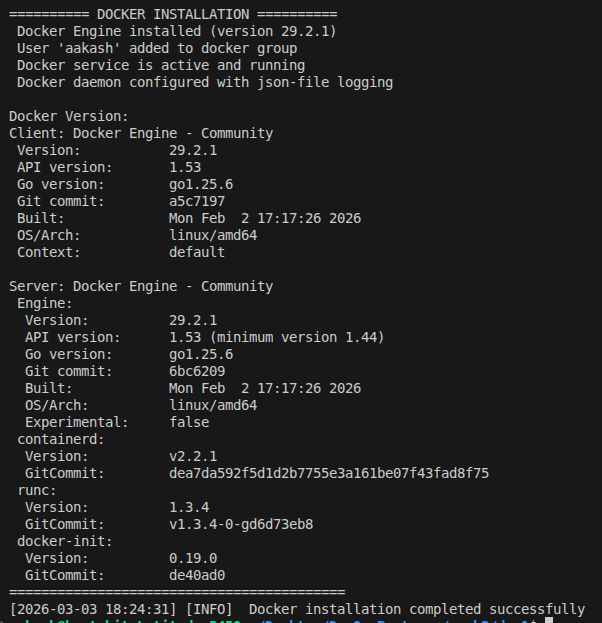

--- 
---

## Create Dockerfile for Node.js application (basic)

- Application file -- `server.js`
- Package file -- `package.json`
- Dockerfile -- `basic_express_app/Dockerfile` (copied to `all-dockerfiles/1-express-basic.Dockerfile`)

- Created a basic Express.js app listening on port 3000.
- Wrote Dockerfile using `node:20-alpine` base image.
- Set working directory to `/app`.
- Copied `package.json` and installed production dependencies.
- Copied source code into container.
- Exposed port 3000.
- Defined `CMD ["node", "server.js"]`.
- Built Docker image using `docker build`.
- Ran container using `docker run -p 3000:3000`.
- Verified application at `http://localhost:3000`.

#### verification

- Docker image build output
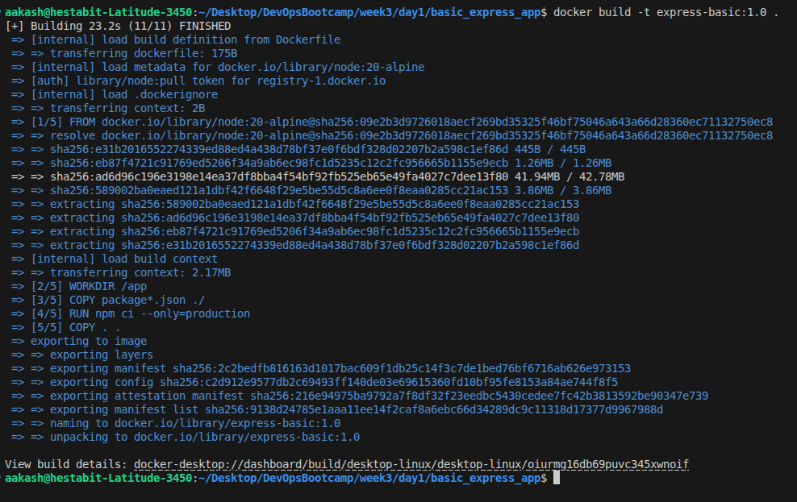
- Running container
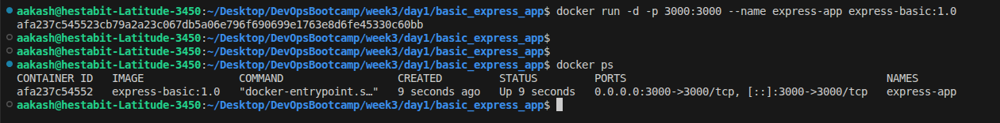
- Browser output 
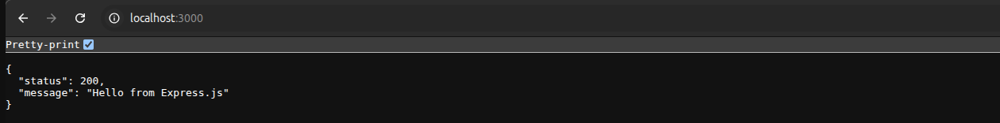

---
---

## Implement multi-stage Dockerfile for Node.js

created a TypeScript-based Node.js application built using Express with basic routes for root, hello, and health check.  
The application is compiled to JavaScript using `tsc` and runs the production build from the generated `dist/` directory.

- **Multi-stage Dockerfile:** `basic_ts_app/Dockerfile` (copied to `all-dockerfiles/2-nodejs-typescript-multistage.Dockerfile`)
- **Single-stage Dockerfile:** `basic_ts_app/Dockerfile.single` (copied to `all-dockerfiles/3-nodejs-typescript-singlestage.Dockerfile`)
- Created a **multi-stage Dockerfile** with:
  - **Stage 1 (builder):**
    - Installed all dependencies (including devDependencies).
    - Executed `npm run build` to generate compiled output (`dist/`).
  - **Stage 2 (production):**
    - Installed only production dependencies (`--only=production`).
    - Copied compiled artifacts (`dist/`) from builder stage.
    - Excluded TypeScript source code and devDependencies.
- Built both images for comparison.
- Compared final image sizes using `docker images`.

#### Image Size Comparison

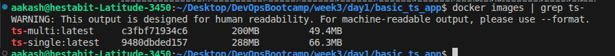

Size Reduction:

((288 - 200) / 288) * 100 = 30.5%

#### Key Differences

Single-Stage Image:
- Contains TypeScript compiler
- Includes devDependencies
- Includes full source code
- Larger image size

Multi-Stage Image:
- Contains only production dependencies
- Includes compiled JavaScript (`dist/`)
- Excludes devDependencies and build tools
- Smaller and optimized for production

---
---

## Implement Multi-Stage Dockerfile for FastAPI (Python)

Created a lightweight FastAPI application with basic root and health check endpoints.  
The application is containerized using a multi-stage Docker build based on `python:3.11-slim`.

- **Multi-stage Dockerfile:** `fastapi-app/Dockerfile` (copied to `all-dockerfiles/4-fastapi-python-multistage.Dockerfile`)
- **Single-stage Dockerfile:** `fastapi-app/Dockerfile.single` (copied to `all-dockerfiles/5-fastapi-python-singlestage.Dockerfile`)
- Created a **multi-stage Dockerfile** with:
  - **Stage 1 (build):**
    - Installed dependencies from `requirements.txt`.
    - Prepared Python packages in an isolated build layer.
  - **Stage 2 (runtime):**
    - Copied only installed dependencies from build stage.
    - Copied application source code.
    - Configured `uvicorn` with workers.
    - Created and used a non-root user for security.
- Built both images for comparison.
- Tested application locally on port 8000.
- Compared final image sizes using `docker images`.

- Application Build

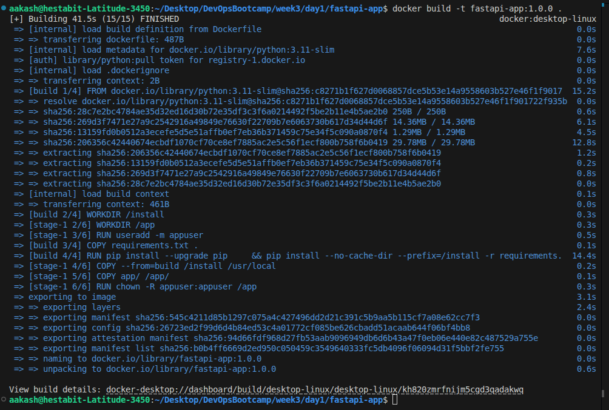

- Application Running Locally

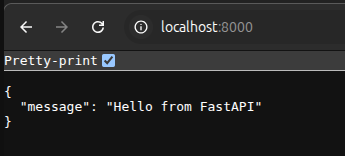

- Image Size Comparison

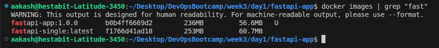

Size Reduction:

((253 - 236) / 253) * 100 = 6.7%

#### Key Differences

Single-Stage Image:
- Installs dependencies directly in runtime image.
- Larger final image.
- No separation of build and runtime layers.

Multi-Stage Image:
- Separates dependency installation and runtime.
- Copies only required runtime components.
- Uses non-root user for better security.
- Optimized and cleaner production image.

---
---

## Implement Multi-Stage Dockerfile for Static Website (Nginx)

Created a lightweight React SPA and containerized it using a multi-stage Docker build.  
The application is built using Node.js and served using a minimal `nginx:alpine-slim` runtime image.

- **Dockerfile:** `static-spa/Dockerfile` (copied to `all-dockerfiles/6-static-spa-optimized.Dockerfile`)
- **Stage 1 (builder):**
  - Used `node:20-alpine`.
  - Installed dependencies using `npm ci`.
  - Built optimized production assets using `npm run build`.
- **Stage 2 (production):**
  - Used `nginx:1.29.5-alpine-slim`.
  - Removed default nginx configuration.
  - Added custom `nginx.conf` to support SPA routing.
  - Copied build artifacts (`dist/`) to `/usr/share/nginx/html`.
- Exposed port `80` and configured nginx to run in foreground.
- Built and tested container locally.

#### Docker Image Build

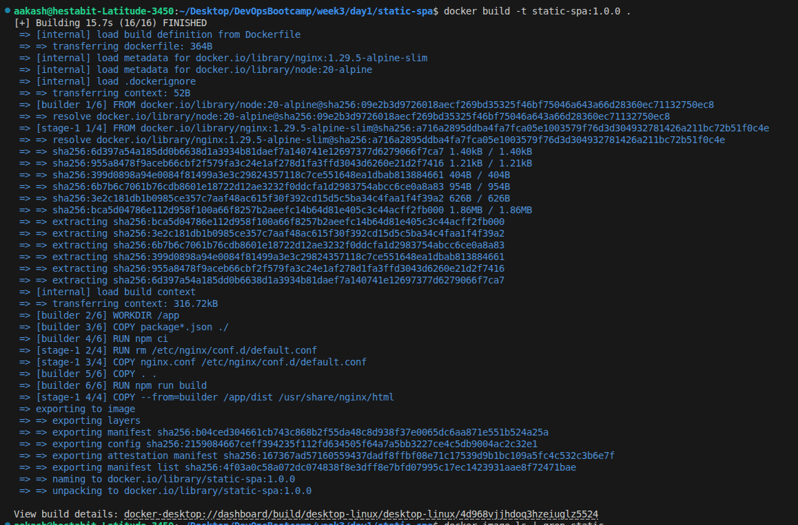

#### Image Size Verification

The final optimized image size was verified using `docker image ls`.

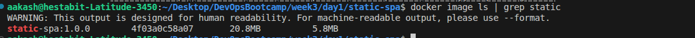

| Image | Unpacked Size | Compressed Size |
|------|---------------|----------------|
| static-spa:1.0.0 | 20.8MB | 5.8MB |

---
---

---
---

## All Dockerfiles Reference

All Dockerfiles from day1 projects are centralized in the `all-dockerfiles/` directory :

| # | Filename | Original Location | Description |
|---|----------|------------------|-------------|
| 1 | `1-express-basic.Dockerfile` | `basic_express_app/` | Basic Express.js app with Node.js Alpine |
| 2 | `2-nodejs-typescript-multistage.Dockerfile` | `basic_ts_app/` | TypeScript Express app - Multi-stage (optimized) |
| 3 | `3-nodejs-typescript-singlestage.Dockerfile` | `basic_ts_app/` | TypeScript Express app - Single-stage (baseline) |
| 4 | `4-fastapi-python-multistage.Dockerfile` | `fastapi-app/` | FastAPI Python app - Multi-stage (optimized) |
| 5 | `5-fastapi-python-singlestage.Dockerfile` | `fastapi-app/` | FastAPI Python app - Single-stage (baseline) |
| 6 | `6-static-spa-optimized.Dockerfile` | `static-spa/` | React SPA - Nginx |

---
---

## Container Management Practice

Practiced common Docker container management operations using the `express-basic:1.0` image built on a Node.js Alpine base.

- Ran a container in **detached mode** with a custom name using `docker run -d --name webapp express-basic:1.0`.
- Verified running containers using `docker ps`.
- Executed commands inside the running container using `docker exec -it webapp /bin/sh` (Alpine images use `sh` instead of `bash`).
- Inspected container filesystem and OS details (`cat /etc/os-release`, `ls`).
- Viewed container logs in real time using `docker logs -f --tail=100 webapp`.
- Inspected container configuration and metadata using `docker inspect`.
- Retrieved container network IP using:
  - `docker inspect webapp | jq`
  - `docker inspect -f '{{range .NetworkSettings.Networks}}{{.IPAddress}}{{end}}' webapp`
- Practiced container lifecycle management:
  - `docker pause`
  - `docker unpause`
  - `docker stop`
  - `docker start`
  - `docker rm -f`

#### Run Container in Detached Mode

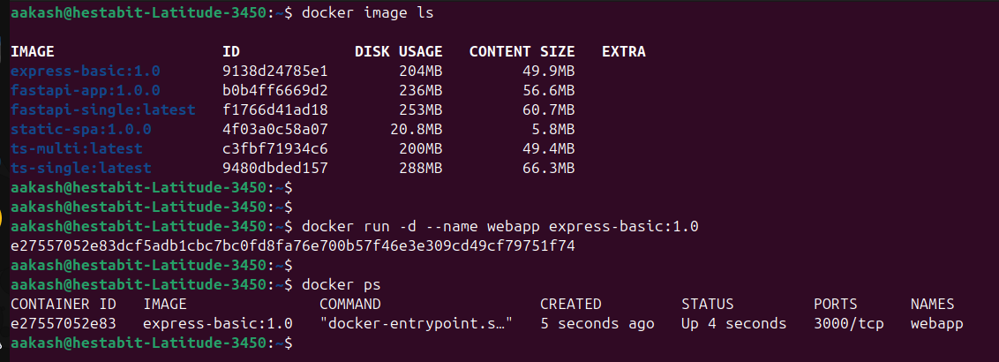

#### Execute Commands Inside Running Container

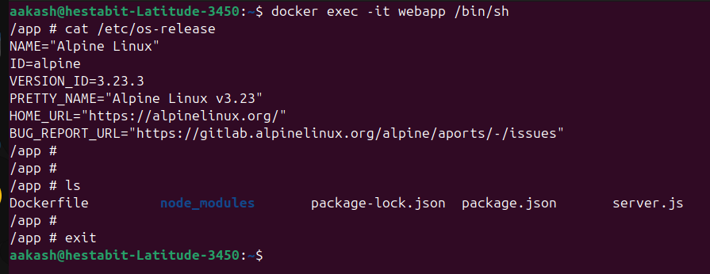

#### View Container Logs in Real Time

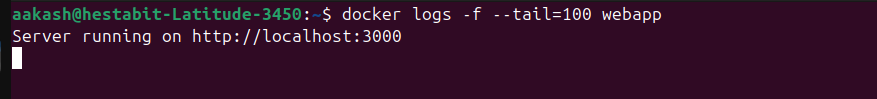

#### Inspect Container Configuration

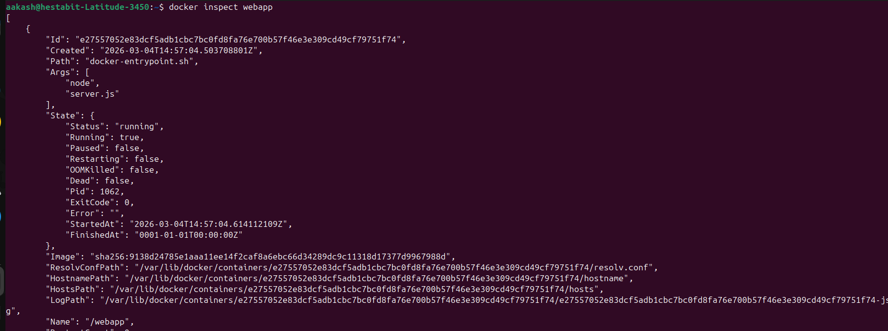

#### Inspect Container Network Settings

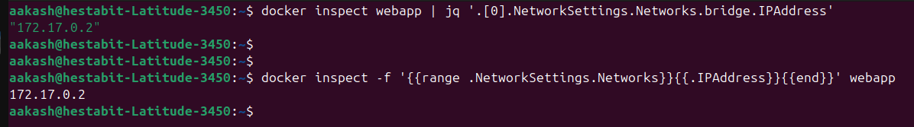

---
---
