## Dockerised 3-Tier Web Application

Implemented a **3-tier containerized application** using **React (Frontend), Express.js (Backend), and PostgreSQL (Database)** orchestrated with Docker Compose.

### Architecture


Browser --> Frontend (React - Nginx :80) --> Backend (Express - Node :3000) --> DB (PostgreSQL :5432)

All services communicate through a shared **Docker bridge network (`app_network`)**.

- Created a **Docker Compose setup (`docker-compose.yml`)** to orchestrate all three services.
- Configured **PostgreSQL (`postgres:15-alpine`)** with:
  - Environment-based credentials
  - Persistent volume `postgres_data`
  - Automatic schema initialization using `init.sql`
  - Health check using `pg_isready`.

- Built **Express backend service** using a custom Dockerfile with:
  - Environment-based `DATABASE_URL`
  - Health check endpoint `/health`
  - Dependency on the database service (`depends_on: service_healthy`).

- Built **React frontend service** using a multi-stage Dockerfile:
  - Node build stage for React compilation
  - Nginx runtime stage for serving static assets.

- Configured **health checks for all services**:
  - DB --> `pg_isready`
  - Backend --> `curl /health`
  - Frontend --> `wget` request.

- Implemented **internal service communication** using a shared bridge network (`app_network`).

- Used **restart policy `unless-stopped`** for all containers.

- Used **environment variables (`.env`)** to configure ports and credentials.

- App is running on port 8080 in local machine via port mapping

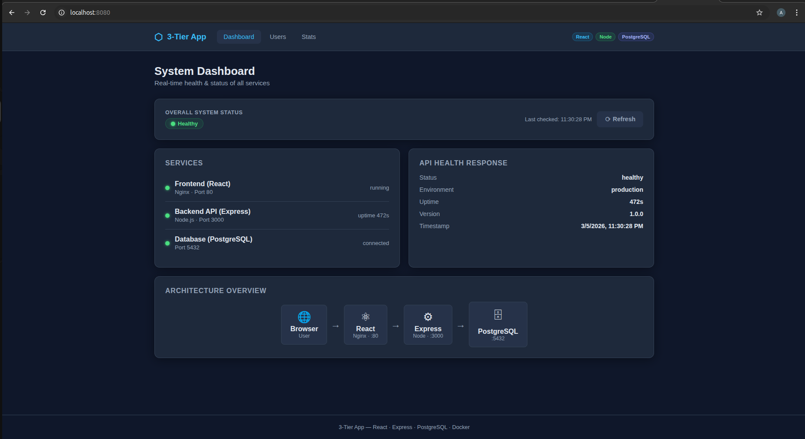

- All the services are healthy
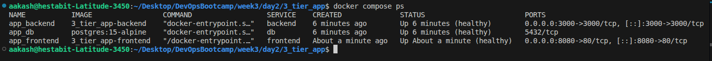

- compose file -- **[3_tier_app/docker-compose.yml](3_tier_app/docker-compose.yml)**

---
---

## `compose_override_practice/` - Docker Compose Override Files (Dev & Prod)

Practiced **Docker Compose override patterns** to manage environment-specific configurations for the same 3-tier app without duplicating the base service definitions.

### File Structure

| File | Purpose |
|------|---------|
| `docker-compose.yml` | Base service definitions (shared across all environments) |
| `docker-compose.override.yml` | Dev overrides - auto-applied by `docker compose up` |
| `docker-compose.prod.yml` | Prod overrides - applied explicitly with `-f` flag |

### Dev Stack (`docker compose up --build`)

- Backend runs with **`node --watch index.js`** (Node built-in hot-reload, no nodemon devDep needed).
- Frontend uses a dedicated **`Dockerfile.dev`** (`node:20-alpine`) that runs the **CRA webpack dev server on port 5173** - the production Dockerfile produces an nginx image which has no `node`/`npm`.
- Source code bind-mounted into both containers; `node_modules` protected via anonymous volume so the container's installed packages are not overwritten.
- File-watching in Docker volumes enabled via `CHOKIDAR_USEPOLLING` and `WATCHPACK_POLLING`.
- Debug port **9229** exposed on backend for Node inspector.
- Frontend healthcheck overridden to check `http://127.0.0.1:5173` (CRA dev server, not nginx `:80`).

### Prod Stack (`docker compose -f docker-compose.yml -f docker-compose.prod.yml up --build`)

- Backend and frontend use their production **multi-stage Dockerfiles**.
- Frontend served by **Nginx** on port **8080**.
- `restart: unless-stopped` on both backend and frontend.
- No source mounts; images are fully self-contained.


### Commands

```bash
# Dev (auto-applies docker-compose.override.yml)
docker compose up --build -d

# Prod
docker compose -f docker-compose.yml -f docker-compose.prod.yml up --build -d

docker compose down -v
```
- Listing dokcer containers in development mode
  - the ports and health status can be verified from the screenshot below 
  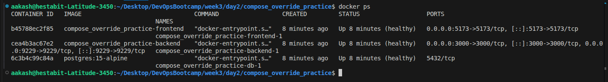

- Listing dokcer containers in production mode
  - the ports and health status can be verified from the screenshot below 
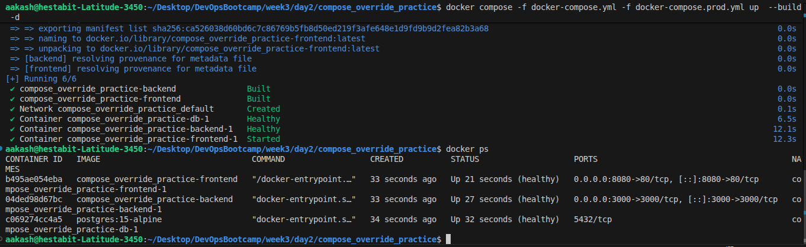


---
---

## `mern_stack/` - MERN Stack with Docker Compose

Built a full **MERN stack** application containerised with Docker Compose, featuring a **MongoDB replica set**, Express.js API with JWT authentication, React frontend built with Vite, and Nginx as a reverse proxy.

#### Architecture

```
Browser --> Nginx (:8080) --> Frontend (React/Vite --> Nginx :80)
                          --> Backend  (Express.js :5000) --> MongoDB Replica Set
                                                                  mongo1 (PRIMARY  :27017)
                                                                  mongo2 (SECONDARY :27017 --> host:27018)
```

All services communicate over a shared Docker bridge network (`mern_net`).

- **MongoDB Replica Set** (`mongo:7`) with two members:
  - `mongo1` - PRIMARY, host port **27017**
  - `mongo2` - SECONDARY, host port **27018**
  - Custom image embeds a pre-generated keyfile (required by MongoDB auth + replica sets)
  - One-shot `mongo-init` container runs `rs.initiate()` after both nodes are healthy
  - Persistent volumes: `mongo1_data`, `mongo2_data`

- **Express.js API** (`node:20-alpine`) with:
  - Mongoose ODM connecting to the replica set via `readPreference=primaryPreferred`
  - JWT authentication (`/api/auth/register`, `/api/auth/login`)
  - Protected CRUD routes: `/api/users`
  - Stats endpoint: `/api/stats` (role breakdown, memory, uptime)
  - Health endpoint: `/health` (MongoDB connection state)

- **React Frontend** (Vite + `node:20-alpine` build --> `nginx:alpine` serve):
  - Auth page (login / register) - JWT stored in `localStorage`
  - Dashboard, Users, Stats tabs
  - Verified running locally with `vite dev` before containerising

- **Nginx reverse proxy** (`nginx:alpine`):
  - `/api/*` and `/health` --> backend
  - `/` --> frontend 
  - Own health probe at `/nginx-health`

- **Health checks** on all services (MongoDB `ping`, `wget 127.0.0.1`)
- **Environment variables** via `.env` - see `.env.example`


- compose file - **[mern_stack/docker-compose.yml](mern_stack/docker-compose.yml)**

- app is running on port 8080
    - 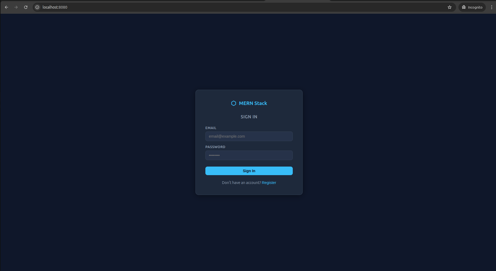

- all the services are healthy
    - 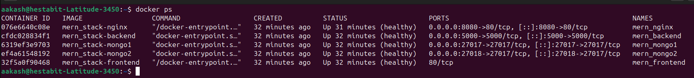
---
---

## `laravel_mysql_redis/` - Laravel + MySQL + Redis Stack

Built a **Laravel 11 (PHP 8.2)** application containerised with Docker Compose, backed by **MySQL 8.0**, **Redis** for caching/sessions/queues, **Nginx** as the PHP-FPM proxy, and a dedicated **queue worker** service.

### Architecture

```
Browser --> Nginx (:8080) --> PHP-FPM (app :9000) --> MySQL 8.0
                                                   --> Redis (cache / sessions / queues)
Queue Worker ----------------------------------------> MySQL + Redis
```

- **Laravel app** (`php:8.2-fpm`): `composer create-project` runs at **build time** - no local PHP needed; extensions `pdo_mysql`, `mbstring`, `redis`, `gd`, `bcmath`; `entrypoint.sh` writes `.env` from container env vars, waits for MySQL, runs `migrate --force`, caches config/routes, then starts `php-fpm`

- **Nginx** (`nginx:alpine`): PHP-FPM proxy to `app:9000`, `try_files` SPA routing, `/nginx-health` endpoint; named volume `laravel_app` shared with `app` for static asset serving

- **MySQL 8.0**: persistent volume `mysql_data`; `mysqladmin ping` healthcheck

- **Redis** (`redis:alpine`): `redis-cli ping` healthcheck

- **Queue worker**: same image as `app`, CMD overridden to `php artisan queue:work --tries=3`, skips migrations in entrypoint

- Health checks on all services; `app` waits for `mysql` + `redis` healthy; `nginx` waits for `app` healthy

- compose file - **[laravel_mysql_redis/docker-compose.yml](laravel_mysql_redis/docker-compose.yml)**

- the app is running on port 8080
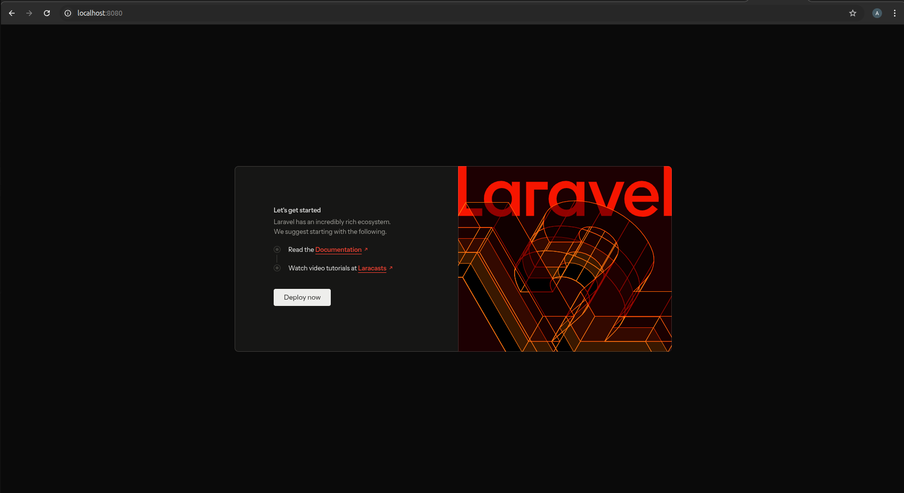

- all the services are healthy
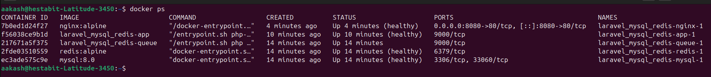

---
---

## `health_checks/` - Docker Health Check Patterns

Implemented liveness and readiness health checks for two different app stacks, including embedded container scripts, external scripts with CLI options, and automated failure scenario testing.

#### Architecture

```
Host scripts/node_healthcheck.sh  --> Node.js API (:3000) --> PostgreSQL 15
Host scripts/python_healthcheck.sh --> Python Flask (:5000) --> MySQL 8.0
scripts/test_failures.sh          -->  both apps (stops DBs, asserts 503, restores)
```

- **Node.js API** (`node:20-alpine`):
  - `GET /health` - liveness: returns `{status:"ok", uptime}`, always 200 while process is alive
  - `GET /ready`  - readiness: runs `SELECT 1` against PostgreSQL; 200 if connected, 503 if not
  - Embedded `healthcheck.sh` calls both endpoints; used in Dockerfile `HEALTHCHECK` directive

- **Python Flask app** (`python:3.12-slim`):
  - `GET /health` - same liveness pattern
  - `GET /ready`  - opens a MySQL connection; 200 if connected, 503 if not
  - Embedded `healthcheck.sh` follows the same pattern

- **PostgreSQL 15**: `pg_isready` healthcheck; `node_api` depends on `service_healthy`

- **MySQL 8.0**: `mysqladmin ping` healthcheck; `python_app` depends on `service_healthy`

- **External scripts** (all support `--help`):

  | Script | Purpose |
  |---|---|
  | `scripts/node_healthcheck.sh` | Probe Node API from host; `--host`, `--port`, `--only-health/ready` |
  | `scripts/python_healthcheck.sh` | Probe Python app from host; same options |
  | `scripts/test_failures.sh` | Stop each DB, assert 503, restart, assert 200 recovery |

- **Failure test results**: 10/10 assertions passed - liveness survives DB outage; readiness correctly returns 503 and recovers on restore

### Commands

```bash
# Run health checks
./scripts/node_healthcheck.sh
./scripts/python_healthcheck.sh

./scripts/test_failures.sh

# help
./scripts/test_failures.sh --help
```

- compose file - **[health_checks/docker-compose.yml](health_checks/docker-compose.yml)**

- all the services are running fine 
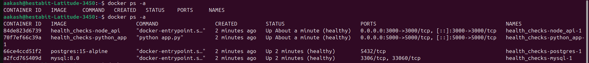

---
---

## `env_management/` - Environment Variable Management

Practiced Docker Compose environment variable substitution using `.env`, `.env.dev`, and `.env.prod` files, with a Node.js API that exposes all injected config at `/config` and a `verify.sh` script that proves the correct values are loaded per environment.

### File Structure

| File | Purpose |
|---|---|
| `.env.example` | Template - all keys, no secrets |
| `.env` | Default (dev) values - used by plain `docker compose up` |
| `.env.dev` | Dev overrides (`appdb_dev`, API :3000, Redis :6399) |
| `.env.prod` | Prod overrides (`appdb_prod`, `APP_DEBUG=false`, API :4000, Redis :6380) |
| `docker-compose.yml` | All values via `${VAR}` substitution |
| `api/index.js` | `/health`, `/ready` (DB + Redis), `/config` (shows injected vars) |
| `verify.sh` | Starts stack 3× with different env files, asserts correct values |

### Variable Reference

| Variable | Description | Dev | Prod |
|---|---|---|---|
| `APP_ENV` | Application environment | `development` | `production` |
| `APP_DEBUG` | Debug mode | `true` | `false` |
| `DB_NAME` | PostgreSQL database name | `appdb_dev` | `appdb_prod` |
| `DB_USER` / `DB_PASSWORD` | DB credentials | `devuser` | `produser` |
| `API_PORT` | Host port for API | `3000` | `4000` |
| `REDIS_EXPOSED_PORT` | Host port for Redis | `6399` | `6380` |

### Commands

```bash
# Default run uses .env
docker compose up -d

# Dev environment
docker compose --env-file .env.dev up -d

# Prod environment
docker compose --env-file .env.prod up -d

# Check which vars are loaded
curl http://localhost:3000/config

# Run substitution verification (all 3 env files)
./verify.sh
```

- compose file - **[env_management/docker-compose.yml](env_management/docker-compose.yml)**

- succesfully verified all the env file injection
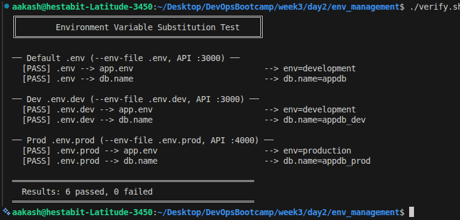
---
---

## `service_scaling/` - Service Scaling with Docker Compose

Configured a Node.js API service to run multiple replicas behind an Nginx load balancer, demonstrated dynamic scale-up/down, and verified traffic distribution across all replicas.

#### Architecture

```
Browser --> Nginx (:8090) --> api-1 (3000/tcp)
                        --> api-2 (3000/tcp)
                        --> api-3 (3000/tcp)   <-- scale with --scale api=N
```

- **API** (`node:20-alpine`): no `ports:` mapping (required for scaling); exposes `3000/tcp` internally; `/` returns `hostname` + `pid` + `requests_served`; `/health` for Docker healthcheck

- **Nginx** (`nginx:alpine`): single host entry point on `:8090`; uses `resolver 127.0.0.11 valid=1s` + `set $backend "api:3000"` so it re-queries Docker's embedded DNS every second and gets a different replica IP each cycle (Docker DNS round-robins across all live replicas)

- **Scaling**: the `api` service has no fixed host port, so `--scale api=N` starts N containers sharing the same DNS name; nginx discovers all of them via the resolver

- **Verified**: 18 requests sent at 1.1s intervals hit all 3 replicas (distribution: 7 / 3 / 8); scale-up to 5 and scale-down to 2 both applied live without downtime

### Commands

```bash
# Build and start 3 replicas
docker compose up --build --scale api=3 -d

# Scale up / down live
docker compose up --scale api=5 -d
docker compose up --scale api=2 -d

# View logs from all replicas
docker compose logs -f api

# See which replica handles each request (X-Upstream-Addr header)
curl -I http://localhost:8090/

```

- compose file - **[service_scaling/docker-compose.yml](service_scaling/docker-compose.yml)**

- dynamically scaled up and down 
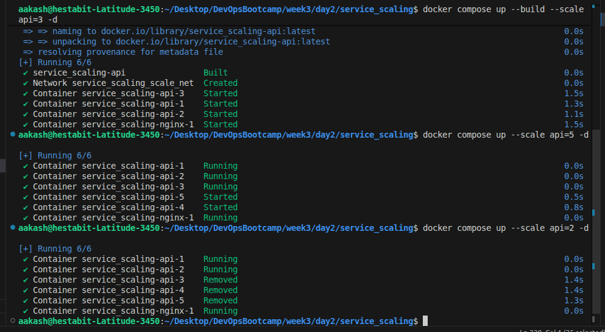
---
---

