## Custom Docker Networks for 3-Tier Application

- Created **three isolated bridge networks**: `frontend-network`, `backend-network`, and `database-network`.
- Configured **`database-network` as internal** to restrict direct external access.
- Deployed **frontend container (nginx)** on `frontend-network`.
- Deployed **API container (express-basic)** on `backend-network`.
- Deployed **PostgreSQL container** on `database-network`.
- Connected **API container to both frontend and database networks** using `docker network connect`.
- Verified **frontend --> database communication is blocked** (network isolation).
- Verified **API --> database communication succeeds** using `docker exec api ping postgres`.
- Tested connectivity and service isolation using `docker exec`, `ping`, and container inspection.
- Demonstrated **tier-based network segmentation for secure service communication**.

- created networks and containers
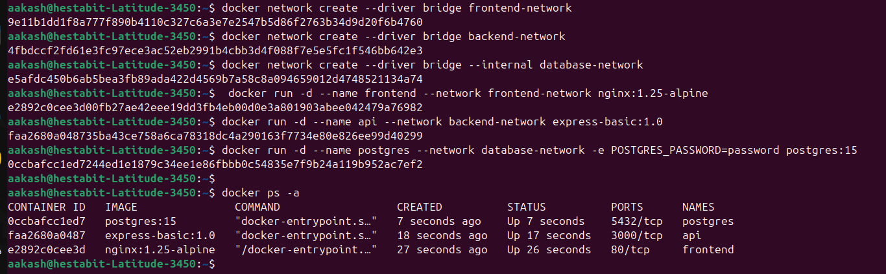

- listing networks 
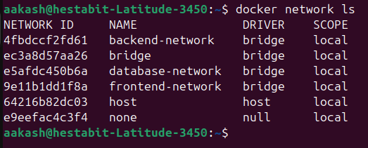

- assigned networks and tested the service discovery within network
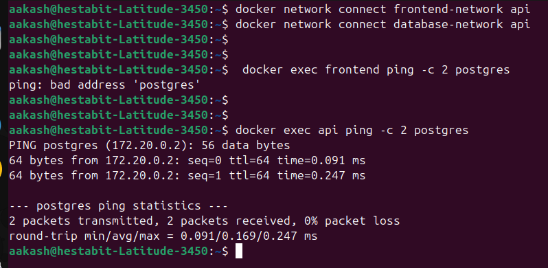

---
---


## Implement Network Isolation with Docker Compose

- Created a **Docker Compose configuration** with multiple isolated networks.
- Defined **three networks**: `frontend-net`, `backend-net`, and `db-net`.
- Configured **frontend service (nginx)** to connect to `frontend-net` and `backend-net` for external access and API communication.
- Configured **API service (express-basic)** to connect to `backend-net` and `db-net`.
- Configured **database service (postgres)** to connect only to `db-net`.
- Marked **`db-net` as internal** to isolate the database from external access.
- Used **port mapping (`8080:80`)** to expose the frontend to the host.
- Verified that all services and networks were created successfully and functioning as expected.

- Compose file - **[`docker_network_isolation.yml`](docker_network_isolation.yml)**

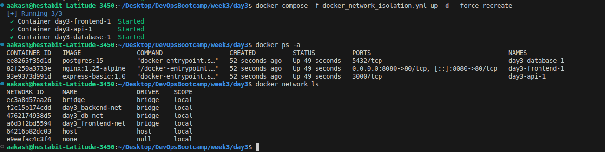

---
---


## Configure Named Volumes for Database Persistence

- Created **named Docker volumes** for databases: `postgres_data`, `mysql_data`, and `mongo_data`.
- Verified volume creation using `docker volume ls`.
- Attached volumes to database containers to ensure **persistent storage outside container filesystem**.
- Confirmed that **data persists even after container removal** by recreating containers with the same volume.
- Configured proper **mount paths for database data directories** (e.g., `/var/lib/postgresql/data`).
- Performed **volume backup** by archiving the volume contents to the host using a temporary Alpine container and `tar`.
- Restored the backup into a new volume (`postgres_data_new`) using the same method.
- Started a PostgreSQL container with the restored volume to verify successful recovery.
- Observed PostgreSQL logs confirming that **existing database files were detected and loaded**.

#### Volume Creation

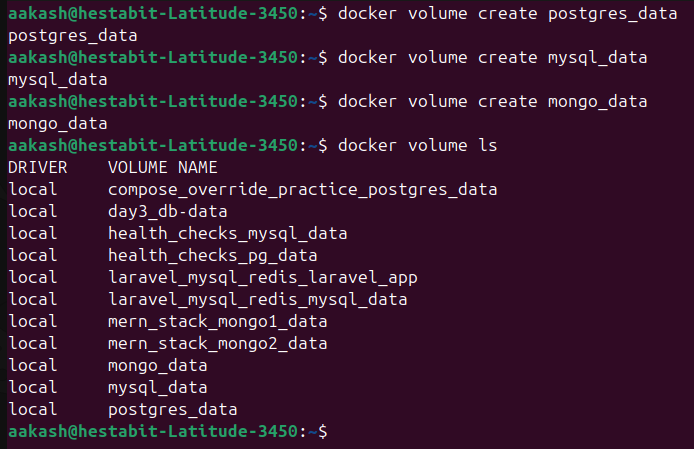

#### Data Persistence Verification

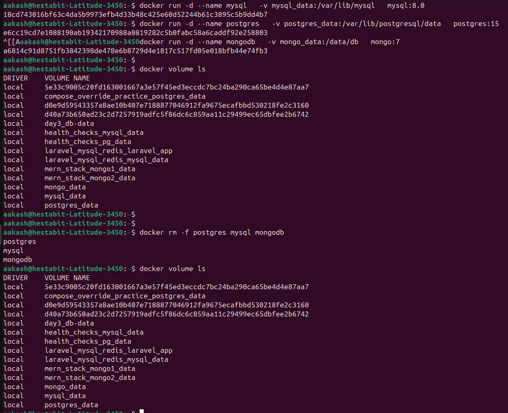

#### Backup and Restore Verification

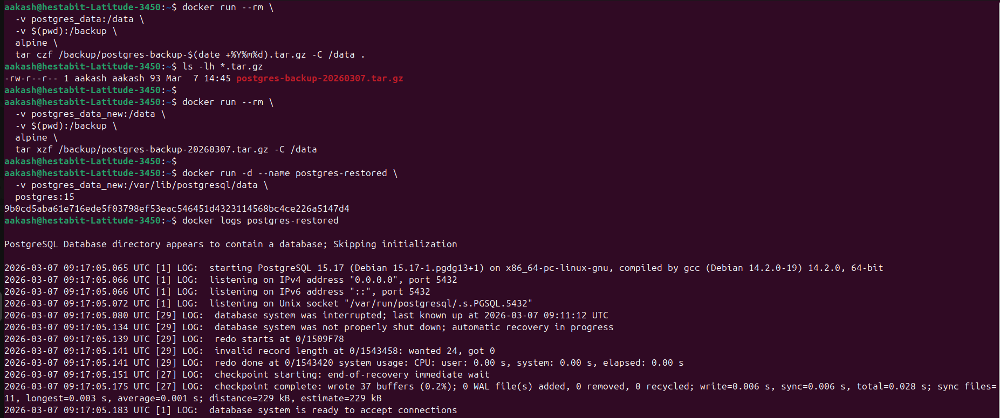

---
---

## Bind Mounts for Development — Hot Reload (`hot_reload/`)

Built a minimal **Express API + Nginx frontend** stack to practice live code updates via bind mounts.

### Structure

```
hot_reload/
├── api/
│   ├── src/index.js        <-- bind-mounted --> nodemon watches for hot reload
│   ├── config/app.config.js<-- bind-mounted --> edit message/version live
│   └── Dockerfile
├── frontend/
│   ├── src/index.html      <-- bind-mounted --> nginx serves instantly on save
│   ├── nginx.conf          <-- proxies /api/* to the backend service
│   └── Dockerfile
├── logs/
│   ├── api/                <-- api.log written here from inside container
│   └── frontend/           <-- nginx access.log / error.log
└── docker-compose.yml
```

### Bind Mounts Configured

| Mount | Type | Purpose |
|-------|------|---------|
| `./api/src:/app/src:ro` | bind (read-only) | nodemon hot reload |
| `./api/config:/app/config:ro` | bind (read-only) | live config edits |
| `./logs/api:/app/logs` | bind (writable) | host-accessible API logs |
| `./frontend/src:/usr/share/nginx/html:ro` | bind (read-only) | instant HTML updates |
| `./logs/frontend:/var/log/nginx` | bind (writable) | host-accessible nginx logs |
| `node_modules_api:/app/node_modules` | named volume | keeps node_modules off host fs |

#### How Hot Reload Works

- **Backend** — `nodemon` watches `/app/src` and `/app/config`; when any `.js` or `.json` file changes on the host, the process restarts inside the container automatically.
- **Frontend** — nginx reads files from the bind-mounted directory on every request; editing `index.html` on the host is reflected immediately on browser refresh — no rebuild needed.

- Frontend available at **http://localhost:8080**
- API proxied at **http://localhost:8080/api/message**
- Compose File - **[hot_reload/docker-compose.yml](hot_reload/docker-compose.yml)**

---
---

## Configure tmpfs for Sensitive Data

- Configured **tmpfs mounts** to store temporary sensitive data in memory.
- Created tmpfs directories `/run/secrets` and `/tmp` while running the container.
- Applied **security options** (`noexec`, `nosuid`) to restrict execution and privilege escalation.
- Configured **size limits** (`10MB` for secrets, `50MB` for temporary files).
- Verified tmpfs configuration using `docker inspect` and `jq`.
- Used tmpfs for **temporary secrets, tokens, and runtime-sensitive data**.
- Ensured **data does not persist on disk** after container removal since tmpfs is memory-backed.
- Also implemented the same configuration using Docker Compose.

#### Tmpfs Setup Verification

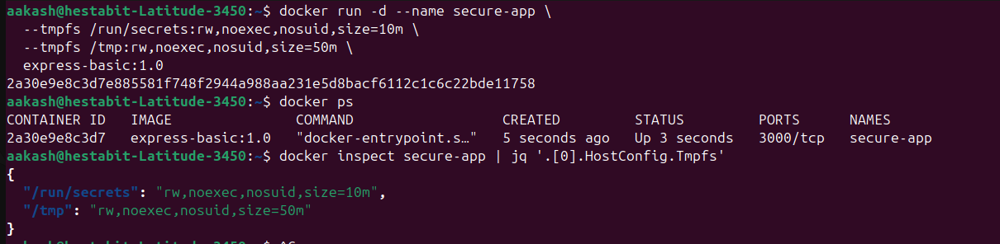

- Compose file → **[`docker_tmpfs.yml`](docker_tmpfs.yml)**

---
---

## Docker Network Troubleshooting Practice

- Inspected Docker networks using `docker network inspect` to view connected containers and IP assignments.
- Verified active containers and network topology using `docker ps` and `docker network ls`.
- Tested **DNS resolution between containers** using `nslookup database` and `dig database`.
- Verified **container-to-container connectivity** using `ping` and `nc` to the PostgreSQL service.
- Tested **service port connectivity** using `curl` and confirmed PostgreSQL port `5432` is reachable.
- Installed troubleshooting tools (`curl`, `bind-tools`, `tcpdump`) inside the container using `apk`.
- Verified Docker’s internal DNS (`127.0.0.11`) resolves service names to container IPs.
- Checked **Docker networking firewall rules** using `iptables` to view DOCKER chains.
- Inspected container **network interfaces** using `ip addr show` to confirm multiple network attachments.
- Examined container **routing table** using `ip route show` to understand traffic flow between networks.


#### Network and Container Inspection

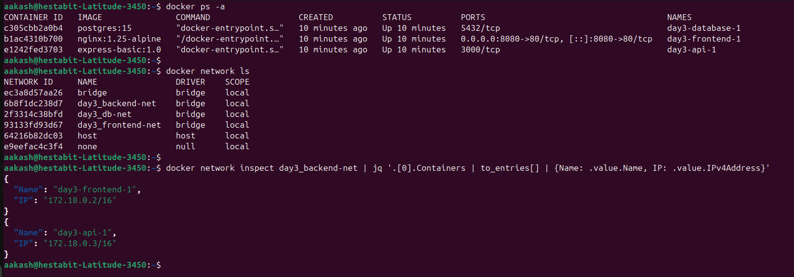

#### Connectivity and Port Verification

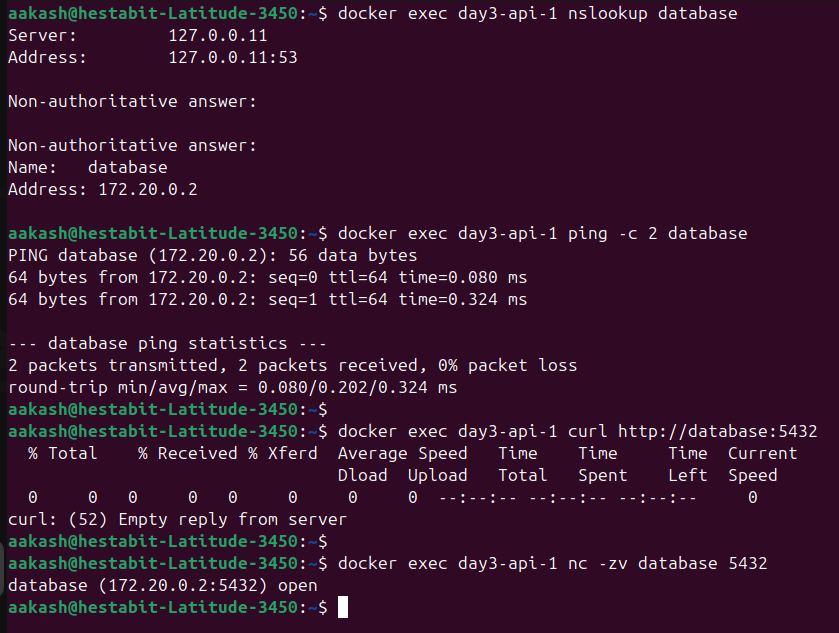

#### Installing Networking Tools

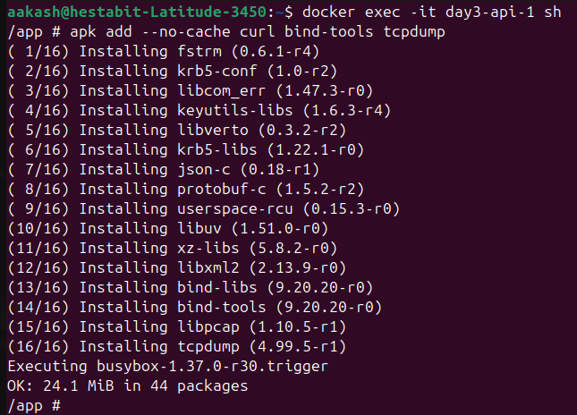

#### DNS Resolution and Service Reachability

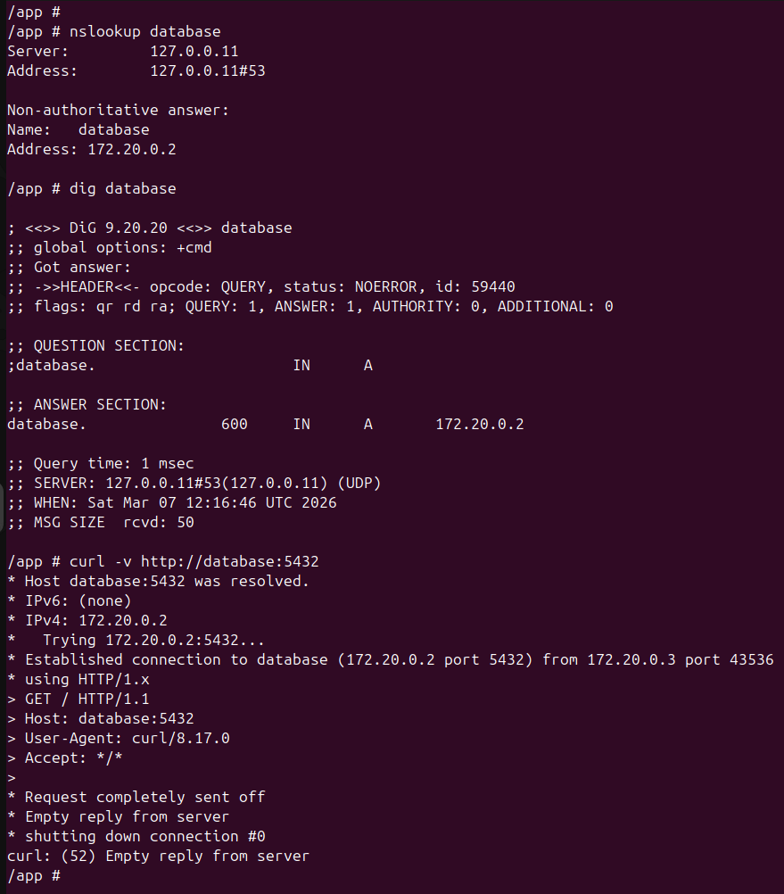

#### Docker iptables Rules

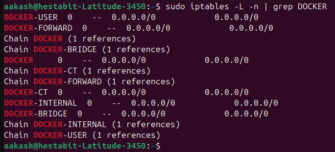

#### Container Network Interfaces

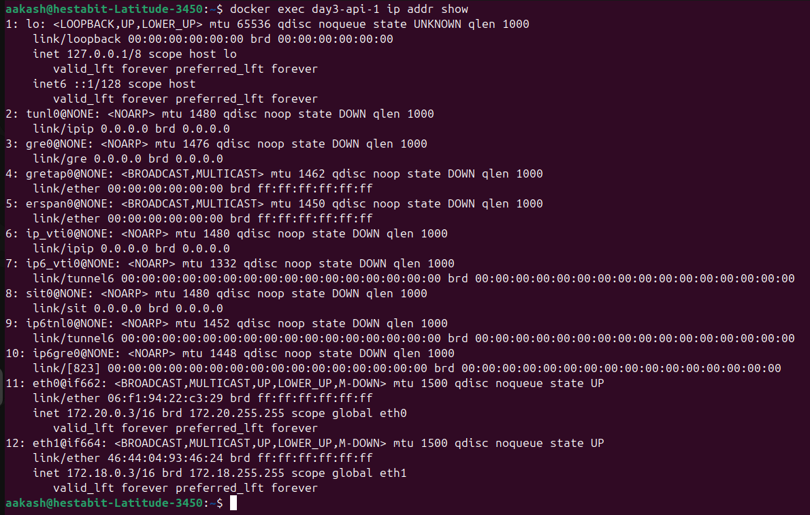

#### Container Routing Table

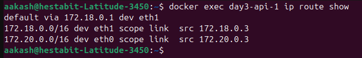

---
---


## Volume Backup Automation (`volume_backup/`)

Created two companion scripts to back up and restore Docker named volumes.

| Script | Purpose |
|--------|---------|
| `backup-volumes.sh` | Compresses each volume into a timestamped `.tar.gz` archive |
| `restore-volume.sh` | Extracts an archive back into a named volume (creates if missing) |

### Features

- `--help` flag on both scripts prints full usage summary.
- `-v` flag selects specific volumes; default backs up **all** named volumes.
- `-d` flag sets a custom output directory (default: `./backups`).
- `-r` flag controls retention — archives older than N days are auto-deleted.
- `--force` on restore skips the confirmation prompt (CI-friendly).
- Each run appends a structured log to `backups/backup.log`.
- Output of the full test run saved to **[`volume_backup/report.txt`](volume_backup/report.txt)**.

### Commands

```bash
# Back up all named volumes
./backup-volumes.sh

# Back up specific volumes with custom dir and retention
./backup-volumes.sh -v postgres_data,mysql_data -d ./backups --retain 14

# Restore into original volume
./restore-volume.sh backups/postgres_data-20260307-175810.tar.gz postgres_data

# Restore into a new test volume (non-destructive)
./restore-volume.sh --force backups/postgres_data-20260307-175810.tar.gz postgres_data_test
```


---
---

## Volume Sharing Between Containers

- Implemented **shared Docker volume (`shared-data`)** to enable data sharing between multiple containers.
- Created three services: **writer, reader, and processor** using Alpine containers.
- **Writer container** continuously writes the current timestamp to `/data/timestamp.txt`.
- **Reader container** reads the timestamp file using a **read-only (`:ro`) mount**.
- **Processor container** processes the same file by counting lines using `wc -l`.
- Implemented a **file-based communication pattern** using a shared volume.
- Verified data sharing by checking container logs using `docker logs`.
- Confirmed that all containers access the same file through the shared volume.

#### Verification

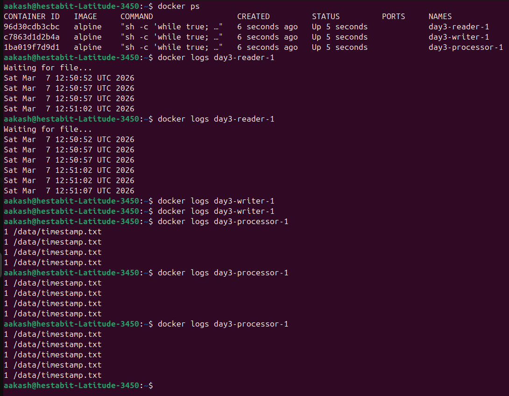

- Compose file - **[docker_shared_volume.yml](docker_shared_volume.yml)**