## Install and Configure Trivy Scanner

- Installed **Trivy vulnerability scanner** on the host system using the official Aqua Security repository.
- Verified installation using `trivy --version`.
- Scanned a public Docker image (`nginx:latest`) to detect vulnerabilities.
- Filtered scan results to show only **HIGH and CRITICAL severity vulnerabilities**.
- Generated vulnerability reports in **JSON format** (`nginx-scan-report.json`).
- Generated vulnerability reports in **table format** (`nginx-scan-report.txt`).
- Optimized scan output using flags such as `--ignore-unfixed` and `--no-progress`.
- Verified vulnerability findings including CVEs affecting Debian-based packages inside the image.
- Demonstrated how Trivy can be used for **container image security analysis in DevOps pipelines**.

### Trivy Installation Verification

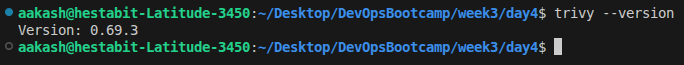

### Vulnerability Scan Results

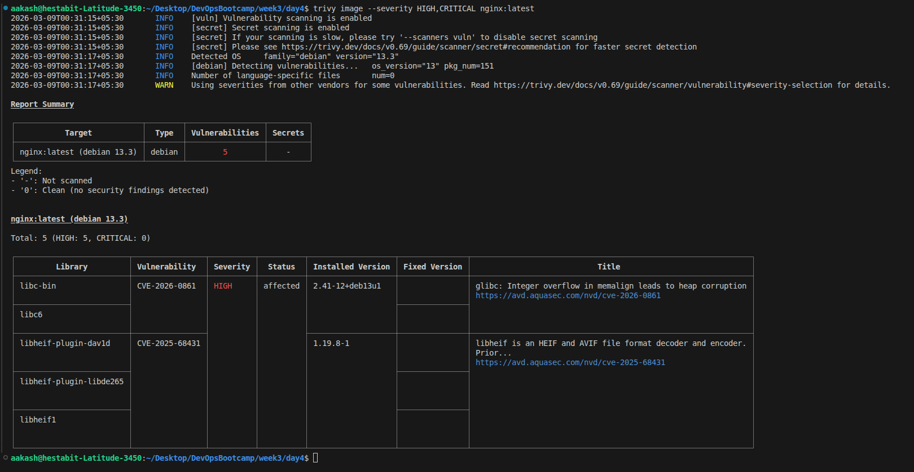

### Optimized Scan Output

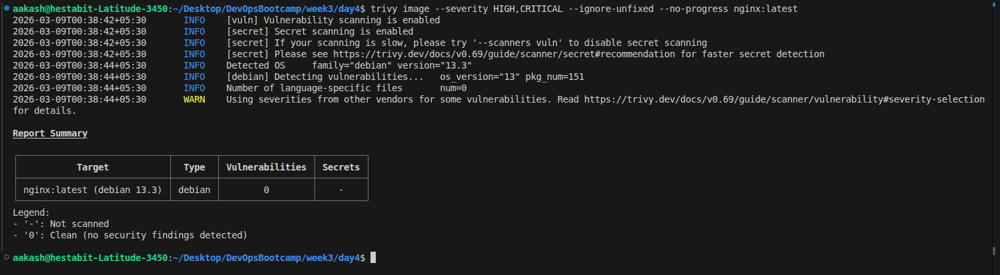

### Generated Reports

- JSON report --> `nginx-scan-report.json`  
- Table report --> `nginx-scan-report.txt`

---
---

## Scan Custom Application Image with Trivy

Built a custom **Node.js application image** using an Alpine-based base image and scanned it using **Trivy** to identify security vulnerabilities.

- Built custom application image --> `express-basic:1.0`
- Used **Trivy** to scan the image for vulnerabilities.
- Filtered results to show only **HIGH and CRITICAL severity vulnerabilities**.
- Verified whether vulnerabilities are **fixable or unfixed** using Trivy output.
- Generated vulnerability reports for documentation and analysis.

---

### Project Structure

```
node-trivy-demo/
├── app.js              # Express application (GET / and GET /health)
├── Dockerfile          # node:20-alpine based image
├── package.json        # Express dependency
├── package-lock.json   # Lock file for reproducible builds
├── scan_image.sh       # Vulnerability scan script
└── reports/            # Generated scan reports
```

---

### Build Command

```bash
docker build -t express-basic:1.0 .
```

---

### Scan Command

```bash
trivy image --severity HIGH,CRITICAL express-basic:1.0
```

---

### Scan Script

```bash
./scan_image.sh
```

The script:
1. Validates Trivy and Docker are available.
2. Checks that the image `express-basic:1.0` exists locally.
3. Runs `trivy image --severity HIGH,CRITICAL --format json` to get structured output.
4. Parses results with `jq` to count CRITICAL / HIGH totals and fixable vs unfixed counts.
5. Lists the top 10 CVEs per severity with the fixed version when available.
6. Saves a plain-text report to `reports/vuln-report-<timestamp>.txt`.
7. Prints the full Trivy table output for reference.

---

### Sample Report Output

```
========== VULNERABILITY SCAN REPORT ==========
Image:      express-basic:1.0
Scan Date:  2026-03-09 11:47:42
Scanner:    Trivy v0.69.3

Severity Summary (HIGH + CRITICAL only):
  CRITICAL: 1
  HIGH:     10
  TOTAL:    11

Fixability Breakdown:
  CRITICAL fixable  : 1
  CRITICAL unfixed  : 0
  HIGH     fixable  : 10
  HIGH     unfixed  : 0

Top CRITICAL Vulnerabilities (up to 10):
  1. CVE-2026-22184 — zlib 1.3.1-r2  [FIXABLE --> 1.3.2-r0]

Top HIGH Vulnerabilities (up to 10):
  1. CVE-2024-21538 — cross-spawn 7.0.3  [FIXABLE --> 7.0.5, 6.0.6]
  2. CVE-2025-64756 — glob 10.4.2  [FIXABLE --> 11.1.0, 10.5.0]
  3. CVE-2026-26996 — minimatch 9.0.5  [FIXABLE --> 10.2.1, 9.0.6, ...]
  ...
================================================
```

Report file: `node-trivy-demo/reports/vuln-report-<timestamp>.txt`

---
---

## Create Secure Dockerfile with Non-Root User

Refactored the Node.js Dockerfile to run the application as a **non-root user** and follow container security best practices.

- Implemented a **multi-stage Dockerfile** (`deps --> builder --> runner`) to build and run the application securely.
- Created a **dedicated user (`nodejs`, UID 1001)** inside the runtime container.
- Installed dependencies and built the application in build stages, copying only required artifacts to the runtime image.
- Set **proper file ownership** using `--chown=nodejs:nodejs` when copying application files.
- Switched container execution to **non-root user using `USER nodejs`**.
- Added a **healthcheck endpoint** to monitor application health.
- Built the secure image --> `non-root-demo:1.0`.
- Verified the container runs correctly as a non-root user using `whoami`, `id`, and `docker inspect`.
- Confirmed application functionality and health using `curl`.

---

### Image Build and Container Running

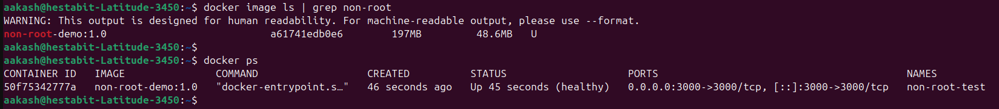

---

### Verification of Non-Root User and Health Status

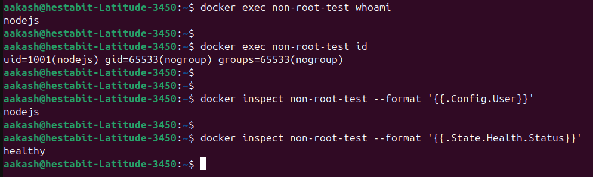

---

### Application Verification

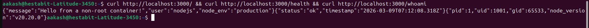

---
---

## Implement Security Hardening for Python Application

## Create Secure Dockerfile with Non-Root User

Refactored the Python Dockerfile to run the application as a **non-root user** and follow container security best practices.

- Implemented a **multi-stage Dockerfile** (`builder --> runner`) to build and run the application securely.
- Created a **dedicated user (`appuser`, UID 10001) and group (`appgroup`, GID 10001)** inside the runtime container.
- Installed Python dependencies in the **builder stage** using `pip install --user`, copying only `~/.local` to the runtime image.
- Set **proper file ownership** using `--chown=appuser:appgroup` when copying application files.
- Set environment variables `PYTHONDONTWRITEBYTECODE` and `PYTHONUNBUFFERED` for clean, production-safe Python execution.
- Created a **writable runtime directory** (`/tmp/runtime-data`) for app temp files while keeping the rest of the filesystem locked.
- Switched container execution to **non-root user using `USER appuser`**.
- Added a **`/health` endpoint** and a `HEALTHCHECK` directive to monitor container health via `curl`.
- Built the secure image --> `python-secure:1.0`.
- Verified the container runs as a non-root user using `whoami`, `id`, and `docker inspect`.
- Confirmed all endpoints (`/`, `/health`, `/whoami`, `/writable-check`) return expected responses.
- Healthcheck status confirmed `healthy` after container start.

#### Structure

```
python_security_hardening/
├── Dockerfile          # 2-stage build (builder -> runner), non-root appuser
├── requirements.txt    # fastapi + uvicorn
└── main.py             # FastAPI app: GET / , /health , /whoami , /writable-check
```

### Verification Commands

```bash
docker exec python-secure-test whoami
# expected: appuser

docker exec python-secure-test id
# expected: uid=10001(appuser) gid=10001(appgroup) groups=10001(appgroup)

docker inspect python-secure-test --format '{{.Config.User}}'
# expected: appuser

# Application endpoints
curl http://localhost:8000/
# {"message":"Hello from a hardened Python container!","env":"production"}

curl http://localhost:8000/health
# {"status":"ok"}

curl http://localhost:8000/whoami
# {"uid":10001,"gid":10001,"username":"appuser",...}

curl http://localhost:8000/writable-check
# {"writable":true,"path":"/tmp/runtime-data"}

docker inspect python-secure-test --format '{{.State.Health.Status}}'
# expected: healthy
```

#### Image Build and Container Running

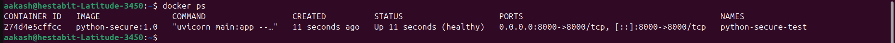


#### Verification of Non-Root User and Health Status

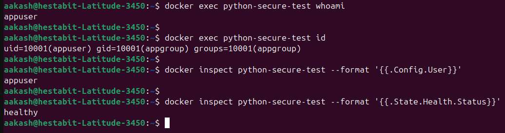

#### Application Endpoint Verification

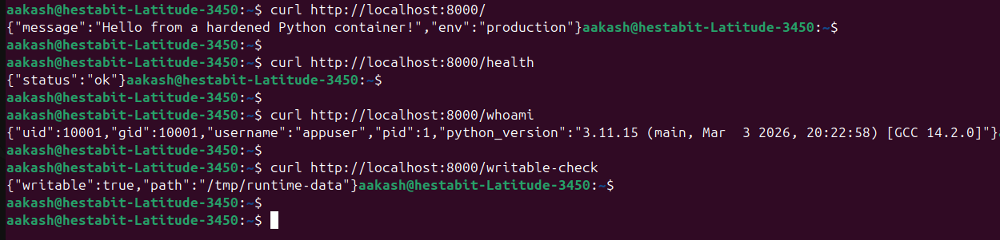

---
---
## Run Containers with Security Options

Executed a container with multiple **Docker runtime security hardening options** to restrict privileges, filesystem access, and resource usage.

- Ran the container with **read-only root filesystem (`--read-only`)** to prevent modifications to application files.
- Dropped all Linux capabilities using **`--cap-drop ALL`** and allowed only `NET_BIND_SERVICE`.
- Enabled **`--security-opt no-new-privileges:true`** to prevent privilege escalation.
- Applied **AppArmor profile (`docker-default`)** for additional runtime isolation.
- Configured **resource limits**: `--memory=512m` and `--cpus=1.0`.
- Mounted **tmpfs for `/tmp`** to allow temporary runtime writes while keeping the root filesystem immutable.
- Verified the read-only filesystem by attempting to create a file in `/app` (operation failed).
- Confirmed temporary writes are allowed inside `/tmp`.
- Verified all runtime security settings using `docker inspect`.


#### Container Started with Security Options

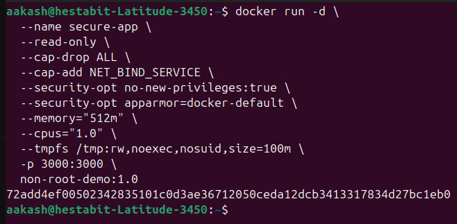


#### Security Verification (Read-Only FS and tmpfs)

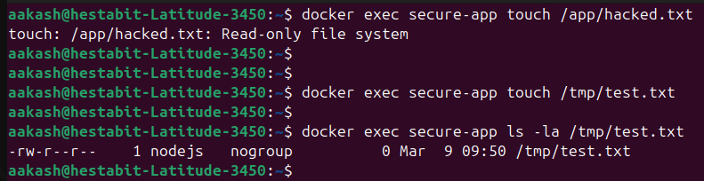


#### Security Configuration Verification

Used:

```bash
docker inspect secure-app | jq '.[0].HostConfig'
```

---
---

## Vulnerability Scanning Automation Script

Built a **`scan-images.sh`** script that automatically discovers and scans every local Docker image with **Trivy**, generating a single consolidated report filtered to **CRITICAL and HIGH** severities.

- Automatically discovers all local Docker images using `docker images`.
- Scans each image one by one using **Trivy** (`--severity CRITICAL,HIGH`).
- For every image, lists each **CVE ID, affected package, installed version, and fixed version** (or `NO FIX`).
- Shows a **fixability breakdown per image** — how many vulnerabilities are fixable vs have no fix.
- Produces a **single consolidated report** only: `trivy-reports/scan-report-<timestamp>.txt`.
- Final summary shows **total CRITICAL / HIGH counts, fixable vs no-fix totals, and grand total** across all images.

### Script 
```
week3/day4/scan-images.sh
```

```bash
./scan-images.sh
```

##### Report Location

```
week3/day4/trivy-reports/
└── scan-report-<timestamp>.txt    # single consolidated report for all images
```

---
---
## Implement Image Signing and Verification (Cosign)

Implemented **container image signing and verification** using **Cosign** since Docker Content Trust is deprecated.

- Installed **Cosign** to sign and verify container images.
- Generated **public/private key pair** using `cosign generate-key-pair`.
- Built and tagged application image → `express-basic:1.0`.
- Tagged image for registry → `aakash1hestabit/practice:1.0`.
- Pushed the image to Docker Hub registry.
- Signed the image using **Cosign private key**.
- Verified the signature using **Cosign public key**.
- Confirmed signature validation through Cosign verification output.
- Implemented **deployment verification logic** to ensure only signed images are deployed.

#### Cosign Installation

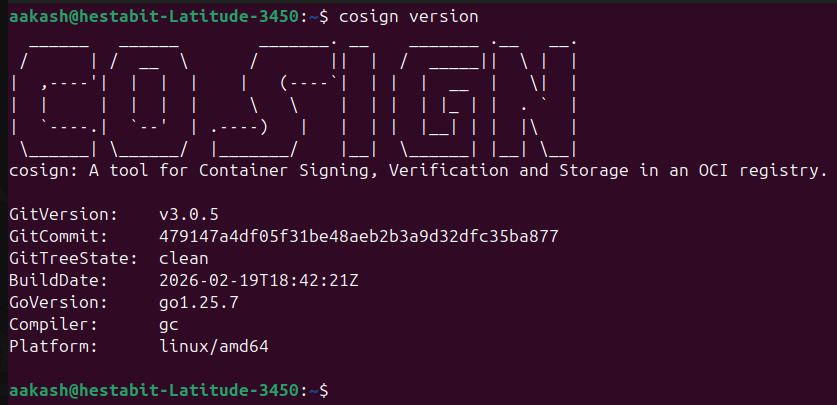

#### Key Pair Generation

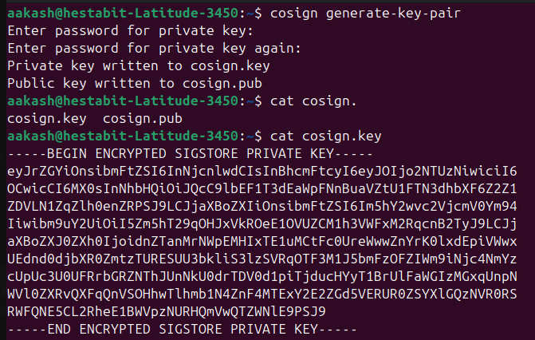

#### Image Push, Signing and Verification

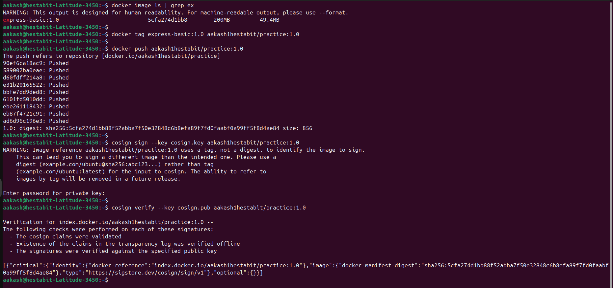

#### Deployment Verification Example

```bash
if cosign verify --key cosign.pub aakash/secure-app:1.0.0 > /dev/null 2>&1; then
    echo "Signature Verified. Deploying..."
    docker run -d aakash/secure-app:1.0.0
else
    echo "SECURITY ALERT: Image signature invalid or missing!"
    exit 1
fi
```

---
---
---

## Security Baseline Checklist

A checklist covering security controls, Dockerfile hardening, container runtime restrictions, and image scanning.

[View full checklist → SECURITY_BASELINE_CHECKLIST.md](SECURITY_BASELINE_CHECKLIST.md)
