## Push Images to Docker Hub

- Logged in to Docker Hub using `docker login`.
- Tagged local images for Docker Hub repository:
  - `express-basic:1.0` --> `aakash1hestabit/node-app:1.0.0`
  - `express-basic:1.0` --> `aakash1hestabit/node-app:latest`
  - `fastapi-app:1.0.0` --> `aakash1hestabit/python-api:latest`
- Pushed Node.js and Python images to Docker Hub using `docker push`.
- Verified images were successfully uploaded and available in the registry.
- Removed images locally to simulate pulling from another machine.
- Pulled images back from Docker Hub using `docker pull`.
- Ran containers from the pulled images to verify functionality.


#### Image Tagging

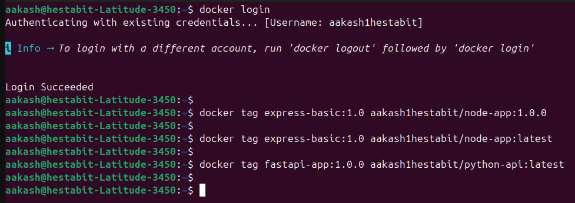

#### Images Pushed to Docker Hub

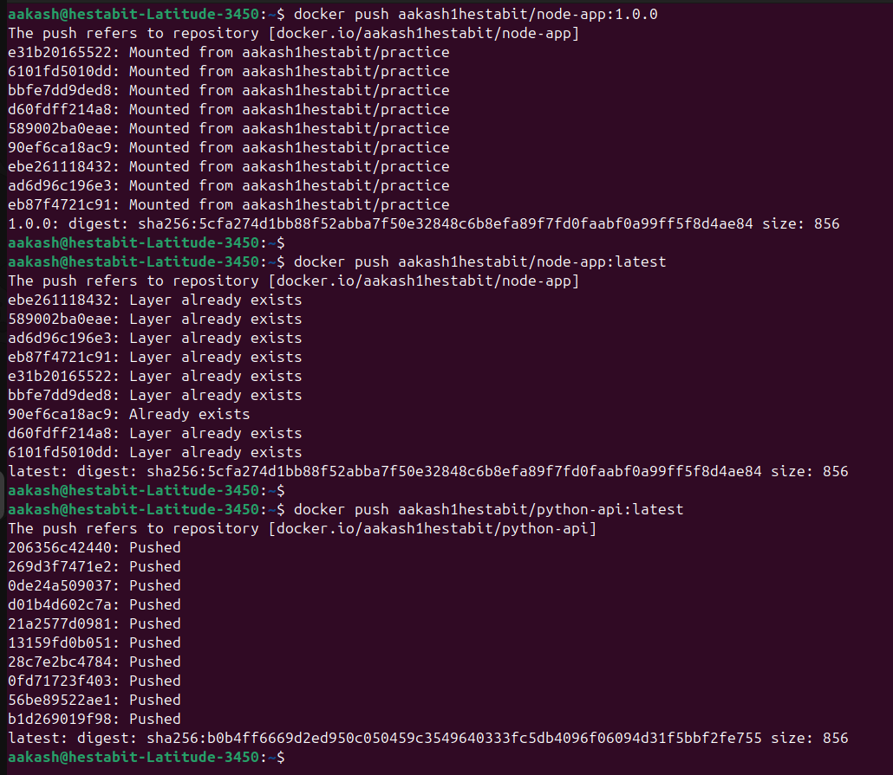

#### Local Image Removal

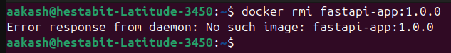

#### Pulling and Running Image from Docker Hub

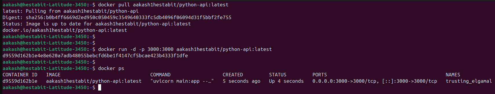

#### Docker Hub Screenshots for images

- python api image

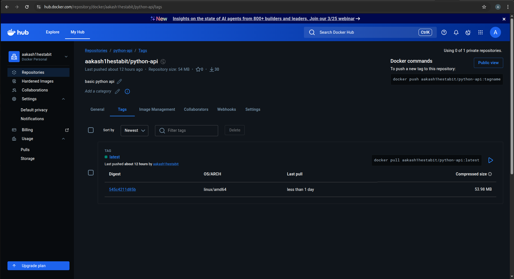

- node api image

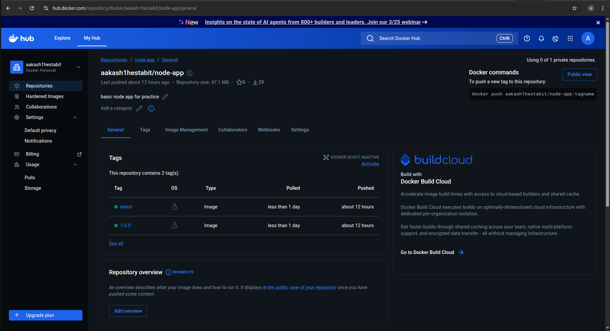


---
---

## Set Up Private Docker Registry

- Created required directories for registry storage --> `/opt/registry/{data,auth,certs}`.
- Generated a **self-signed SSL/TLS certificate** for secure communication (`registry.local`).
- Created **htpasswd authentication file** using `httpd:2` container.
- Ran **Docker registry container (`registry:2`)** with:
  - TLS enabled
  - Basic authentication
  - Persistent storage volume (`/opt/registry/data`)
- Added **domain mapping (`registry.local`)** in `/etc/hosts`.
- Trusted the self-signed certificate by copying it to system CA certificates.
- Logged in to the private registry using `docker login registry.local:5000`.
- Tagged application image for the private registry.
- Pushed the image --> `registry.local:5000/node-app:1.0.0`.
- Verified successful push by checking registry storage path.

#### Registry Directory Setup

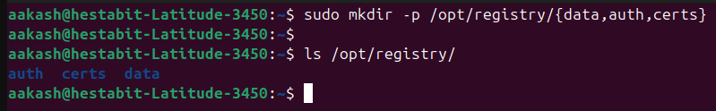

#### TLS Certificate and Authentication Setup

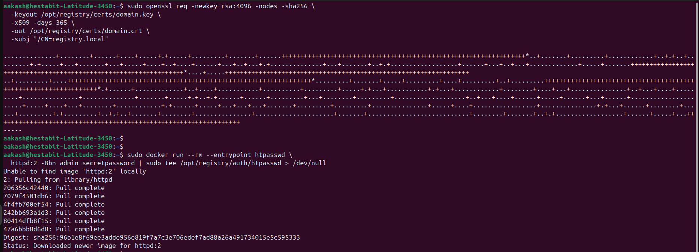

#### Registry Deployment and Domain Mapping

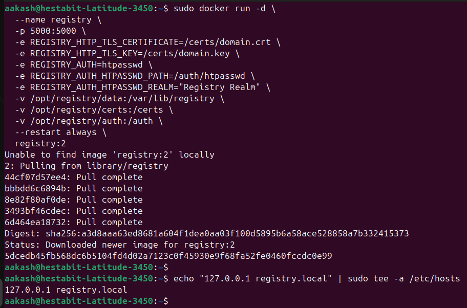

#### Certificate Trust and Registry Login

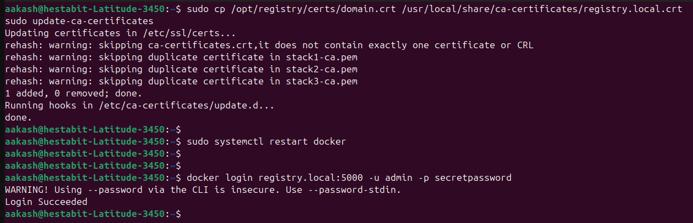

#### Push and Verification in Private Registry

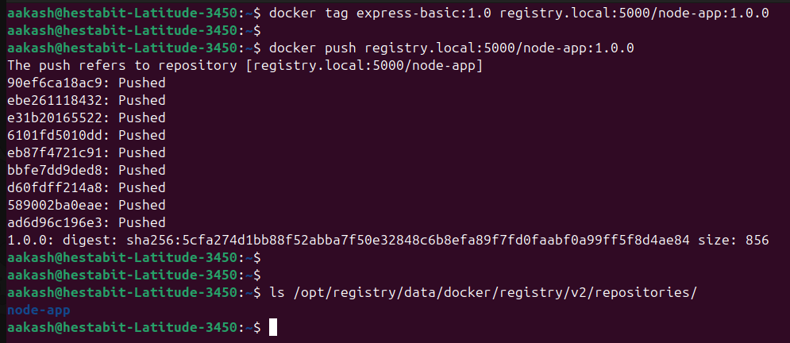

---
---

## Multi-Environment Deployment

### Overview

Implemented a complete multi-environment deployment system inside the `multi-env-deployment/` folder. The setup uses a single basic **Node.js / Express API** backed by **PostgreSQL**, deployed across three isolated environments `dev`, `staging`, and `prod` each with its own Docker Compose overrides and environment variable files.

### Project Structure

```text
multi-env-deployment/
├── app/
│   ├── server.js          # Express API (/, /health, /config endpoints)
│   ├── migrate.js         # Database migration script
│   ├── package.json
│   └── Dockerfile         # Multi-stage build (builder --> production)
├── nginx/
│   ├── staging.conf       # Nginx reverse-proxy config for staging
│   └── prod.conf          # Nginx reverse-proxy config + SSL for prod
├── docker-compose.yml          # Base configuration (shared by all envs)
├── docker-compose.dev.yml      # Dev overrides (live-reload, exposed DB port)
├── docker-compose.staging.yml  # Staging overrides (2 replicas + nginx)
├── docker-compose.prod.yml     # Prod overrides (3 replicas + nginx + TLS + resource limits)
├── .env.dev
├── .env.staging
├── .env.prod
└── deploy.sh              # Deployment script (up / down / status / logs)
```

### Environment Differences

| Feature              | dev                          | staging                      | prod                              |
|----------------------|------------------------------|------------------------------|-----------------------------------|
| API replicas         | 1                            | 2                            | 3                                 |
| Log level            | `debug`                      | `warn`                       | `error`                           |
| DB port exposed      | Yes (`5433` on host)         | No                           | No                                |
| Nginx reverse proxy  | No (direct port 3000)        | Yes (port 80)                | Yes (port 80 --> 443 with SSL)      |
| Resource limits      | None                         | None                         | CPU + Memory limits on all        |
| Rolling update       | -                            | start-after                  | `start-first` (zero-downtime)     |
| Source mount         | Yes (live code sync)         | No                           | No                                |

### Deployment Procedure

**Deploy dev environment**
```bash
./deploy.sh dev up
```

**Deploy staging environment**
```bash
./deploy.sh staging up
```

**Deploy production environment**
```bash
./deploy.sh prod up
```

**Check service status**
```bash
./deploy.sh dev status
```

**Tail logs**
```bash
./deploy.sh dev logs
```

**Tear down an environment**
```bash
./deploy.sh dev down
```

### What deploy.sh does (step by step)

1. Validates the environment name (`dev` | `staging` | `prod`).
2. Sources the matching `.env.<environment>` file.
3. Selects the correct compose file pair (base + override).
4. Pulls any updated base images (`docker compose pull`).
5. Builds the application image (`docker compose build --no-cache`).
6. Runs database migrations (`node migrate.js`) in a one-off container.
7. Starts all services with `--remove-orphans` (rolling update strategy).
8. Waits 15 s and prints the final service status table.

### Node.js API Endpoints

| Endpoint      | Description                                               |
|---------------|-----------------------------------------------------------|
| `GET /`       | Returns greeting, environment name, version, timestamp    |
| `GET /health` | Returns health status and process uptime                  |
| `GET /config` | Returns active environment config (log level, DB info)    |

---
---

## Blue-Green Deployment

### Overview

Implemented a zero-downtime **blue-green deployment** system inside the `blue-green-deployment/` folder. Two identical environments (blue = v1.0, green = v2.0) run as separate Docker containers on a shared network. An **nginx** reverse-proxy routes 100% of traffic to the active slot. Switching is instant (nginx reload) with no dropped connections, and the old slot stays alive for immediate rollback.

#### Project Structure

```text
blue-green-deployment/
├── app/
│   ├── server.js        # Express API – reads COLOR & APP_VERSION env vars
│   ├── package.json
│   └── Dockerfile
├── nginx/
│   └── nginx.conf       # Upstream block toggled by deploy script
├── docker-compose.blue.yml    # Blue slot (v1.0 – "current" release)
├── docker-compose.green.yml   # Green slot (v2.0 – "new" release)
├── docker-compose.nginx.yml   # Nginx router (port 8080 → internal port 80)
├── blue-green-deploy.sh       # Main deployment + traffic-switch script
└── rollback.sh                # Instant rollback to standby slot
```

1. **Both slots always running** - only the nginx upstream switches.
2. **nginx upstream** in `nginx/nginx.conf` has one line commented / uncommented to pick the active slot.
3. `nginx -s reload` is zero-downtime (active connections finish on old worker; new connections go to new upstream).

### Deployment Procedure

**One-time bootstrap** (creates network + starts nginx + launches blue):
```bash
./blue-green-deploy.sh init
```

**Deploy new version to inactive slot** (auto-detects which is active):
```bash
./blue-green-deploy.sh
```

**Force deploy to a specific slot:**
```bash
./blue-green-deploy.sh green   # or blue
```

**Instant rollback:**
```bash
./rollback.sh
```

**Remove old (standby) slot after successful release:**
```bash
docker compose -f docker-compose.blue.yml down   # if green is now live
```

#### blue-green-deploy.sh

- Detects active slot from `nginx.conf` upstream, targets the other slot |
- Builds and starts the new container (`docker compose up -d --build`) |
- Waits (up to 60 s) for Docker HEALTHCHECK to report `healthy` |
- Runs a direct health check inside the new container (`/health` → `{"status":"OK"}`) |
- Updates `nginx.conf` (Python in-place write, preserves inode) and reloads nginx |

### API Endpoints


- `GET /`    - Returns greeting with active `color` and `version` 
- `GT /health` - Returns `{"status":"OK", "color":..., "version":...}` 
- `GET /info`   - Returns color, version, Node.js version, PID   

###Verification

- Bootstrapped the system with `./blue-green-deploy.sh init` (blue active on port 8080).
- Ran `./blue-green-deploy.sh` - all 5 steps passed, nginx reloaded, green went live.
- Confirmed `curl http://localhost:8080/` returned `"color": "green"` after switch.
- Ran `./rollback.sh` - auto-detected blue as standby, switched back, blue went live.
- Confirmed `curl http://localhost:8080/` returned `"color": "blue"` after rollback.
- All three containers (`app-blue`, `app-green`, `bg-nginx`) showed **healthy** health status.

#### All Containers Healthy

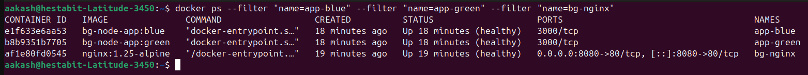

#### Blue-to-Green Deployment

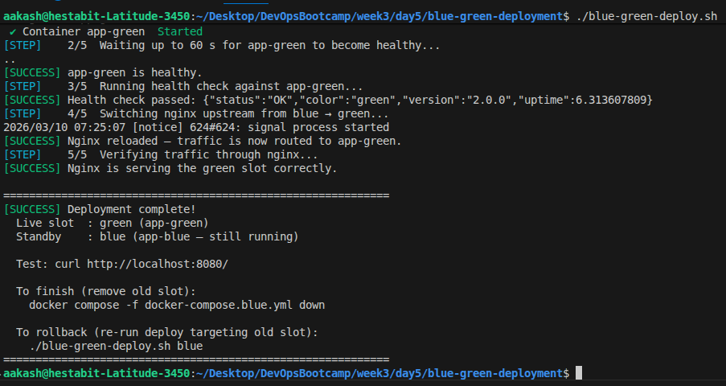

#### Traffic Verification After Switch
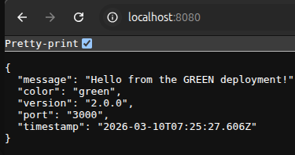
#### Rollback

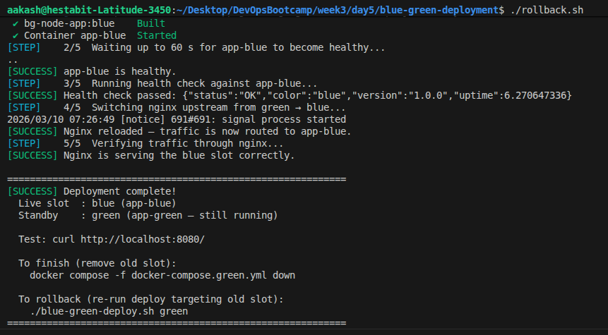

- verified after rollback
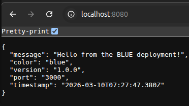

---
---

## Container Monitoring with cAdvisor + Prometheus + Grafana

### Overview

Set up a full container monitoring stack inside the `container-monitoring/` folder. **cAdvisor** scrapes per-container metrics (CPU, memory, network, disk I/O) and exposes them in Prometheus format. **Prometheus** collects and stores those metrics. **Grafana** visualises them through a pre-provisioned dashboard.

### Project Structure

```text
container-monitoring/
├── docker-compose.yml                              # cAdvisor + Prometheus + Grafana
├── prometheus.yml                                  # Scrape config (cadvisor + prometheus self)
├── setup.sh                                        # up / down / status / logs helper
└── grafana/
    ├── provisioning/
    │   ├── datasources/prometheus.yml              # Auto-provision Prometheus datasource
    │   └── dashboards/dashboard.yml                # Tell Grafana where to load dashboards
    └── dashboards/container-monitoring.json        # Pre-built dashboard (CPU/Mem/Net/Disk)
```

### Services & Ports

| Service    | Host Port | Description                          |
|------------|-----------|--------------------------------------|
| cAdvisor   | `9091`    | Container metrics endpoint           |
| Prometheus | `9090`    | Metrics storage + query UI           |
| Grafana    | `3001`    | Visualisation (`admin` / `admin`)    |

### Deployment

```bash
cd container-monitoring
./setup.sh up       # start the stack
./setup.sh status   # check container status
./setup.sh down     # tear down
```


- **cAdvisor** runs with `privileged: true` and mounts host paths (`/`, `/sys`, `/var/lib/docker`, `/dev/disk`) to read container runtime stats.
- **Prometheus** scrapes `cadvisor:8080` every 10 s and retains data for 7 days.
- **Grafana** datasource and dashboard are provisioned automatically at startup (no manual setup needed).
- Dashboard panels: CPU usage, CPU % of host, memory usage, memory % of host, network rx/tx, disk read/write - all per container.

### Verification

- All three containers started and passed HTTP health checks (`200`).
- Prometheus targets: both `cadvisor` and `prometheus` reported `health=up`.
- Grafana REST API confirmed Prometheus datasource and "Container Monitoring" dashboard auto-provisioned.

#### Stack Running

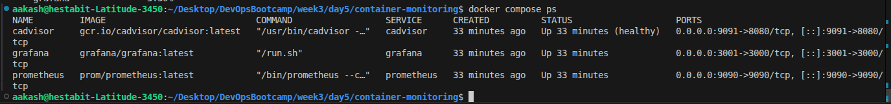
#### Prometheus Targets

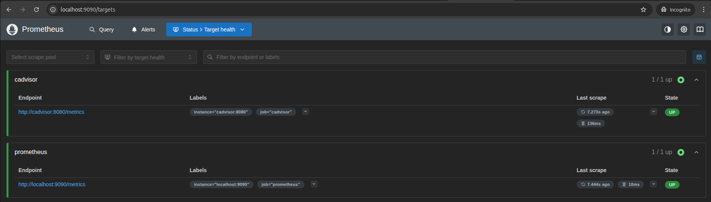

#### Grafana Dashboard – CPU & Memory

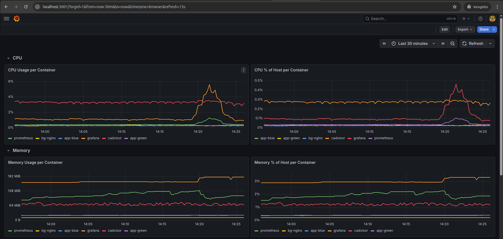

#### Grafana Dashboard – Network & Disk I/O

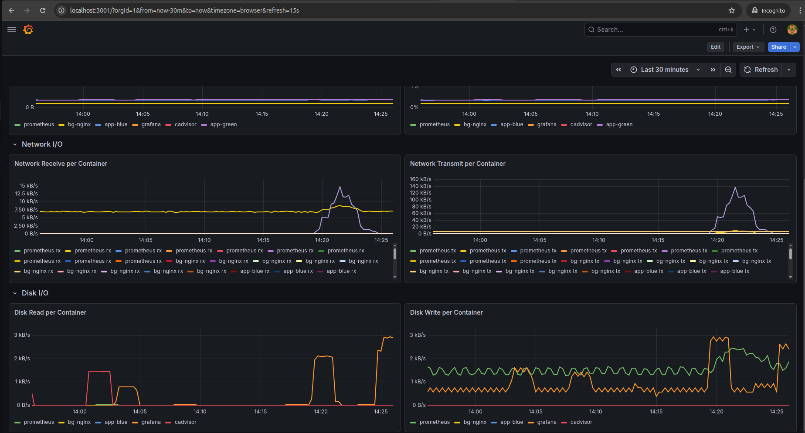

---
---

## Automated Docker Backup System


Created [backup-docker-system.sh](backup-docker-system.sh) - a backup script that archives all Docker volumes, compose configurations, environment files, and images with timestamp-based storage and 7-day rotation.

- Discovers and backs up every Docker volume via an ephemeral `alpine` container that tars the volume contents.
- Finds all `docker-compose*.yml` files under configurable search paths and archives them into a single tarball.
- Separately archives all `.env*` files (excluding `.env.example`) to preserve runtime configuration.
- Saves every local Docker image (`docker save | gzip`) so the full stack can be restored offline.
- Generates a `manifest.txt` inside the backup directory recording date, hostname, Docker version, and item counts.
- Automatically removes backup directories older than 7 days (configurable via `RETENTION_DAYS`).
- Runs a restore dry-run - verifies directory structure exists and `gzip -t` checks every archive for integrity.
- Produces a timestamped report at [reports/backup-report-YYYYMMDD.txt](reports/backup-report-20260310.txt).
- Defaults backup root to `./backups/`; override with `BACKUP_ROOT` env var for production paths like `/backup/docker`.
- Exits with code 0 on success; non-zero indicates the number of errors encountered.

---
---

## Performance Analysis

Created [performance-analysis.sh](performance-analysis.sh) - analyses Docker image sizes, container resource usage, startup times, application response times, and disk utilisation, producing a detailed report with optimisation recommendations.

- Lists all Docker images with repository, tag, size, and creation date in a formatted table.
- Ranks the top 10 largest images by size to highlight candidates for multi-stage builds or base image changes.
- Captures live CPU, memory, network I/O, and block I/O stats for every running container via `docker stats`.
- Records each container's startup timestamp and health status to gauge boot performance.
- Probes common ports (80, 443, 3000, 3001, 5000, 8080, 9090, 9091) with `curl` and reports response times.
- Displays per-volume and overall Docker system disk usage (`docker system df`).
- Lists all Docker networks with driver and scope information.
- Flags actionable optimisation issues: `:latest` tags, dangling images, stopped containers, oversized images, missing health checks.
- Outputs the full report to [reports/performance-report-YYYYMMDD.txt](reports/performance-report-20260310.txt).

---
---

## Production Deployment Playbook

### Overview

Created [DEPLOYMENT_PLAYBOOK.md](DEPLOYMENT_PLAYBOOK.md) - deployment playbook covering pre-deployment checks, step-by-step deployment commands, post-deployment verification, and rollback procedures.

#### Playbook Sections

- **Pre-Deployment Checklist** - covering CI/CD, security scans, migrations, backups, team notification, maintenance windows, rollback rehearsal, and monitoring readiness.
- **Deployment Steps** - ordered steps: backup, pull code, build images, run migrations, deploy, and verify.
- **Post-Deployment Verification** - checks from service health to user acceptance testing.
- **Rollback Procedure** - steps to stop, restore, restart, verify, and document the incident.

### Reference

- [DEPLOYMENT_PLAYBOOK.md](DEPLOYMENT_PLAYBOOK.md)
---
---