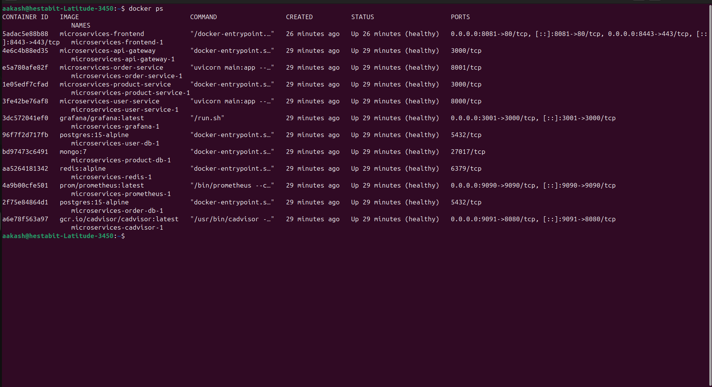
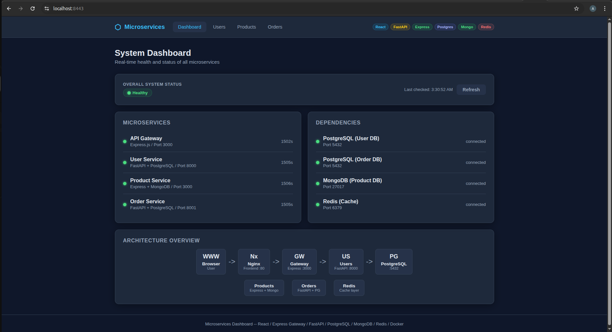
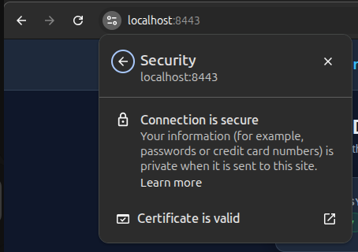
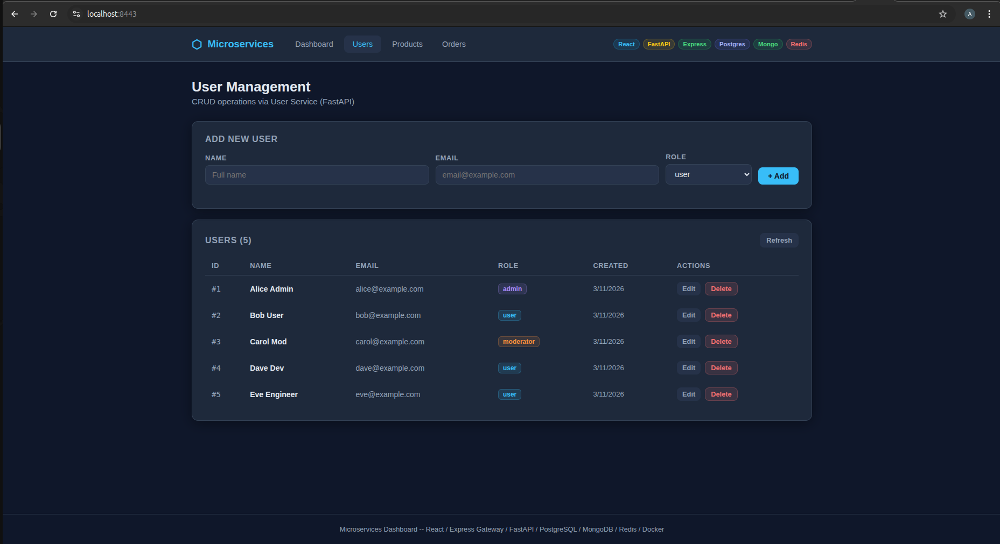
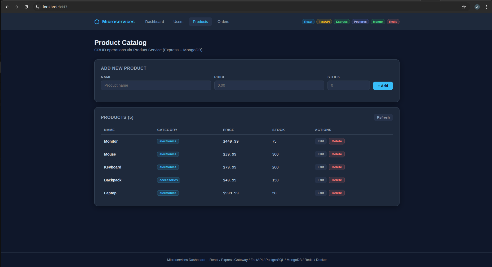
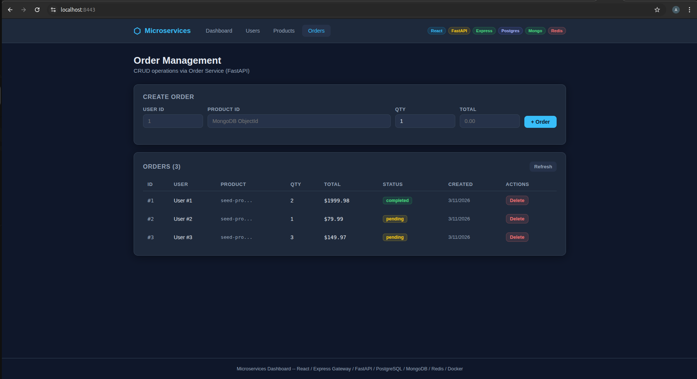
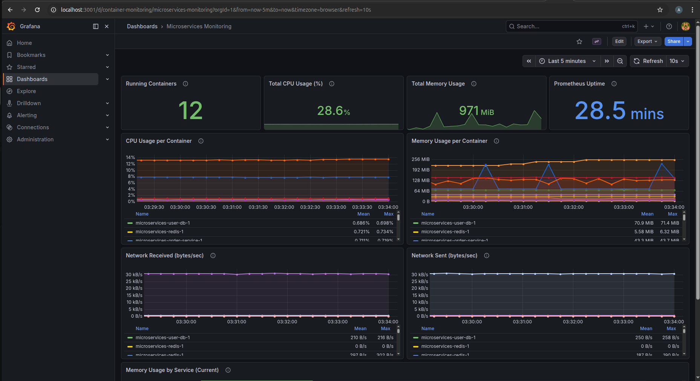
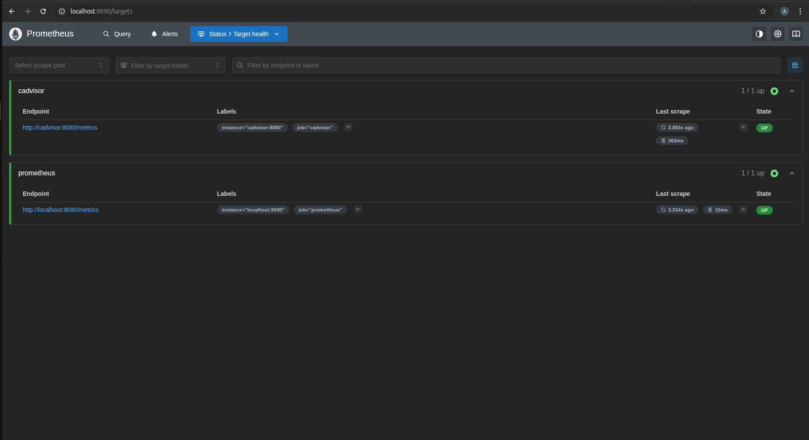

# Week 3 Final Project - Microservices Platform

A containerized microservices application demonstrating Docker concepts covered in Week 3: multi-stage builds, container networking, health checks, monitoring, multi-environment deployment, SSL/TLS, and security hardening.


- **Frontend**: React dashboard served by Nginx with SSL/TLS
- **API Gateway**: Express.js with rate limiting and request proxying
- **User Service**: FastAPI + PostgreSQL + Redis caching
- **Product Service**: Express + MongoDB + Redis caching
- **Order Service**: FastAPI + PostgreSQL + Redis caching
- **Monitoring**: Prometheus + Grafana + cAdvisor

## Quick Start

```bash
# Start all services (development)
./deploy.sh dev

# Start all services (production — requires SSL certs in ssl/)
./deploy.sh prod

# Stop all services
./deploy.sh down

# View stack status
./deploy.sh status
```

## Access Points

| Service    | URL                          | Credentials   |
|------------|------------------------------|---------------|
| Frontend (HTTP)  | http://localhost:8081   |               |
| Frontend (HTTPS) | https://localhost:8443  |               |
| Prometheus | http://localhost:9090         |               |
| Grafana    | http://localhost:3001         | admin / admin |
| cAdvisor   | http://localhost:9091         |               |


## Project Structure

```
week3-final-project/
  api-gateway/          Express API gateway with rate limiting
  frontend/             React dashboard + Nginx reverse proxy (HTTP + HTTPS)
  ssl/                  Self-signed SSL certificate and key
  services/
    user-service/       FastAPI + PostgreSQL (CRUD users)
    product-service/    Express + MongoDB   (CRUD products)
    order-service/      FastAPI + PostgreSQL (CRUD orders)
  database/             PostgreSQL init SQL scripts
  monitoring/           Prometheus, Grafana configs & dashboards
  scripts/              Build, test, health check, security scan, SSL trust
  docs/                 Architecture, deployment, API reference
  security/             Trivy scan reports
```

## Scripts

| Script                     | Purpose                                       |
|----------------------------|-----------------------------------------------|
| `deploy.sh`               | Deploy stack (dev / prod / down / restart / status) |
| `backup.sh`               | Backup databases & configs (gzip, checksums, retention) |
| `backup.sh --list`        | List all available backups                    |
| `backup.sh --restore <dir>`| Restore databases from a backup              |
| `backup.sh --prune`       | Remove backups older than retention period    |
| `scripts/build-all.sh`    | Build all Docker images with timing summary   |
| `scripts/test-all.sh`     | Run end-to-end API + SSL tests               |
| `scripts/health-check.sh` | Check health of all services, APIs, SSL, monitoring |
| `scripts/security-scan.sh`| Trivy vulnerability scan with reports         |
| `scripts/trust-ssl-cert.sh`| Add SSL cert to system & Chrome trust stores |

## Docker Compose Files

| File                    | Purpose                                                      |
|-------------------------|--------------------------------------------------------------|
| `docker-compose.yml`   | Base configuration (all services, networks, volumes)         |
| `docker-compose.dev.yml`| Dev overrides (hot reload, debug ports, relaxed limits)     |
| `docker-compose.prod.yml`| Prod overrides (strict limits, log rotation, restart policies) |

## Networks

| Network            | Services                                              | External |
|--------------------|-------------------------------------------------------|----------|
| frontend-network   | frontend, api-gateway                                 | yes      |
| backend-network    | api-gateway, user/product/order-service, redis        | yes      |
| db-network         | user/product/order-service, user-db, order-db, product-db, redis | no (internal) |
| monitoring-network | cadvisor, prometheus, grafana                         | yes      |

## Key Concepts Demonstrated

- Multi-stage Docker builds (all services)
- Non-root container users (all services)
- Docker health checks (all containers including monitoring)
- Container resource limits
- Network isolation (4 separate networks, db-network is internal)
- Named volumes for data persistence
- Environment-based configuration (.env)
- Centralized API gateway with rate limiting
- Redis caching with 30s TTL
- **SSL/TLS termination** at Nginx (TLSv1.2 + TLSv1.3, HSTS, security headers)
- Container monitoring (Prometheus + Grafana + cAdvisor)
- **Monitoring filtered to project containers only** (no host noise)
- Database backup with compression, checksums, and retention
- Security scanning with Trivy

## SSL/TLS

The frontend serves both HTTP (port 8081) and HTTPS (port 8443) with a self-signed certificate stored in `ssl/`.

**Certificate details:**
- TLS protocols: TLSv1.2, TLSv1.3
- Security headers: HSTS, X-Content-Type-Options, X-Frame-Options, X-XSS-Protection
- Valid for: 365 days (localhost, 127.0.0.1)

**Trust the certificate (optional):**
```bash
sudo ./scripts/trust-ssl-cert.sh
```

## Troubleshooting

**Services not starting?**
```bash
docker compose ps -a              # check container status
docker compose logs <service>     # check specific service logs
```

**Database connection errors?**
```bash
# Verify databases are healthy first
docker compose ps user-db order-db product-db
# Check that .env credentials match the init SQL scripts
```

**Grafana dashboards show no data?**
```bash
# Verify Prometheus is scraping targets
curl http://localhost:9090/api/v1/targets | python3 -m json.tool
# Verify the datasource UID in datasource.yml matches dashboard JSON
```

**API returns 502/503?**
```bash
# The backend service may not be healthy yet — wait and retry
./scripts/health-check.sh
```

## Documentation

- [Architecture](docs/ARCHITECTURE.md)
- [Deployment Guide](docs/DEPLOYMENT.md)
- [API Reference](docs/API.md)


## SCREENSHOTS

- all the containers are running and are healthy 


- frontend on secure port


- the connection is marked as secure in browser


- user management


- product catalog


- order management


- grafana is running fine 


- prometheus is running fine 
