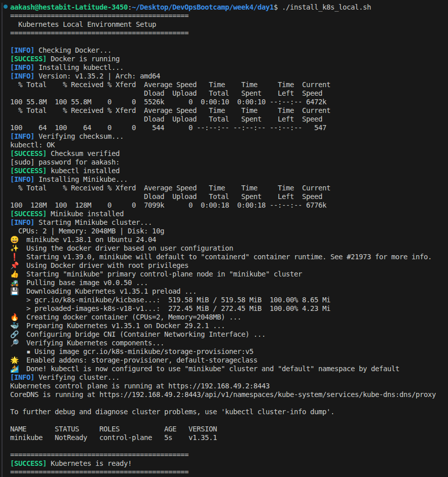
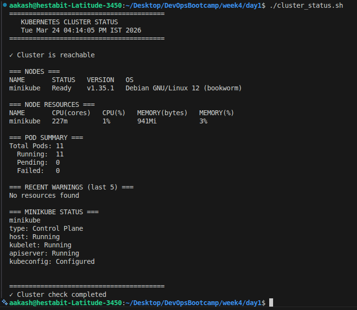
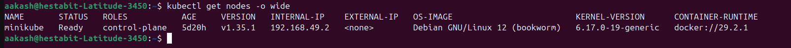
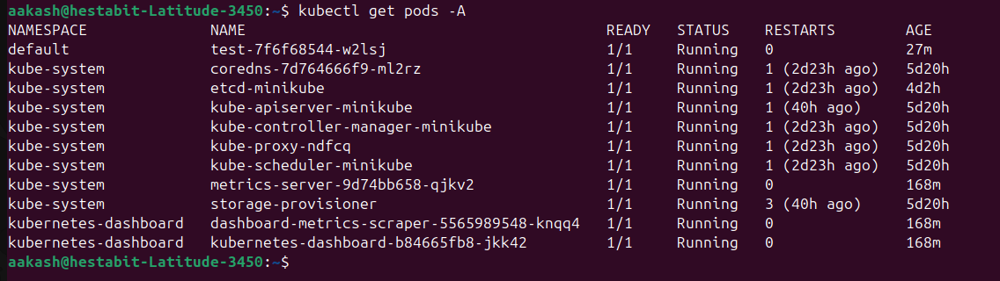
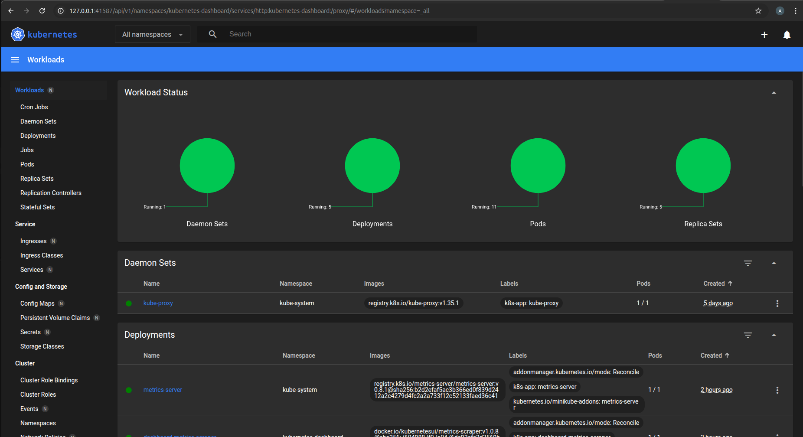

# Kubernetes Architecture & Minikube Setup

## Why Kubernetes?
- **Container Orchestration**: Automatically manage hundreds of containers
- **Self-Healing**: Restart failed containers automatically
- **Horizontal Scaling**: Add/remove replicas on demand
- **Service Discovery**: Built-in load balancing and networking
- **Zero-Downtime Deployments**: Automated rollouts and rollbacks
- **Configuration Management**: Secrets and config maps support

## Kubernetes Architecture

### Control Plane
- **API Server**: Front door for all cluster communication
- **etcd**: key-value database storing all cluster state
- **Scheduler**: Decides which node runs which pod
- **Controller Manager**: Ensures desired state matches actual state

### Worker Nodes 
- **kubelet**: Agent managing pods on each node
- **kube-proxy**: Handles networking rules and service discovery
- **Container Runtime**: Executes containers (Docker, containerd)

---

## Scripts Overview

#### `install_k8s_local.sh` - Installation & Cluster Setup
1.  Validates Docker installation and status before proceeding
2.  Installs kubectl with version verification using official K8s repositories
3.  Automatically downloads and installs latest Minikube binary
4.  Initializes Minikube cluster with Docker driver (2 CPUs, 2GB RAM, 10GB disk)
5.  Performs end-to-end verification of cluster connectivity

#### `cluster_status.sh` - Health Monitoring & Diagnostics
6.  Real-time cluster connectivity checks with error handling
7.  Displays node status, versions, and OS information in structured format
8.  Tracks pod distribution across namespaces (Running/Pending/Failed states)
9.  Reports resource usage metrics when metrics-server is available
10.  Captures recent warning events and Minikube-specific status information

---

## Cluster Verification

### Successfully Installed Kubernetes


### Cluster Status Overview


### kubectl get nodes -o wide Output


### kubectl get pods -A Output


### Minikube Dashboard


---

## Commands Applied

### Installation
```bash
chmod +x install_k8s_local.sh
./install_k8s_local.sh
```

### Cluster Exploration
```bash
# Cluster information
kubectl cluster-info

# View nodes
kubectl get nodes
kubectl get nodes -o wide
kubectl describe node minikube

# View all pods across namespaces
kubectl get pods -A
kubectl get pods -A -o wide

# Namespace management
kubectl get namespaces
kubectl get pods -n kube-system

# Dashboard access
minikube addons enable dashboard
minikube addons enable metrics-server
minikube dashboard

### Cluster Status Check
chmod +x cluster_status.sh
./cluster_status.sh

```