## Pod with Resource Limits

**YAML:** - **[pod-with-resources.yaml](../manifests/day2/pod-with-resources.yaml)**

**Key Points:**  
- `requests` (100m CPU, 64Mi memory) ensure scheduler reserves guaranteed capacity  
- `limits` (200m CPU, 128Mi memory) cap usage to prevent noisy-neighbor issues  
- Memory limit breach --> OOMKill; CPU limit --> throttling  
- Improves bin-packing and cluster resource efficiency  
- Essential for production stability and multi-tenant clusters  

Pod creation & resource config:

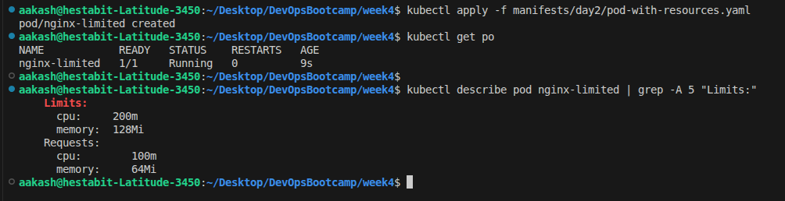

Live resource usage:

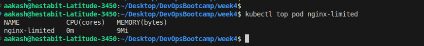

---
---

##  Pod with Health Checks (Probes)

**YAML:** - **[pod-with-resources.yaml](../manifests/day2/pod-with-probes.yaml)**

- Probes are defiend as follows 
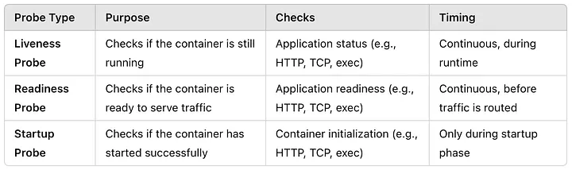

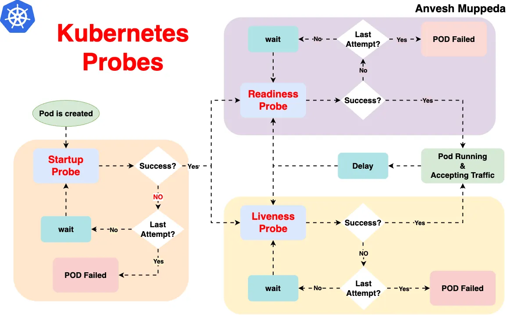

- verified it works properly 
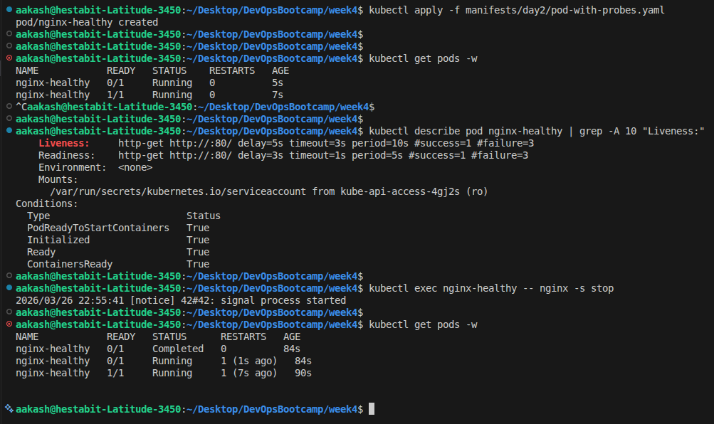

---
---

## Multi-Container Pod (Sidecar Pattern)

**YAML:** - **[multi-container-pod.yaml](../manifests/day2/multi-container-pod.yaml)**

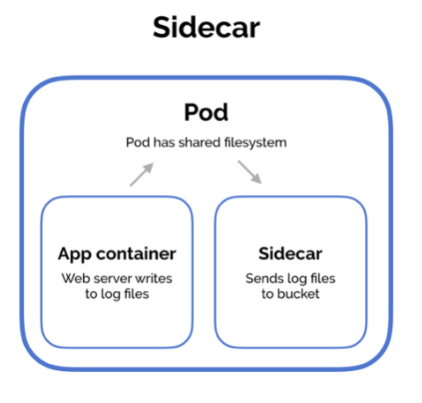

- Test multi-container pod:

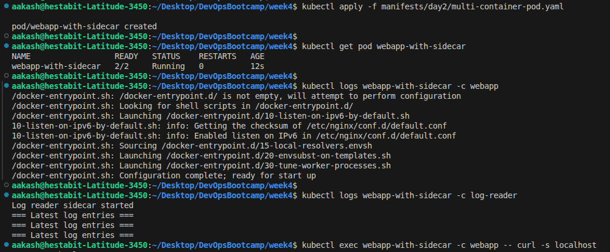

- Log entries printed after some traffic 

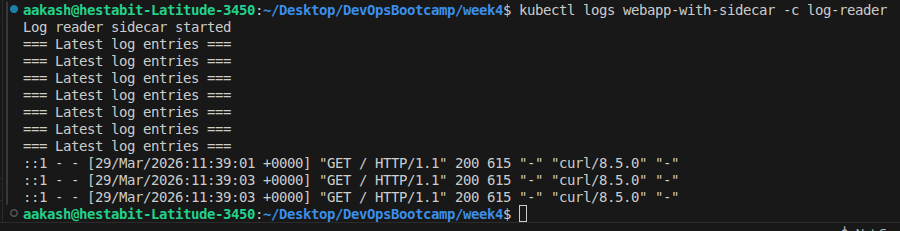

---
---

## Pod with Init Container

**YAML:** - **[pod-with-init.yaml](../manifests/day2/pod-with-init.yaml)**

- created and watched the status of the pod 
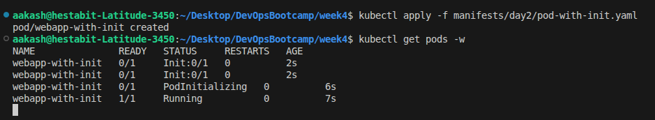

- Verified thw init container ran properly 
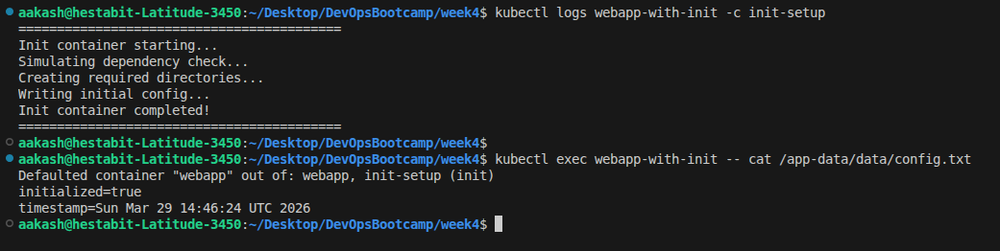

---
---

## Debugging Pods - Common Issues

- Debugged Failed pod 

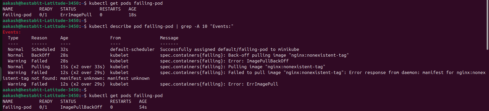

- Debugged Crashed Pod

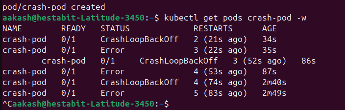

---
---

## script: pod_debug.sh

**SCRIPT:** - **[pod_debug.sh](./pod_debug.sh)**

- Fetch pod status, node placement, and IP details
- List all containers with their image
- Show pod conditions (Ready, Initialized, etc.)
- Display recent pod-related events
- Retrieve logs from all containers (configurable tail)
- Support fetching logs from previous (crashed) containers
- Show real-time resource usage (CPU/Memory) if metrics available
- Validate pod existence before execution
- Support custom namespace and kube-context
- Provide helpful debug commands (`describe`, `logs -f`, `exec`)
- Color-coded output for better readability
- Built-in CLI help via `--help`

- created and tested the script for debugging
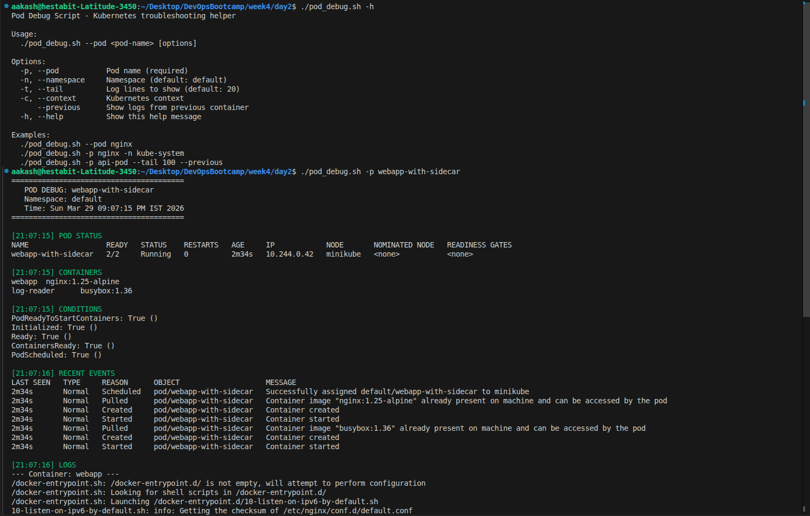