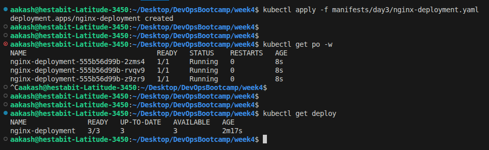
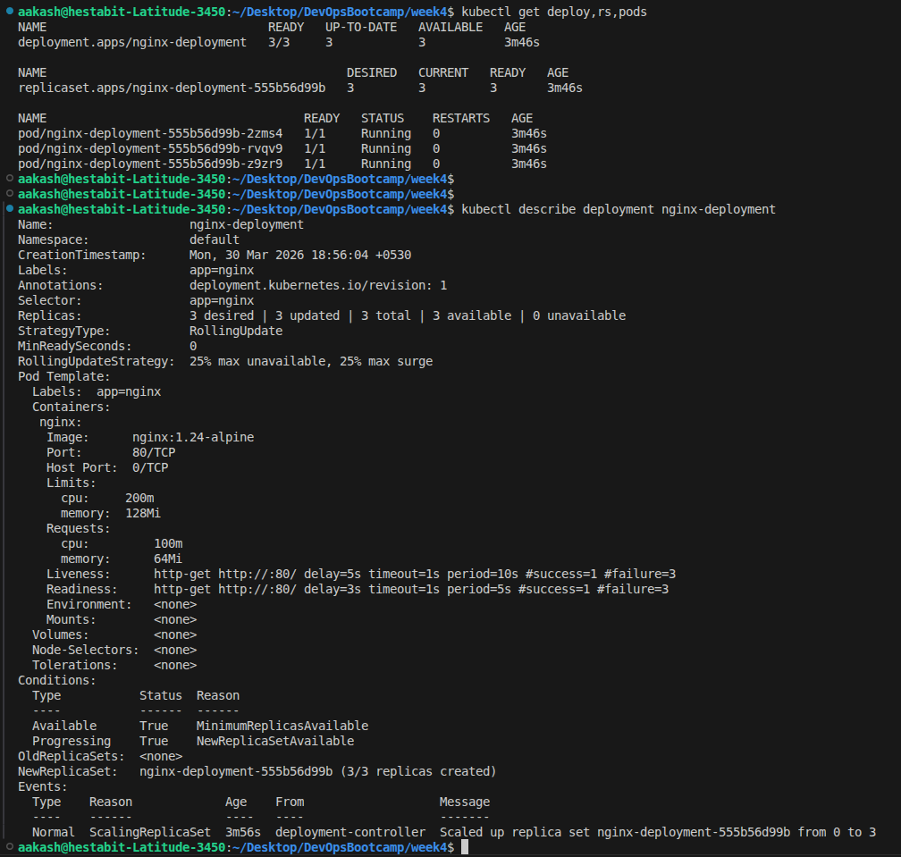
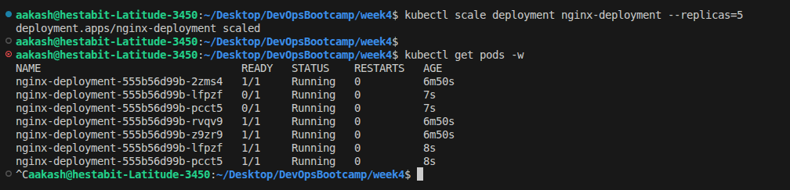
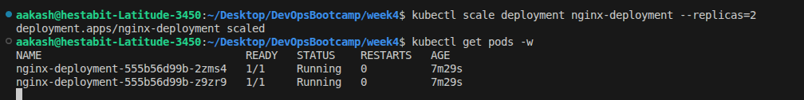
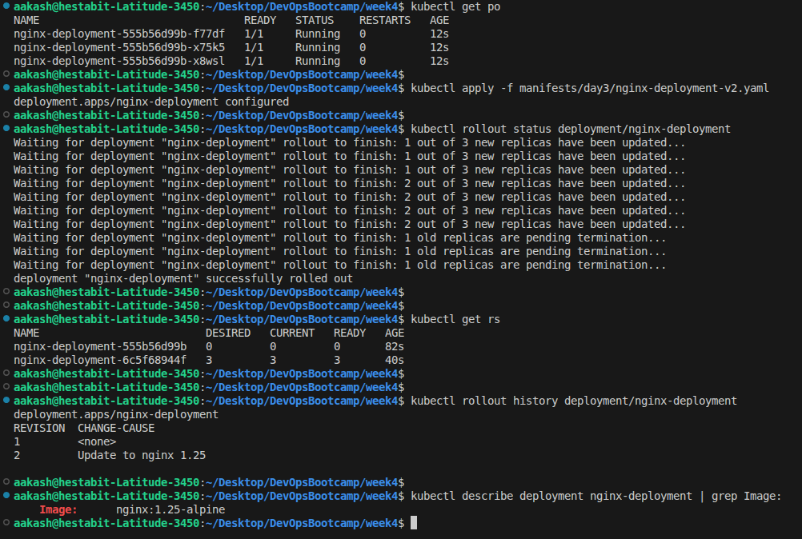
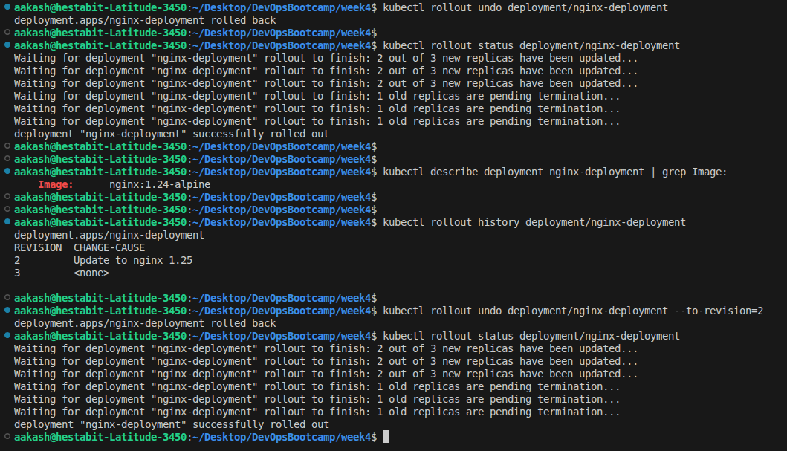
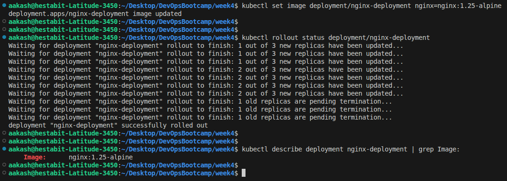
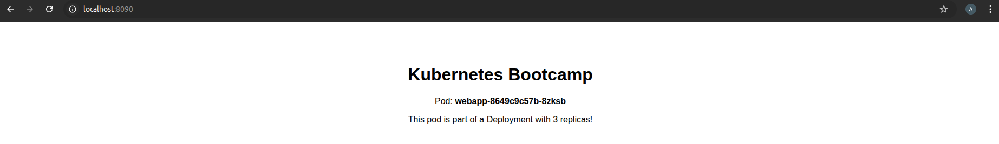

## Creating Deployment 

**YAML:** - **[nginx-deployment.yaml](../manifests/day3/nginx-deployment.yaml)**

- created and verified the deployment

- details of the deployment

---
---

## Scaling Applications

- Scaled deployment up

- Scaled deployment down 

---
---

## Rolling Updates

**YAML:** - **[nginx-deployment-v2.yaml](../manifests/day3/nginx-deployment-v2.yaml)**

- Practiced rolling update

---
---

## Rollbacks

- Practiced rollbacks 

---
---

## Update Using kubectl set image

- Practiced Update Using kubectl set image

---
---

## Deployment with Custom HTML

**YAML:** - **[webapp-deployment.yaml](../manifests/day3/webapp-deployment.yaml)**

- Applied the deployment and then checked the port forewarding in the browser

---
---

## Script: deployment_manager.sh

**SCRIPT:** - **[deployment_manager.sh](deployment_manager.sh)**

- **list** --> Lists all deployments and their pods in the namespace  
- **status** --> Shows deployment details, ReplicaSets, pods, and rollout status  
- **scale** --> Scales a deployment to the desired number of replicas  
- **update** --> Updates the container image of a deployment  
- **rollback** --> Reverts deployment to previous or specified revision  
- **history** --> Displays rollout history of the deployment  
- **restart** --> Restarts all pods in the deployment (rolling restart)