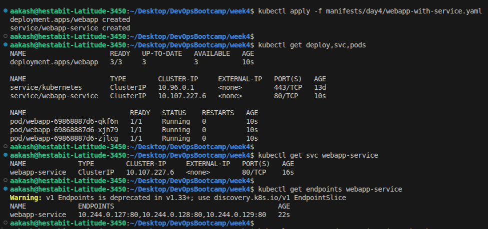
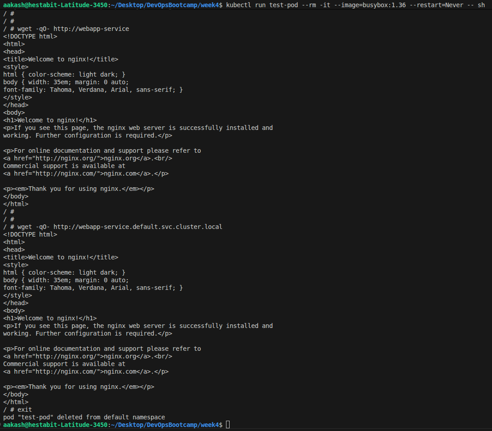
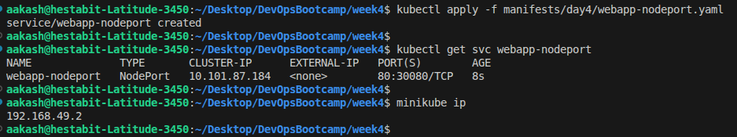
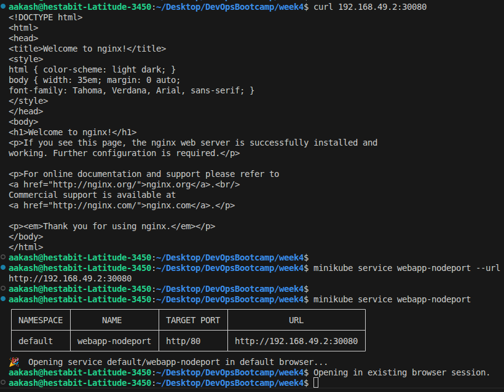
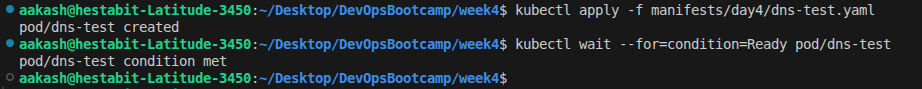
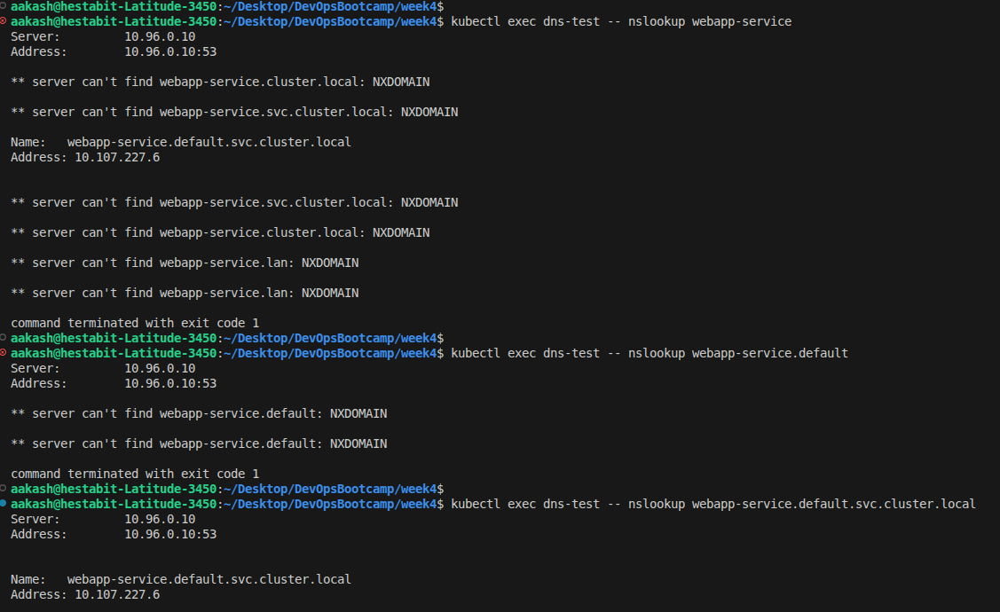
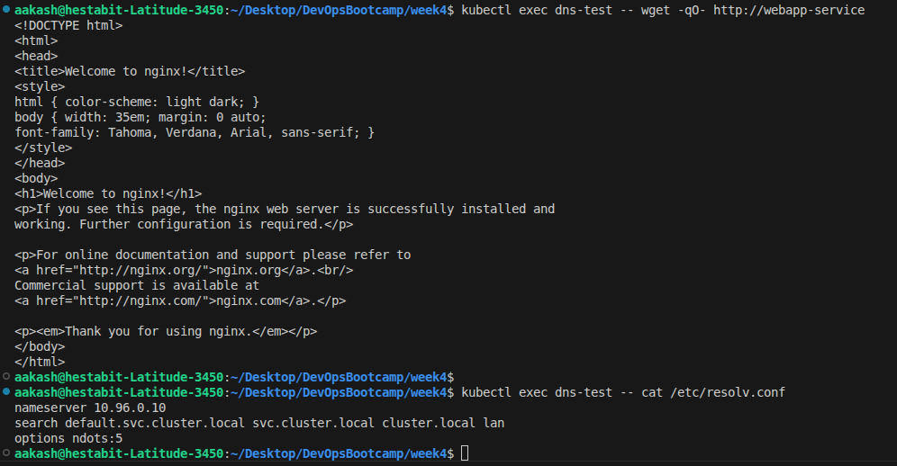
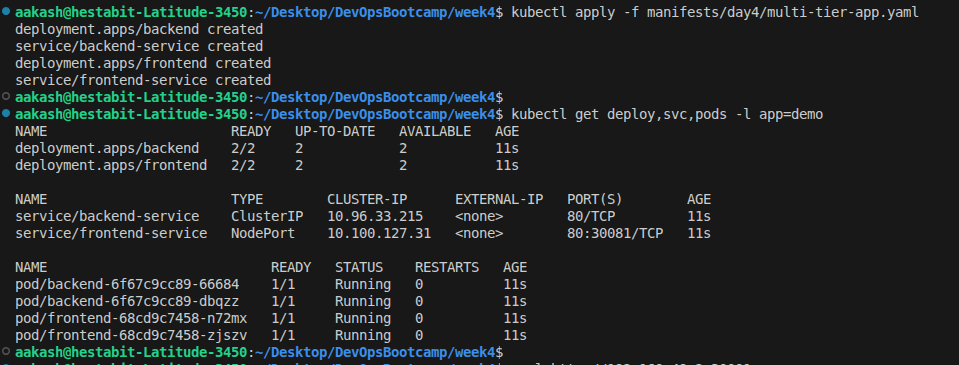
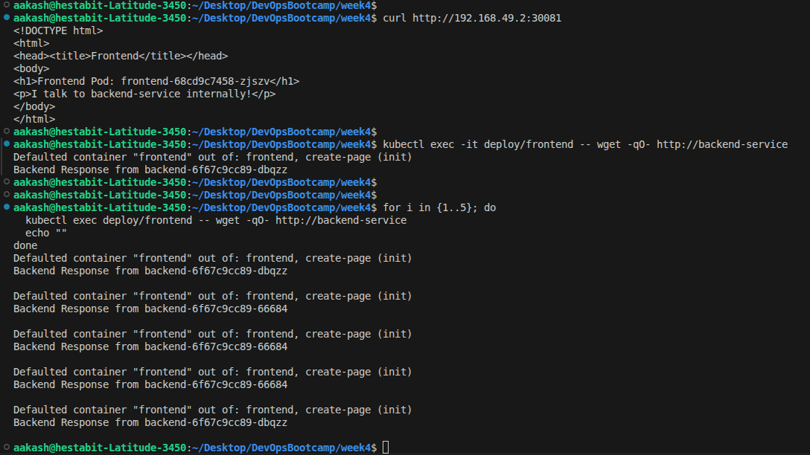
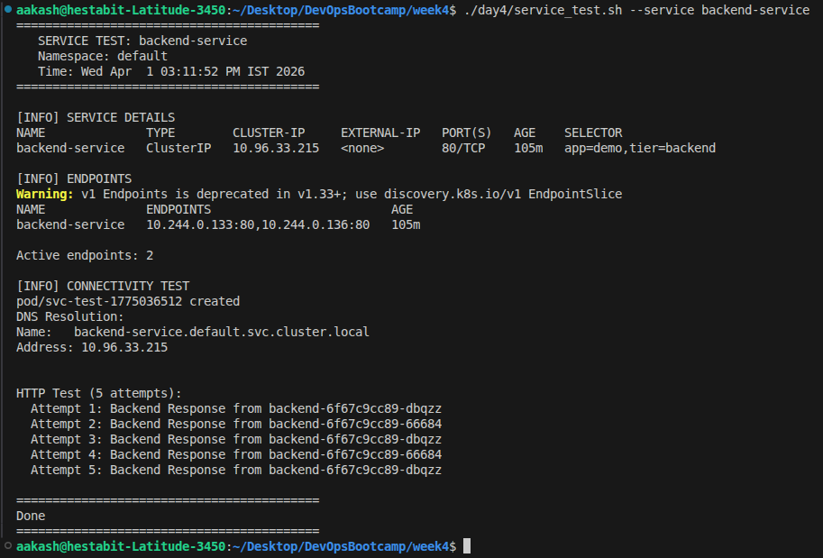

## Create Deployment and ClusterIP Service

**YAML:** - **[webapp-with-service.yaml](../manifests/day4/webapp-with-service.yaml)**

- created and inspected the service

- Test from within cluster

## NodePort Service for External Access

**YAML:** - **[webapp-nodeport.yaml](../manifests/day4/webapp-nodeport.yaml)**

- Created and inspected the NodePort service

- verifed the service using curl commands

## Service Discovery with DNS

**YAML:** - **[dns-test.yaml](../manifests/day4/dns-test.yaml)**

- Started the pod 

- performed dns lookup

- Tested connectivity and looked at all dns options available 

## Multi-Service Application

**YAML:** - **[multi-tier-app.yaml](../manifests/day4/multi-tier-app.yaml)**

- Applied and inspected the resources 

- accessing the services internally and externally and verifying the load balancing

## script: service_test.sh

**SCRIPT:** - **[service_test.sh](service_test.sh)**

- Validates service existence before execution  
- Displays service details (type, cluster IP, ports, etc.)  
- Lists associated endpoints and counts active backends  
- Detects and warns if no endpoints are available  
- Performs in-cluster DNS resolution test  
- Executes HTTP connectivity checks with configurable attempts  
- Supports custom namespace and kube-context  
- Allows configurable retries and request timeout  
- Uses temporary pod for realistic in-cluster testing  
- Automatically cleans up test pod after execution  
- Provides CLI help with usage and examples (`--help`)

- tested the service using the script

