##  Enable Ingress Controller in Minikube

- #### nable nginx ingress controller
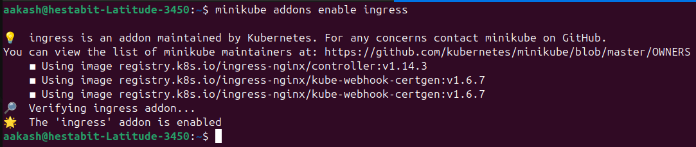

- #### Verified Ingress

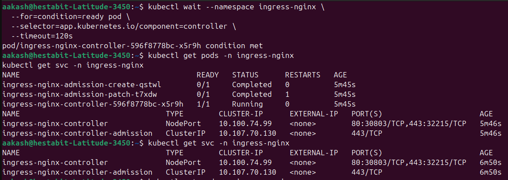

---
---

## Create Applications for Ingress Demo

#### **YAML:** - **[ingress-apps.yaml](../manifests/day5/ingress-apps.yaml)**

- #### applied and verified the deployments and services

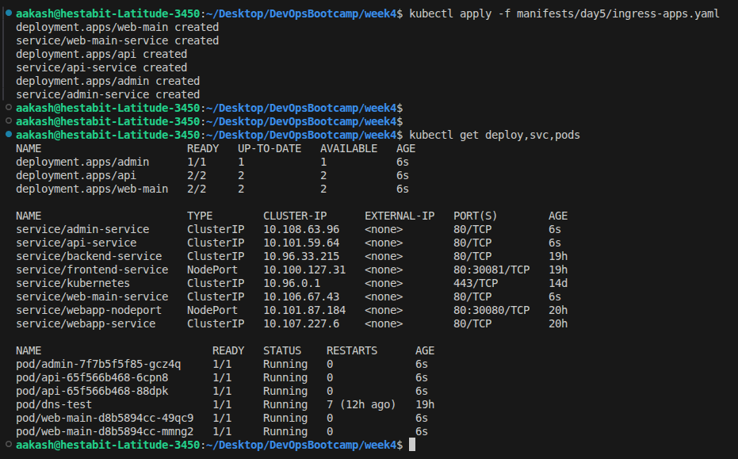

---
---

## Path-Based Ingress

#### **YAML:** - **[ingress-path-based.yaml](../manifests/day5/ingress-path-based.yaml)**

- #### Apply and Check ingress

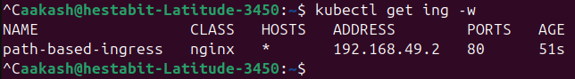

- #### Test each path
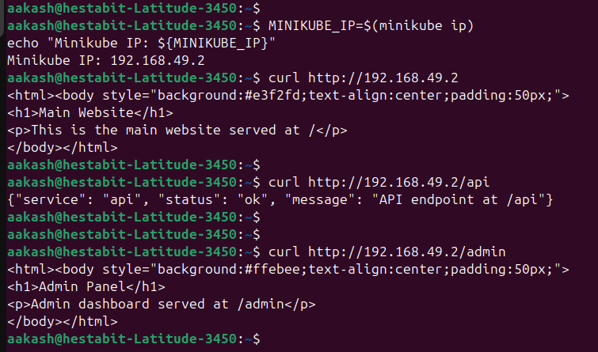

---
---

## Host-Based Ingress

#### **YAML:** - **[ingress-host-based.yaml](../manifests/day5/ingress-host-based.yaml)**

- #### Apply and Verify

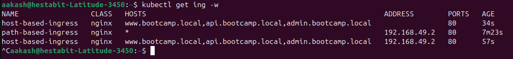

- #### Added the hosts
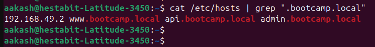

- #### Test each host

- - ##### www.bootcamp.local 

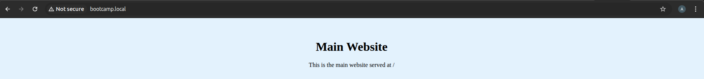

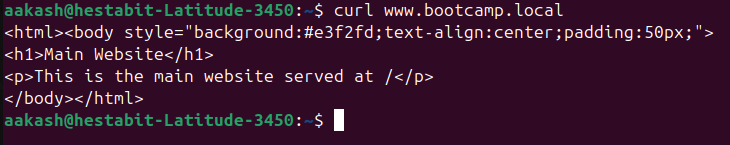

- - ##### api.bootcamp.local

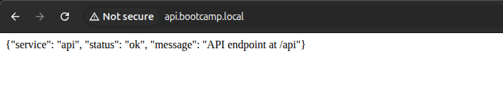

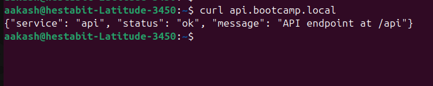

- - ##### admin.bootcamp.local 

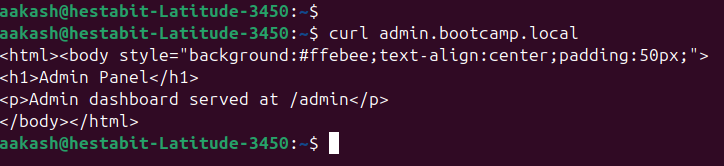

---
---

## ingress_test.sh 

#### **SCRIPT:** - **[ingress_test.sh](ingress_test.sh)**

- Validates ingress controller availability  
- Lists all ingress resources in the namespace  
- Detects cluster/node IP for testing  
- Tests host-based and path-based routing rules  
- Performs HTTP connectivity checks with retries and timeout  
- Supports custom namespace, context, and ingress controller namespace  
- Handles missing ingress/resources gracefully  
- Fetches recent ingress controller logs for debugging  
- Provides CLI help with usage and examples (`--help`)

  - #### Script Output
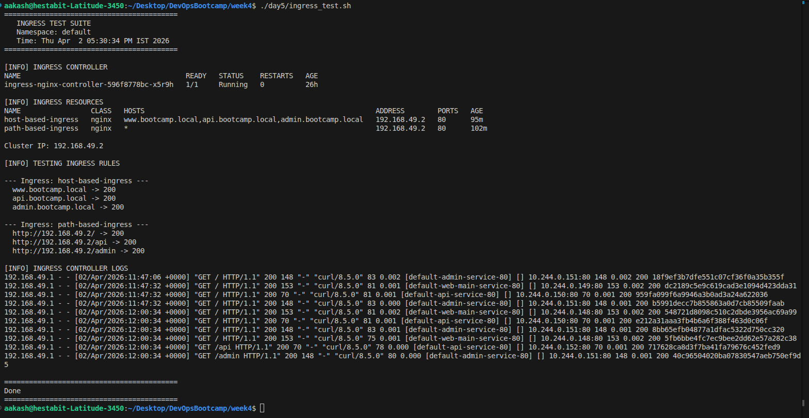