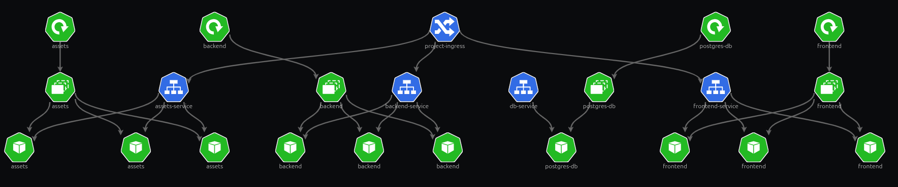
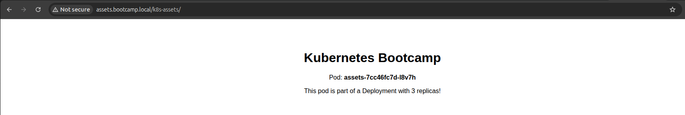
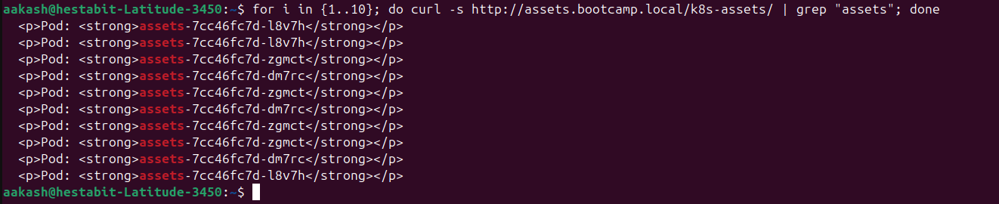
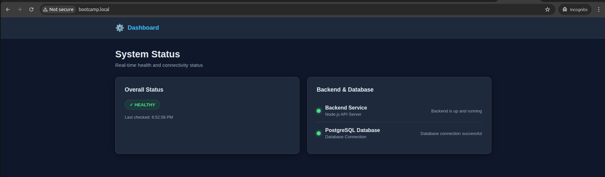
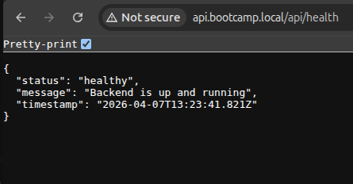
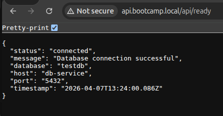

# K8S Application

## Architecture

**Services:**
- **Frontend** (3 replicas) - Vite-based React app, exposed via Ingress at `www.bootcamp.local`
- **Backend** (3 replicas) - Node.js API on port 9000, exposed at `api.bootcamp.local`
- **Assets** (3 replicas) - Static files via Nginx, exposed at `assets.bootcamp.local`
- **Database** (1 replica) - PostgreSQL 15, internal service only




**Features:**
- Rolling update strategy (0 downtime deployments)
- Health checks (liveness & readiness probes)
- Resource limits (64-128Mi memory, 100-200m CPU)
- NGINX Ingress routing
- Database persistence via emptyDir

---
---

## Quick Start

```bash
# Deploy all manifests
./scripts/deploy.sh

# Run health checks
./scripts/test.sh

# Clean up resources
./scripts/cleanup.sh
```

### Scripts 

- #### ./scripts/deploy.sh

- Prerequisite validation (kubectl, cluster connectivity)
- Namespace creation/validation
- Ordered manifest deployment (database → services → deployments)
- Rollout status monitoring with 3-min timeout
- Comprehensive logging with timestamps
- Color-coded output for clarity
- Deployment verification and status display
- Error handling and failure reporting


- #### ./scripts/test.sh

- Safety checks with user confirmation
- Resource detection before deletion
- Dual cleanup strategy (manifest-based + direct deletion)
- Graceful namespace preservation
- Cleanup verification
- Detailed logging
- Warning prompts for destructive operations

- #### ./scripts/cleanup.sh

- Deployment & pod status checks
- Service endpoint verification
- Ingress configuration validation
- Health check testing (via pod exec)
- Database connectivity verification
- Pod readiness & replica count validation
- Network/DNS resolution tests
- Result summary with Pass/Fail/Skip counts
- Diagnostic information collection

---
---


## Manifest Files

Located in `manifests/`:
- `frontend-deployment.yaml`, `frontend-service.yaml`
- `backend-deployment.yaml`, `backend-service.yaml`
- `assets-deployment.yaml`, `assets-service.yaml`
- `db.yaml`, `db-service.yaml`
- `ingress.yaml`

## Database Credentials
- User: `testuser`
- Password: `testpass`
- Database: `testdb`

---
---


## Screenshots from running application 

- #### assets response


- #### assets response



- #### frontend response



- #### health reponse from backend



- #### readiness reponse from backend

